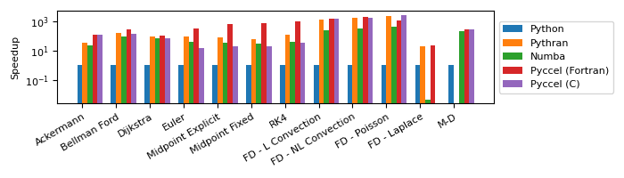
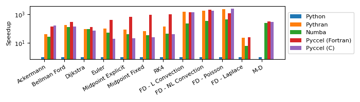
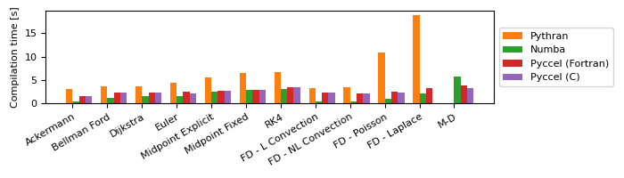
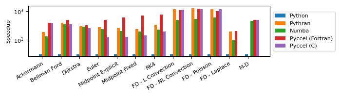
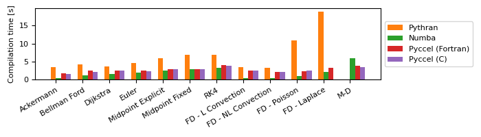
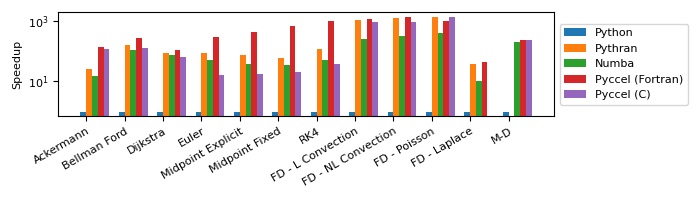
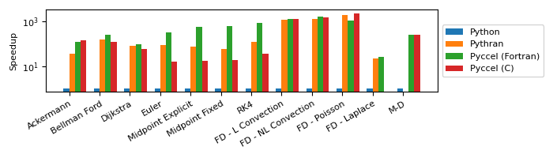

# Benchmarks

Several tests are available for the user to benchmark Pyccel against other common accelerators, notably [pythran](https://pythran.readthedocs.io/en/latest/) and [numba](https://numba.pydata.org/).
The same code is used for all tests, only the decorators change.

The code can be executed by running the script `run_benchmarks.py`.
Additional options can be used with this script to add additional comparisons, change the output format, or change what is generated.

Run `python3 run_benchmarks.py --help` for more details.

The results below are presented for the current state of the development branch of pyccel, as well as the most recent version of pyccel available on pypi.
## Tests used

The tests used can be found in the [benchmark_code/](./benchmark_code) directory

### Ackermann

A basic implementation of the Ackermann function which is one of the simplest and oldest examples of a total computable function that is not primitive recursive.

### Bellman Ford

An algorithm for solving the shortest path problem. The code is adapted from examples written by [J. Burkardt](https://people.sc.fsu.edu/~jburkardt/py_src/py_src.html)

### Djikstra

An algorithm for solving the shortest path problem. The code is adapted from examples written by [J. Burkardt](https://people.sc.fsu.edu/~jburkardt/py_src/py_src.html)

### Euler

Solves an ordinary differential equation using Euler's method. The code is adapted from examples written by [J. Burkardt](https://people.sc.fsu.edu/~jburkardt/py_src/py_src.html)

### Midpoint Explicit

Solves an ordinary differential equation using the explicit midpoint method. The code is adapted from examples written by [J. Burkardt](https://people.sc.fsu.edu/~jburkardt/py_src/py_src.html)

### Midpoint Fixed

Solves an ordinary differential equation using the implicit midpoint method with a fixed number of iterations. The code is adapted from examples written by [J. Burkardt](https://people.sc.fsu.edu/~jburkardt/py_src/py_src.html)

### RK4

Solves an ordinary differential equation using a fourth order Runge-Kutta method. The code is adapted from examples written by [J. Burkardt](https://people.sc.fsu.edu/~jburkardt/py_src/py_src.html)

### FD - Linear Convection

Solves a 1D linear convection problem using Finite Differences methods. The code is adapted from examples written by [L. A. Barba](https://lorenabarba.com/blog/cfd-python-12-steps-to-navier-stokes/)

### FD - Non-Linear Convection

Solves a 1D non-linear convection problem using Finite Differences methods. The code is adapted from examples written by [L. A. Barba](https://lorenabarba.com/blog/cfd-python-12-steps-to-navier-stokes/)

### FD - Poisson

Solves a 2D Poisson problem using Finite Differences methods. The code is adapted from examples written by [L. A. Barba](https://lorenabarba.com/blog/cfd-python-12-steps-to-navier-stokes/)

### FD - Laplace

Solves a 2D Laplace problem using Finite Differences methods. The code is adapted from examples written by [L. A. Barba](https://lorenabarba.com/blog/cfd-python-12-steps-to-navier-stokes/)

### MD

Runs a molecular dynamics simulation. The code is adapted from examples written by [J. Burkardt](https://people.sc.fsu.edu/~jburkardt/py_src/py_src.html)
## Development branch results
### Performance Comparison (as of Tue Nov 22 15:43:53 UTC 2022)
## Compilation time
Algorithm                 | python                    | pythran                   | numba                     | pyccel                    | pyccel_c                 
------------------------- | ------------------------- | ------------------------- | ------------------------- | ------------------------- | -------------------------
Ackermann                 | -                         | 3.27                      | 0.40                      | 1.53                      | 1.51                     
Bellman Ford              | -                         | 3.57                      | 1.13                      | 2.25                      | 2.18                     
Dijkstra                  | -                         | 3.61                      | 1.52                      | 2.42                      | 2.22                     
Euler                     | -                         | 4.26                      | 1.54                      | 2.33                      | 2.28                     
Midpoint Explicit         | -                         | 5.43                      | 2.38                      | 2.70                      | 2.62                     
Midpoint Fixed            | -                         | 6.37                      | 2.75                      | 2.77                      | 2.72                     
RK4                       | -                         | 6.34                      | 2.85                      | 3.44                      | 3.29                     
FD - L Convection         | -                         | 3.15                      | 0.37                      | 2.20                      | 2.15                     
FD - NL Convection        | -                         | 3.15                      | 0.39                      | 2.13                      | 2.24                     
FD - Poisson              | -                         | 9.77                      | 0.89                      | 2.28                      | 2.21                     
FD - Laplace              | -                         | 16.14                     | 2.04                      | 3.07                      | -                        
M-D                       | -                         | -                         | 6.22                      | 3.49                      | 3.19                     

## Execution time
Algorithm                 | python                    | pythran                   | numba                     | pyccel                    | pyccel_c                 
------------------------- | ------------------------- | ------------------------- | ------------------------- | ------------------------- | -------------------------
Ackermann (ms)            | 450.00                    | 13.30                     | 21.60                     | 3.90                      | 3.91                     
Bellman Ford (ns)         | 71100.00                  | 431.00                    | 800.00                    | 263.00                    | 557.00                   
Dijkstra (ns)             | 34600.00                  | 401.00                    | 500.00                    | 326.00                    | 540.00                   
Euler (ms)                | 54.80                     | 0.64                      | 1.33                      | 0.18                      | 3.61                     
Midpoint Explicit (ms)    | 119.00                    | 1.49                      | 3.44                      | 0.20                      | 6.46                     
Midpoint Fixed (ms)       | 582.00                    | 9.46                      | 19.00                     | 0.80                      | 29.80                    
RK4 (ms)                  | 276.00                    | 2.25                      | 6.88                      | 0.30                      | 7.67                     
FD - L Convection (ms)    | 2600.00                   | 2.09                      | 10.90                     | 1.79                      | 1.82                     
FD - NL Convection (ms)   | 3280.00                   | 1.90                      | 10.50                     | 1.84                      | 2.13                     
FD - Poisson (ms)         | 5170.00                   | 2.41                      | 12.40                     | 4.52                      | 2.03                     
FD - Laplace (\textmu s)  | 50.90                     | 2.64                      | 9900.00                   | 2.32                      | -                        
M-D (ms)                  | 55200.00                  | -                         | 257.00                    | 200.00                    | 208.00                   

## Python 3.7 results
### Performance Comparison (as of 1.7.0)
## Compilation time
Algorithm                 | python                    | pythran                   | numba                     | pyccel                    | pyccel_c                 
------------------------- | ------------------------- | ------------------------- | ------------------------- | ------------------------- | -------------------------
Ackermann                 | -                         | 2.97                      | 0.40                      | 1.53                      | 1.33                     
Bellman Ford              | -                         | 3.14                      | 1.15                      | 2.12                      | 2.06                     
Dijkstra                  | -                         | 3.17                      | 1.49                      | 2.19                      | 2.09                     
Euler                     | -                         | 3.87                      | 1.57                      | 2.14                      | 2.02                     
Midpoint Explicit         | -                         | 4.84                      | 2.34                      | 2.56                      | 2.45                     
Midpoint Fixed            | -                         | 5.88                      | 2.69                      | 2.53                      | 2.53                     
RK4                       | -                         | 5.78                      | 2.78                      | 3.17                      | 3.11                     
FD - L Convection         | -                         | 2.71                      | 0.37                      | 2.01                      | 1.94                     
FD - NL Convection        | -                         | 2.78                      | 0.37                      | 2.05                      | 2.01                     
FD - Poisson              | -                         | 9.23                      | 0.90                      | 2.12                      | 2.14                     
FD - Laplace              | -                         | 15.35                     | 2.09                      | 2.86                      | -                        
M-D                       | -                         | -                         | 6.17                      | 3.36                      | 3.01                     

## Execution time
Algorithm                 | python                    | pythran                   | numba                     | pyccel                    | pyccel_c                 
------------------------- | ------------------------- | ------------------------- | ------------------------- | ------------------------- | -------------------------
Ackermann (ms)            | 533.00 $\pm$ 14.00        | 13.50 $\pm$ 0.20          | 20.70 $\pm$ 0.40          | 3.81 $\pm$ 0.08           | 3.27 $\pm$ 0.07          
Bellman Ford (ns)         | 77000.00 $\pm$ 1800.00    | 428.00 $\pm$ 8.00         | 619.00 $\pm$ 15.00        | 266.00 $\pm$ 7.00         | 564.00 $\pm$ 15.00       
Dijkstra (ns)             | 38700.00 $\pm$ 900.00     | 409.00 $\pm$ 7.00         | 431.00 $\pm$ 10.00        | 316.00 $\pm$ 7.00         | 543.00 $\pm$ 11.00       
Euler (ms)                | 63.80 $\pm$ 1.30          | 0.67 $\pm$ 0.01           | 1.28 $\pm$ 0.03           | 0.16 $\pm$ 0.01           | 3.49 $\pm$ 0.07          
Midpoint Explicit (ms)    | 130.00 $\pm$ 3.00         | 1.51 $\pm$ 0.03           | 3.30 $\pm$ 0.07           | 0.20 $\pm$ 0.01           | 6.23 $\pm$ 0.12          
Midpoint Fixed (ms)       | 644.00 $\pm$ 12.00        | 9.78 $\pm$ 0.16           | 18.40 $\pm$ 0.40          | 0.72 $\pm$ 0.02           | 27.20 $\pm$ 0.70         
RK4 (ms)                  | 293.00 $\pm$ 8.00         | 2.11 $\pm$ 0.07           | 6.63 $\pm$ 0.18           | 0.29 $\pm$ 0.01           | 7.40 $\pm$ 0.15          
FD - L Convection (ms)    | 2470.00 $\pm$ 90.00       | 1.65 $\pm$ 0.05           | 10.70 $\pm$ 0.30          | 1.74 $\pm$ 0.04           | 1.84 $\pm$ 0.06          
FD - NL Convection (ms)   | 3580.00 $\pm$ 60.00       | 2.07 $\pm$ 0.04           | 10.70 $\pm$ 0.20          | 1.71 $\pm$ 0.04           | 1.94 $\pm$ 0.04          
FD - Poisson (ms)         | 5190.00 $\pm$ 90.00       | 2.35 $\pm$ 0.04           | 12.00 $\pm$ 0.20          | 4.52 $\pm$ 0.09           | 2.05 $\pm$ 0.05          
FD - Laplace (\textmu s)  | 58.30 $\pm$ 1.60          | 2.69 $\pm$ 0.05           | 10.20 $\pm$ 0.20          | 2.31 $\pm$ 0.04           | -                        
M-D (ms)                  | 61500.00 $\pm$ 900.00     | -                         | 253.00 $\pm$ 6.00         | 199.00 $\pm$ 4.00         | 208.00 $\pm$ 4.00        

## Python 3.8 results
### Performance Comparison (as of 1.7.0)
## Compilation time
Algorithm                 | python                    | pythran                   | numba                     | pyccel                    | pyccel_c                 
------------------------- | ------------------------- | ------------------------- | ------------------------- | ------------------------- | -------------------------
Ackermann                 | -                         | 3.18                      | 0.44                      | 1.60                      | 1.50                     
Bellman Ford              | -                         | 3.71                      | 1.27                      | 2.27                      | 2.28                     
Dijkstra                  | -                         | 3.66                      | 1.60                      | 2.39                      | 2.32                     
Euler                     | -                         | 4.33                      | 1.64                      | 2.43                      | 2.23                     
Midpoint Explicit         | -                         | 5.48                      | 2.52                      | 2.78                      | 2.68                     
Midpoint Fixed            | -                         | 6.52                      | 2.95                      | 2.89                      | 2.85                     
RK4                       | -                         | 6.68                      | 3.00                      | 3.56                      | 3.46                     
FD - L Convection         | -                         | 3.21                      | 0.42                      | 2.38                      | 2.31                     
FD - NL Convection        | -                         | 3.40                      | 0.43                      | 2.21                      | 2.18                     
FD - Poisson              | -                         | 10.93                     | 0.98                      | 2.48                      | 2.35                     
FD - Laplace              | -                         | 18.83                     | 2.23                      | 3.26                      | -                        
M-D                       | -                         | -                         | 5.80                      | 3.85                      | 3.36                     

## Execution time
Algorithm                 | python                    | pythran                   | numba                     | pyccel                    | pyccel_c                 
------------------------- | ------------------------- | ------------------------- | ------------------------- | ------------------------- | -------------------------
Ackermann (ms)            | 607.00 $\pm$ 19.00        | 17.80 $\pm$ 0.80          | 34.20 $\pm$ 1.10          | 3.84 $\pm$ 0.09           | 4.38 $\pm$ 0.10          
Bellman Ford (ns)         | 77300.00 $\pm$ 2700.00    | 487.00 $\pm$ 12.00        | 639.00 $\pm$ 19.00        | 310.00 $\pm$ 16.00        | 614.00 $\pm$ 19.00       
Dijkstra (ns)             | 37400.00 $\pm$ 1300.00    | 413.00 $\pm$ 20.00        | 457.00 $\pm$ 18.00        | 358.00 $\pm$ 11.00        | 588.00 $\pm$ 26.00       
Euler (ms)                | 55.80 $\pm$ 3.90          | 0.74 $\pm$ 0.02           | 1.01 $\pm$ 0.03           | 0.23 $\pm$ 0.01           | 3.66 $\pm$ 0.13          
Midpoint Explicit (ms)    | 112.00 $\pm$ 5.00         | 1.66 $\pm$ 0.07           | 2.78 $\pm$ 0.08           | 0.30 $\pm$ 0.02           | 6.68 $\pm$ 0.37          
Midpoint Fixed (ms)       | 561.00 $\pm$ 21.00        | 9.62 $\pm$ 0.31           | 15.30 $\pm$ 0.60          | 1.13 $\pm$ 0.03           | 27.70 $\pm$ 0.90         
RK4 (ms)                  | 286.00 $\pm$ 15.00        | 2.48 $\pm$ 0.08           | 5.42 $\pm$ 0.20           | 0.47 $\pm$ 0.02           | 7.73 $\pm$ 0.34          
FD - L Convection (ms)    | 2810.00 $\pm$ 50.00       | 2.00 $\pm$ 0.17           | 11.70 $\pm$ 0.40          | 2.30 $\pm$ 0.23           | 2.19 $\pm$ 0.18          
FD - NL Convection (ms)   | 3550.00 $\pm$ 50.00       | 2.14 $\pm$ 0.16           | 11.80 $\pm$ 0.40          | 2.42 $\pm$ 0.06           | 2.58 $\pm$ 0.08          
FD - Poisson (ms)         | 5210.00 $\pm$ 90.00       | 3.86 $\pm$ 0.08           | 14.50 $\pm$ 0.50          | 5.09 $\pm$ 0.14           | 3.65 $\pm$ 0.12          
FD - Laplace (\textmu s)  | 113.00 $\pm$ 5.00         | 2.97 $\pm$ 0.12           | 11.50 $\pm$ 0.20          | 2.65 $\pm$ 0.05           | -                        
M-D (ms)                  | 58800.00 $\pm$ 3000.00    | -                         | 281.00 $\pm$ 11.00        | 228.00 $\pm$ 6.00         | 235.00 $\pm$ 4.00        

## Python 3.9 results
### Performance Comparison (as of 1.7.0)
## Compilation time
Algorithm                 | python                    | pythran                   | numba                     | pyccel                    | pyccel_c                 
------------------------- | ------------------------- | ------------------------- | ------------------------- | ------------------------- | -------------------------
Ackermann                 | -                         | 3.42                      | 0.47                      | 1.69                      | 1.52                     
Bellman Ford              | -                         | 4.20                      | 1.26                      | 2.48                      | 2.24                     
Dijkstra                  | -                         | 3.74                      | 1.66                      | 2.62                      | 2.59                     
Euler                     | -                         | 4.53                      | 1.90                      | 2.49                      | 2.38                     
Midpoint Explicit         | -                         | 5.87                      | 2.62                      | 2.88                      | 2.82                     
Midpoint Fixed            | -                         | 6.84                      | 2.99                      | 2.97                      | 2.89                     
RK4                       | -                         | 6.81                      | 3.30                      | 4.09                      | 3.92                     
FD - L Convection         | -                         | 3.57                      | 0.46                      | 2.46                      | 2.44                     
FD - NL Convection        | -                         | 3.24                      | 0.44                      | 2.24                      | 2.24                     
FD - Poisson              | -                         | 10.96                     | 1.01                      | 2.43                      | 2.49                     
FD - Laplace              | -                         | 18.89                     | 2.21                      | 3.34                      | -                        
M-D                       | -                         | -                         | 6.03                      | 3.83                      | 3.39                     

## Execution time
Algorithm                 | python                    | pythran                   | numba                     | pyccel                    | pyccel_c                 
------------------------- | ------------------------- | ------------------------- | ------------------------- | ------------------------- | -------------------------
Ackermann (ms)            | 523.00 $\pm$ 7.00         | 20.00 $\pm$ 1.00          | 35.20 $\pm$ 0.30          | 3.95 $\pm$ 0.05           | 4.53 $\pm$ 0.05          
Bellman Ford (ns)         | 77700.00 $\pm$ 2000.00    | 499.00 $\pm$ 9.00         | 697.00 $\pm$ 9.00         | 284.00 $\pm$ 3.00         | 616.00 $\pm$ 11.00       
Dijkstra (ns)             | 37600.00 $\pm$ 800.00     | 439.00 $\pm$ 5.00         | 493.00 $\pm$ 6.00         | 350.00 $\pm$ 5.00         | 599.00 $\pm$ 11.00       
Euler (ms)                | 59.40 $\pm$ 3.20          | 0.72 $\pm$ 0.02           | 1.21 $\pm$ 0.02           | 0.21 $\pm$ 0.01           | 3.80 $\pm$ 0.08          
Midpoint Explicit (ms)    | 117.00 $\pm$ 3.00         | 1.62 $\pm$ 0.04           | 3.09 $\pm$ 0.04           | 0.28 $\pm$ 0.01           | 6.85 $\pm$ 0.17          
Midpoint Fixed (ms)       | 580.00 $\pm$ 19.00        | 10.00 $\pm$ 0.30          | 16.50 $\pm$ 0.30          | 0.89 $\pm$ 0.02           | 29.10 $\pm$ 0.50         
RK4 (ms)                  | 294.00 $\pm$ 15.00        | 2.51 $\pm$ 0.04           | 5.91 $\pm$ 0.26           | 0.31 $\pm$ 0.01           | 8.16 $\pm$ 0.28          
FD - L Convection (ms)    | 2970.00 $\pm$ 20.00       | 2.77 $\pm$ 0.04           | 11.60 $\pm$ 0.20          | 2.67 $\pm$ 0.05           | 3.33 $\pm$ 0.05          
FD - NL Convection (ms)   | 3630.00 $\pm$ 50.00       | 2.91 $\pm$ 0.03           | 11.30 $\pm$ 0.20          | 2.77 $\pm$ 0.03           | 4.16 $\pm$ 0.06          
FD - Poisson (ms)         | 5420.00 $\pm$ 50.00       | 4.24 $\pm$ 0.08           | 13.50 $\pm$ 0.40          | 5.49 $\pm$ 0.16           | 4.03 $\pm$ 0.07          
FD - Laplace (\textmu s)  | 127.00 $\pm$ 10.00        | 3.31 $\pm$ 0.09           | 12.40 $\pm$ 0.40          | 2.93 $\pm$ 0.04           | -                        
M-D (ms)                  | 57100.00 $\pm$ 1800.00    | -                         | 298.00 $\pm$ 4.00         | 243.00 $\pm$ 2.00         | 254.00 $\pm$ 4.00        

## Python 3.10 results
### Performance Comparison (as of 1.7.0)
## Compilation time
Algorithm                 | python                    | pythran                   | numba                     | pyccel                    | pyccel_c                 
------------------------- | ------------------------- | ------------------------- | ------------------------- | ------------------------- | -------------------------
Ackermann                 | -                         | 2.89                      | 0.37                      | 1.51                      | 1.34                     
Bellman Ford              | -                         | 3.17                      | 1.00                      | 2.04                      | 1.96                     
Dijkstra                  | -                         | 3.25                      | 1.32                      | 2.05                      | 1.95                     
Euler                     | -                         | 3.65                      | 1.33                      | 1.97                      | 1.93                     
Midpoint Explicit         | -                         | 4.71                      | 2.06                      | 2.39                      | 2.37                     
Midpoint Fixed            | -                         | 5.69                      | 2.41                      | 2.52                      | 2.48                     
RK4                       | -                         | 5.71                      | 2.50                      | 3.05                      | 2.88                     
FD - L Convection         | -                         | 2.84                      | 0.34                      | 1.92                      | 1.89                     
FD - NL Convection        | -                         | 2.82                      | 0.33                      | 1.90                      | 1.89                     
FD - Poisson              | -                         | 8.72                      | 0.80                      | 1.99                      | 2.00                     
FD - Laplace              | -                         | 14.44                     | 1.81                      | 2.65                      | -                        
M-D                       | -                         | -                         | 5.46                      | 3.15                      | 2.79                     

## Execution time
Algorithm                 | python                    | pythran                   | numba                     | pyccel                    | pyccel_c                 
------------------------- | ------------------------- | ------------------------- | ------------------------- | ------------------------- | -------------------------
Ackermann (ms)            | 406.00 $\pm$ 2.00         | 18.90 $\pm$ 0.10          | 31.20 $\pm$ 0.40          | 10.60 $\pm$ 0.00          | 10.10 $\pm$ 0.00         
Bellman Ford (ns)         | 58800.00 $\pm$ 300.00     | 362.00 $\pm$ 3.00         | 539.00 $\pm$ 29.00        | 221.00 $\pm$ 3.00         | 469.00 $\pm$ 3.00        
Dijkstra (ns)             | 29100.00 $\pm$ 200.00     | 344.00 $\pm$ 3.00         | 367.00 $\pm$ 7.00         | 276.00 $\pm$ 1.00         | 459.00 $\pm$ 6.00        
Euler (ms)                | 46.40 $\pm$ 0.40          | 0.54 $\pm$ 0.00           | 1.14 $\pm$ 0.02           | 0.14 $\pm$ 0.01           | 3.07 $\pm$ 0.01          
Midpoint Explicit (ms)    | 93.80 $\pm$ 2.00          | 1.25 $\pm$ 0.01           | 2.90 $\pm$ 0.02           | 0.17 $\pm$ 0.00           | 5.50 $\pm$ 0.06          
Midpoint Fixed (ms)       | 458.00 $\pm$ 4.00         | 7.94 $\pm$ 0.01           | 16.00 $\pm$ 0.10          | 0.68 $\pm$ 0.00           | 24.20 $\pm$ 0.30         
RK4 (ms)                  | 228.00 $\pm$ 4.00         | 1.85 $\pm$ 0.00           | 5.77 $\pm$ 0.04           | 0.26 $\pm$ 0.03           | 6.59 $\pm$ 0.11          
FD - L Convection (ms)    | 2230.00 $\pm$ 40.00       | 1.77 $\pm$ 0.02           | 9.39 $\pm$ 0.06           | 1.71 $\pm$ 0.02           | 1.73 $\pm$ 0.08          
FD - NL Convection (ms)   | 2720.00 $\pm$ 20.00       | 1.75 $\pm$ 0.08           | 9.22 $\pm$ 0.04           | 1.66 $\pm$ 0.02           | 1.72 $\pm$ 0.09          
FD - Poisson (ms)         | 4250.00 $\pm$ 30.00       | 2.05 $\pm$ 0.00           | 10.50 $\pm$ 0.10          | 3.89 $\pm$ 0.00           | 1.78 $\pm$ 0.00          
FD - Laplace (\textmu s)  | 55.50 $\pm$ 0.70          | 2.34 $\pm$ 0.02           | 8.74 $\pm$ 0.11           | 2.08 $\pm$ 0.04           | -                        
M-D (ms)                  | 45700.00 $\pm$ 1100.00    | -                         | 221.00 $\pm$ 2.00         | 174.00 $\pm$ 1.00         | 181.00 $\pm$ 1.00        

## Python 3.11 results
### Performance Comparison (as of 1.7.0)
## Compilation time
Algorithm                 | python                    | pythran                   | pyccel                    | pyccel_c                 
------------------------- | ------------------------- | ------------------------- | ------------------------- | -------------------------
Ackermann                 | -                         | 3.12                      | 1.66                      | 1.50                     
Bellman Ford              | -                         | 3.50                      | 2.26                      | 2.14                     
Dijkstra                  | -                         | 3.51                      | 2.38                      | 2.24                     
Euler                     | -                         | 4.16                      | 2.30                      | 2.24                     
Midpoint Explicit         | -                         | 5.15                      | 2.65                      | 2.59                     
Midpoint Fixed            | -                         | 6.07                      | 2.74                      | 2.70                     
RK4                       | -                         | 5.93                      | 3.24                      | 3.19                     
FD - L Convection         | -                         | 3.18                      | 2.13                      | 2.12                     
FD - NL Convection        | -                         | 3.19                      | 2.17                      | 2.23                     
FD - Poisson              | -                         | 9.88                      | 2.30                      | 2.23                     
FD - Laplace              | -                         | 16.29                     | 3.09                      | -                        
M-D                       | -                         | -                         | 3.49                      | 3.17                     

## Execution time
Algorithm                 | python                    | pythran                   | pyccel                    | pyccel_c                 
------------------------- | ------------------------- | ------------------------- | ------------------------- | -------------------------
Ackermann (ms)            | 500.00 $\pm$ 5.00         | 13.50 $\pm$ 0.20          | 4.02 $\pm$ 0.04           | 3.34 $\pm$ 0.08          
Bellman Ford (ns)         | 70500.00 $\pm$ 2200.00    | 449.00 $\pm$ 31.00        | 277.00 $\pm$ 4.00         | 582.00 $\pm$ 14.00       
Dijkstra (ns)             | 32800.00 $\pm$ 300.00     | 415.00 $\pm$ 4.00         | 342.00 $\pm$ 1.00         | 560.00 $\pm$ 5.00        
Euler (\textmu s)         | 56400.00 $\pm$ 1700.00    | 666.00 $\pm$ 4.00         | 166.00 $\pm$ 9.00         | 3590.00 $\pm$ 50.00      
Midpoint Explicit (ms)    | 112.00 $\pm$ 2.00         | 1.52 $\pm$ 0.02           | 0.20 $\pm$ 0.00           | 6.39 $\pm$ 0.09          
Midpoint Fixed (ms)       | 534.00 $\pm$ 9.00         | 9.47 $\pm$ 0.07           | 0.82 $\pm$ 0.03           | 28.70 $\pm$ 0.60         
RK4 (ms)                  | 272.00 $\pm$ 5.00         | 2.17 $\pm$ 0.02           | 0.30 $\pm$ 0.01           | 7.74 $\pm$ 0.14          
FD - L Convection (ms)    | 2410.00 $\pm$ 40.00       | 2.00 $\pm$ 0.02           | 1.89 $\pm$ 0.04           | 1.89 $\pm$ 0.03          
FD - NL Convection (ms)   | 3100.00 $\pm$ 40.00       | 2.26 $\pm$ 0.02           | 1.83 $\pm$ 0.04           | 1.98 $\pm$ 0.03          
FD - Poisson (ms)         | 5080.00 $\pm$ 50.00       | 2.45 $\pm$ 0.01           | 4.68 $\pm$ 0.05           | 2.12 $\pm$ 0.01          
FD - Laplace (\textmu s)  | 63.70 $\pm$ 0.80          | 2.82 $\pm$ 0.03           | 2.55 $\pm$ 0.15           | -                        
M-D (ms)                  | 54400.00 $\pm$ 600.00     | -                         | 209.00 $\pm$ 1.00         | 216.00 $\pm$ 1.00        

