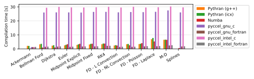
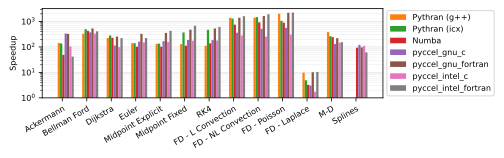
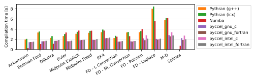
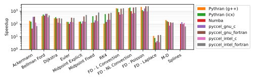

# Benchmarks

Several tests are available for the user to benchmark Pyccel against other common accelerators, notably [pythran](https://pythran.readthedocs.io/en/latest/) and [numba](https://numba.pydata.org/).
The same code is used for all tests, only the decorators change.

The dependencies can be installed using the command `python3 -m pip install .`

The code can be executed by running the script `benchmarks/run_benchmarks.py`.

In order to test pyccel and/or pythran, configuration files must be provided. An example configuration for pythran is found in [`benchmarks/config.pythranrc`](./benchmarks/config.pythranrc). This configuration is the default pythran configuration with the following additional flags:
- `-O3`
- `-march=native`
- `-mtune=native`
- `-mavx`
- `-ffast-math`

Pyccel configurations valid for your machine can be generated using the following command (which may be adapted for another compiler family, see the [pyccel documentation](https://pyccel.github.io/pyccel/docs/compiler.html)):
```
pyccel --compiler-family intel --export-compiler-config pyccel_intel.json
```
This configuration can then be modified to include additional flags or use different compilers. The tests shown below add the following additional flags (which match the flags added to pythran):
- `-O3`
- `-march=native`
- `-mtune=native`
- `-mavx`
- `-ffast-math`

Additional options can be used with this script to add further comparisons, change the output format, or change what is generated.

Run `python3 benchmarks/run_benchmarks.py --help` for more details.

The results below are presented for the current state of the development branch of pyccel, as well as the most recent version of pyccel available on pypi.

A requirements.txt file providing the necessary packages to reproduce the tests run can be found in the `version_specific_results` folder.
The environment can be reproduced using the following commands:
```
python3 -m venv my_virtual_environment
source my_virtual_environment/bin/activate
pip3 install -r requirements.txt
```
## Tests used

The tests used can be found in the [benchmarks/tests](./benchmarks/tests) directory.

### Ackermann

A basic implementation of the Ackermann function which is one of the simplest and oldest examples of a total computable function that is not primitive recursive.

### Bellman Ford

An algorithm for solving the shortest path problem. The code is adapted from examples written by [J. Burkardt](https://people.sc.fsu.edu/~jburkardt/py_src/py_src.html)

### Djikstra

An algorithm for solving the shortest path problem. The code is adapted from examples written by [J. Burkardt](https://people.sc.fsu.edu/~jburkardt/py_src/py_src.html)

### Euler

Solves an ordinary differential equation using Euler's method. The code is adapted from examples written by [J. Burkardt](https://people.sc.fsu.edu/~jburkardt/py_src/py_src.html)

### Midpoint Explicit

Solves an ordinary differential equation using the explicit midpoint method. The code is adapted from examples written by [J. Burkardt](https://people.sc.fsu.edu/~jburkardt/py_src/py_src.html)

### Midpoint Fixed

Solves an ordinary differential equation using the implicit midpoint method with a fixed number of iterations. The code is adapted from examples written by [J. Burkardt](https://people.sc.fsu.edu/~jburkardt/py_src/py_src.html)

### RK4

Solves an ordinary differential equation using a fourth order Runge-Kutta method. The code is adapted from examples written by [J. Burkardt](https://people.sc.fsu.edu/~jburkardt/py_src/py_src.html)

### FD - Linear Convection

Solves a 1D linear convection problem using Finite Differences methods. The code is adapted from examples written by [L. A. Barba](https://lorenabarba.com/blog/cfd-python-12-steps-to-navier-stokes/)

### FD - Non-Linear Convection

Solves a 1D non-linear convection problem using Finite Differences methods. The code is adapted from examples written by [L. A. Barba](https://lorenabarba.com/blog/cfd-python-12-steps-to-navier-stokes/)

### FD - Poisson

Solves a 2D Poisson problem using Finite Differences methods. The code is adapted from examples written by [L. A. Barba](https://lorenabarba.com/blog/cfd-python-12-steps-to-navier-stokes/)

### FD - Laplace

Solves a 2D Laplace problem using Finite Differences methods. The code is adapted from examples written by [L. A. Barba](https://lorenabarba.com/blog/cfd-python-12-steps-to-navier-stokes/)

### MD

Runs a molecular dynamics simulation. The code is adapted from examples written by [J. Burkardt](https://people.sc.fsu.edu/~jburkardt/py_src/py_src.html)

### Splines

Evaluates a non-uniform spline saved as a class instance at a large number of test points. The code uses Algorithm A2.2 from the NURBS book (Piegl, Les, and Wayne Tiller. The NURBS book. Springer Science & Business Media, 2012.).
## Development branch results
### Performance Comparison (as of Wed Jul 23 18:14:39 UTC 2025)
## Compilation time
Algorithm                 | python                    | pythran_gnu               | pythran_intel             | numba                     | pyccel_gnu_c              | pyccel_gnu_fortran        | pyccel_intel_c            | pyccel_intel_fortran     
------------------------- | ------------------------- | ------------------------- | ------------------------- | ------------------------- | ------------------------- | ------------------------- | ------------------------- | -------------------------
Ackermann                 | -                         | 2.34                      | 2.03                      | 0.27                      | 1.32                      | 1.34                      | 1.32                      | 1.37                     
Bellman Ford              | -                         | 3.32                      | 3.55                      | 0.92                      | 1.61                      | 1.50                      | 1.54                      | 1.54                     
Dijkstra                  | -                         | 2.29                      | 2.56                      | 1.19                      | 1.71                      | 1.59                      | 1.63                      | 1.67                     
Euler                     | -                         | 2.56                      | 2.91                      | 3.27                      | 1.57                      | 1.46                      | 1.56                      | 1.51                     
Midpoint Explicit         | -                         | 2.89                      | 3.28                      | 3.55                      | 1.79                      | 1.68                      | 1.74                      | 1.73                     
Midpoint Fixed            | -                         | 3.30                      | 3.61                      | 3.67                      | 1.86                      | 1.74                      | 1.79                      | 1.79                     
RK4                       | -                         | 3.39                      | 3.82                      | 3.70                      | 2.19                      | 2.12                      | 2.11                      | 2.15                     
FD - L Convection         | -                         | 2.27                      | 2.53                      | 2.41                      | 1.53                      | 1.42                      | 1.48                      | 1.47                     
FD - NL Convection        | -                         | 3.19                      | 3.50                      | 2.42                      | 1.53                      | 1.43                      | 1.48                      | 1.47                     
FD - Poisson              | -                         | 3.37                      | 3.62                      | 5.58                      | 1.66                      | 1.69                      | 1.61                      | 1.85                     
FD - Laplace              | -                         | 6.72                      | 7.44                      | 6.97                      | 1.89                      | 1.85                      | 1.79                      | 1.92                     
M-D                       | -                         | 6.10                      | 6.04                      | 8.33                      | 2.32                      | 2.44                      | 2.22                      | 2.54                     
Splines                   | -                         | -                         | -                         | 0.58                      | 1.77                      | 1.72                      | 1.69                      | 1.81                     

## Execution time
Algorithm                 | python                    | pythran_gnu               | pythran_intel             | numba                     | pyccel_gnu_c              | pyccel_gnu_fortran        | pyccel_intel_c            | pyccel_intel_fortran     
------------------------- | ------------------------- | ------------------------- | ------------------------- | ------------------------- | ------------------------- | ------------------------- | ------------------------- | -------------------------
Ackermann (ms)            | 413.00                    | 2.92                      | 3.06                      | 9.78                      | 1.33                      | 1.32                      | 4.01                      | 9.87                     
Bellman Ford (ms)         | 1730.00                   | 5.25                      | 3.44                      | 3.91                      | 3.75                      | 3.25                      | 6.45                      | 4.18                     
Dijkstra (ms)             | 4810.00                   | 20.30                     | 16.90                     | 18.60                     | 67.70                     | 19.50                     | 68.10                     | 22.00                    
Euler (ms)                | 3370.00                   | 25.10                     | 26.30                     | 36.00                     | 27.20                     | 10.70                     | 26.50                     | 15.00                    
Midpoint Explicit (ms)    | 6870.00                   | 50.90                     | 50.40                     | 70.30                     | 50.20                     | 18.70                     | 45.30                     | 16.10                    
Midpoint Fixed (ms)       | 34900.00                  | 271.00                    | 92.10                     | 319.00                    | 189.00                    | 71.80                     | 197.00                    | 54.80                    
RK4 (ms)                  | 17300.00                  | 153.00                    | 34.90                     | 164.00                    | 95.30                     | 31.30                     | 92.50                     | 28.80                    
FD - L Convection (ms)    | 2140.00                   | 1.52                      | 1.66                      | 5.63                      | 6.63                      | 1.79                      | 7.79                      | 1.49                     
FD - NL Convection (ms)   | 2630.00                   | 1.84                      | 1.73                      | 5.65                      | 6.68                      | 1.60                      | 8.42                      | 1.52                     
FD - Poisson (ms)         | 5510.00                   | 2.88                      | 5.40                      | 6.75                      | 14.70                     | 2.68                      | 24.00                     | 2.56                     
FD - Laplace (ms)         | 631.00                    | 62.70                     | 126.00                    | 273.00                    | 477.00                    | 56.60                     | 663.00                    | 55.40                    
M-D (ms)                  | 14400.00                  | 35.80                     | 52.10                     | 60.00                     | 116.00                    | 62.20                     | 61.10                     | 89.40                    
Splines (ms)              | 1740.00                   | -                         | -                         | 18.60                     | 14.30                     | 17.60                     | 15.20                     | 27.70                    



## Python 3.9 results
### Performance Comparison (as of 2.0.1)
## Compilation time
Algorithm                 | python                    | pythran_gnu               | pythran_intel             | numba                     | pyccel_gnu_c              | pyccel_gnu_fortran        | pyccel_intel_c            | pyccel_intel_fortran     
------------------------- | ------------------------- | ------------------------- | ------------------------- | ------------------------- | ------------------------- | ------------------------- | ------------------------- | -------------------------
Ackermann                 | -                         | 1.93                      | 1.85                      | 0.33                      | 1.40                      | 1.44                      | 1.39                      | 1.44                     
Bellman Ford              | -                         | 3.28                      | 3.53                      | 1.08                      | 1.70                      | 1.58                      | 1.62                      | 1.61                     
Dijkstra                  | -                         | 2.28                      | 2.56                      | 1.58                      | 1.78                      | 1.67                      | 1.71                      | 1.73                     
Euler                     | -                         | 2.52                      | 2.89                      | 2.02                      | 1.65                      | 1.55                      | 1.60                      | 1.59                     
Midpoint Explicit         | -                         | 2.87                      | 3.25                      | 3.00                      | 1.89                      | 1.77                      | 1.82                      | 1.80                     
Midpoint Fixed            | -                         | 3.27                      | 3.64                      | 3.21                      | 1.96                      | 1.83                      | 1.86                      | 1.87                     
RK4                       | -                         | 3.38                      | 3.81                      | 3.75                      | 2.36                      | 2.27                      | 2.26                      | 2.29                     
FD - L Convection         | -                         | 2.20                      | 2.50                      | 0.86                      | 1.61                      | 1.51                      | 1.55                      | 1.55                     
FD - NL Convection        | -                         | 3.12                      | 3.43                      | 0.87                      | 1.60                      | 1.52                      | 1.56                      | 1.55                     
FD - Poisson              | -                         | 3.34                      | 3.60                      | 1.33                      | 1.75                      | 1.78                      | 1.68                      | 1.93                     
FD - Laplace              | -                         | 6.69                      | 7.34                      | 3.02                      | 2.00                      | 1.94                      | 1.87                      | 2.02                     
M-D                       | -                         | 6.12                      | 6.07                      | 4.04                      | 2.46                      | 2.60                      | 2.35                      | 2.71                     
Splines                   | -                         | -                         | -                         | 0.61                      | 1.83                      | 1.79                      | 1.75                      | 1.86                     

## Execution time
Algorithm                 | python                    | pythran_gnu               | pythran_intel             | numba                     | pyccel_gnu_c              | pyccel_gnu_fortran        | pyccel_intel_c            | pyccel_intel_fortran     
------------------------- | ------------------------- | ------------------------- | ------------------------- | ------------------------- | ------------------------- | ------------------------- | ------------------------- | -------------------------
Ackermann (ms)            | 303.00 $\pm$ 2.00         | 2.83 $\pm$ 0.01           | 3.08 $\pm$ 0.11           | 10.90 $\pm$ 0.10          | 1.23 $\pm$ 0.00           | 1.32 $\pm$ 0.00           | 4.36 $\pm$ 0.01           | 10.30 $\pm$ 0.40         
Bellman Ford (ms)         | 1850.00 $\pm$ 20.00       | 4.58 $\pm$ 0.01           | 3.53 $\pm$ 0.13           | 3.84 $\pm$ 0.05           | 3.73 $\pm$ 0.03           | 3.23 $\pm$ 0.01           | 5.85 $\pm$ 0.03           | 4.20 $\pm$ 0.02          
Dijkstra (ms)             | 4980.00 $\pm$ 70.00       | 18.20 $\pm$ 0.10          | 16.50 $\pm$ 0.10          | 19.10 $\pm$ 0.50          | 67.00 $\pm$ 0.40          | 17.80 $\pm$ 0.00          | 66.30 $\pm$ 0.10          | 20.70 $\pm$ 0.00         
Euler (ms)                | 3890.00 $\pm$ 30.00       | 25.20 $\pm$ 0.40          | 25.50 $\pm$ 0.60          | 39.40 $\pm$ 8.10          | 26.80 $\pm$ 0.40          | 11.00 $\pm$ 0.30          | 26.80 $\pm$ 0.30          | 15.60 $\pm$ 0.40         
Midpoint Explicit (ms)    | 7940.00 $\pm$ 70.00       | 51.70 $\pm$ 0.40          | 50.10 $\pm$ 0.20          | 69.80 $\pm$ 1.50          | 44.80 $\pm$ 0.40          | 19.70 $\pm$ 2.20          | 45.80 $\pm$ 0.40          | 16.60 $\pm$ 1.40         
Midpoint Fixed (ms)       | 39800.00 $\pm$ 300.00     | 267.00 $\pm$ 2.00         | 92.30 $\pm$ 0.50          | 357.00 $\pm$ 6.00         | 188.00 $\pm$ 1.00         | 72.80 $\pm$ 1.30          | 199.00 $\pm$ 3.00         | 51.00 $\pm$ 0.50         
RK4 (ms)                  | 20000.00 $\pm$ 200.00     | 154.00 $\pm$ 2.00         | 35.60 $\pm$ 0.90          | 138.00 $\pm$ 23.00        | 95.60 $\pm$ 0.80          | 31.50 $\pm$ 0.30          | 91.80 $\pm$ 1.50          | 27.70 $\pm$ 0.30         
FD - L Convection (ms)    | 2370.00 $\pm$ 20.00       | 1.52 $\pm$ 0.05           | 1.49 $\pm$ 0.03           | 2.69 $\pm$ 0.01           | 7.44 $\pm$ 0.07           | 1.54 $\pm$ 0.08           | 7.72 $\pm$ 0.08           | 1.53 $\pm$ 0.05          
FD - NL Convection (ms)   | 2920.00 $\pm$ 10.00       | 1.81 $\pm$ 0.06           | 1.58 $\pm$ 0.07           | 2.84 $\pm$ 0.07           | 6.71 $\pm$ 0.04           | 1.50 $\pm$ 0.06           | 8.13 $\pm$ 0.16           | 1.51 $\pm$ 0.01          
FD - Poisson (ms)         | 6500.00 $\pm$ 60.00       | 2.83 $\pm$ 0.03           | 5.38 $\pm$ 0.10           | 7.21 $\pm$ 0.03           | 16.00 $\pm$ 0.00          | 2.70 $\pm$ 0.03           | 24.10 $\pm$ 0.00          | 2.67 $\pm$ 0.04          
FD - Laplace (ms)         | 586.00 $\pm$ 6.00         | 67.10 $\pm$ 0.40          | 127.00 $\pm$ 1.00         | 252.00 $\pm$ 1.00         | 491.00 $\pm$ 1.00         | 60.70 $\pm$ 0.50          | 662.00 $\pm$ 1.00         | 59.40 $\pm$ 0.50         
M-D (ms)                  | 15900.00 $\pm$ 200.00     | 35.00 $\pm$ 2.20          | 52.80 $\pm$ 0.40          | 58.70 $\pm$ 0.40          | 113.00 $\pm$ 0.00         | 62.00 $\pm$ 0.20          | 61.40 $\pm$ 0.70          | 89.50 $\pm$ 0.20         
Splines (ms)              | 2050.00 $\pm$ 30.00       | -                         | -                         | 17.00 $\pm$ 0.00          | 14.40 $\pm$ 0.00          | 17.90 $\pm$ 0.60          | 15.30 $\pm$ 0.20          | 27.70 $\pm$ 0.10         


## Python 3.10 results
### Performance Comparison (as of 2.0.1)
## Compilation time
Algorithm                 | python                    | pythran_gnu               | pythran_intel             | numba                     | pyccel_gnu_c              | pyccel_gnu_fortran        | pyccel_intel_c            | pyccel_intel_fortran     
------------------------- | ------------------------- | ------------------------- | ------------------------- | ------------------------- | ------------------------- | ------------------------- | ------------------------- | -------------------------
Ackermann                 | -                         | 2.38                      | 2.10                      | 0.32                      | 1.35                      | 1.38                      | 1.34                      | 1.39                     
Bellman Ford              | -                         | 3.46                      | 3.77                      | 0.95                      | 1.66                      | 1.53                      | 1.58                      | 1.57                     
Dijkstra                  | -                         | 2.42                      | 2.73                      | 1.26                      | 1.74                      | 1.63                      | 1.69                      | 1.71                     
Euler                     | -                         | 2.72                      | 3.05                      | 3.35                      | 1.61                      | 1.50                      | 1.57                      | 1.57                     
Midpoint Explicit         | -                         | 3.04                      | 3.44                      | 3.69                      | 1.84                      | 1.73                      | 1.78                      | 1.77                     
Midpoint Fixed            | -                         | 3.45                      | 3.83                      | 3.84                      | 1.91                      | 1.80                      | 1.85                      | 1.83                     
RK4                       | -                         | 3.53                      | 4.02                      | 3.84                      | 2.31                      | 2.22                      | 2.20                      | 2.24                     
FD - L Convection         | -                         | 2.35                      | 2.63                      | 2.54                      | 1.50                      | 1.47                      | 1.51                      | 1.51                     
FD - NL Convection        | -                         | 3.28                      | 3.62                      | 2.59                      | 1.57                      | 1.49                      | 1.52                      | 1.51                     
FD - Poisson              | -                         | 3.54                      | 3.81                      | 5.89                      | 1.70                      | 1.74                      | 1.65                      | 1.89                     
FD - Laplace              | -                         | 6.91                      | 7.63                      | 7.35                      | 1.94                      | 1.89                      | 1.85                      | 1.97                     
M-D                       | -                         | 6.32                      | 6.34                      | 8.60                      | 2.45                      | 2.62                      | 2.32                      | 2.66                     
Splines                   | -                         | -                         | -                         | 0.57                      | 1.78                      | 1.74                      | 1.72                      | 1.82                     

## Execution time
Algorithm                 | python                    | pythran_gnu               | pythran_intel             | numba                     | pyccel_gnu_c              | pyccel_gnu_fortran        | pyccel_intel_c            | pyccel_intel_fortran     
------------------------- | ------------------------- | ------------------------- | ------------------------- | ------------------------- | ------------------------- | ------------------------- | ------------------------- | -------------------------
Ackermann (ms)            | 305.00 $\pm$ 3.00         | 2.94 $\pm$ 0.03           | 3.06 $\pm$ 0.02           | 10.80 $\pm$ 0.10          | 1.33 $\pm$ 0.01           | 1.33 $\pm$ 0.00           | 4.07 $\pm$ 0.08           | 9.44 $\pm$ 0.27          
Bellman Ford (ms)         | 1820.00 $\pm$ 20.00       | 5.27 $\pm$ 0.02           | 3.54 $\pm$ 0.08           | 3.88 $\pm$ 0.07           | 3.75 $\pm$ 0.03           | 3.27 $\pm$ 0.02           | 5.87 $\pm$ 0.02           | 4.21 $\pm$ 0.03          
Dijkstra (ms)             | 5100.00 $\pm$ 60.00       | 20.70 $\pm$ 0.20          | 17.10 $\pm$ 0.20          | 19.00 $\pm$ 0.20          | 66.90 $\pm$ 0.60          | 18.90 $\pm$ 0.80          | 68.70 $\pm$ 0.70          | 22.40 $\pm$ 0.40         
Euler (ms)                | 3510.00 $\pm$ 40.00       | 25.80 $\pm$ 0.40          | 25.50 $\pm$ 0.30          | 36.20 $\pm$ 0.30          | 27.00 $\pm$ 0.40          | 11.00 $\pm$ 0.30          | 27.00 $\pm$ 0.40          | 15.30 $\pm$ 0.40         
Midpoint Explicit (ms)    | 7120.00 $\pm$ 50.00       | 51.20 $\pm$ 0.30          | 50.70 $\pm$ 0.60          | 69.70 $\pm$ 0.70          | 44.70 $\pm$ 0.40          | 18.80 $\pm$ 0.20          | 46.10 $\pm$ 0.50          | 16.20 $\pm$ 0.40         
Midpoint Fixed (ms)       | 35600.00 $\pm$ 200.00     | 268.00 $\pm$ 3.00         | 94.60 $\pm$ 4.20          | 322.00 $\pm$ 1.00         | 190.00 $\pm$ 1.00         | 72.50 $\pm$ 0.70          | 198.00 $\pm$ 1.00         | 55.40 $\pm$ 0.40         
RK4 (ms)                  | 17600.00 $\pm$ 100.00     | 154.00 $\pm$ 4.00         | 35.60 $\pm$ 0.70          | 126.00 $\pm$ 1.00         | 95.50 $\pm$ 0.70          | 31.70 $\pm$ 0.20          | 94.50 $\pm$ 7.30          | 29.40 $\pm$ 0.40         
FD - L Convection (ms)    | 2290.00 $\pm$ 20.00       | 1.53 $\pm$ 0.05           | 1.64 $\pm$ 0.01           | 5.64 $\pm$ 0.01           | 6.68 $\pm$ 0.06           | 1.58 $\pm$ 0.07           | 7.75 $\pm$ 0.12           | 1.50 $\pm$ 0.01          
FD - NL Convection (ms)   | 2770.00 $\pm$ 20.00       | 1.88 $\pm$ 0.05           | 1.78 $\pm$ 0.00           | 5.68 $\pm$ 0.03           | 6.72 $\pm$ 0.05           | 1.67 $\pm$ 0.07           | 8.35 $\pm$ 0.21           | 1.51 $\pm$ 0.02          
FD - Poisson (ms)         | 6470.00 $\pm$ 160.00      | 2.94 $\pm$ 0.06           | 5.40 $\pm$ 0.16           | 6.90 $\pm$ 0.15           | 16.00 $\pm$ 0.00          | 2.63 $\pm$ 0.03           | 23.90 $\pm$ 0.10          | 2.57 $\pm$ 0.02          
FD - Laplace (ms)         | 593.00 $\pm$ 17.00        | 63.60 $\pm$ 0.40          | 127.00 $\pm$ 1.00         | 280.00 $\pm$ 8.00         | 492.00 $\pm$ 1.00         | 61.40 $\pm$ 0.60          | 657.00 $\pm$ 2.00         | 55.10 $\pm$ 0.30         
M-D (ms)                  | 15300.00 $\pm$ 100.00     | 35.30 $\pm$ 0.30          | 52.60 $\pm$ 0.30          | 60.30 $\pm$ 0.30          | 117.00 $\pm$ 1.00         | 62.20 $\pm$ 0.20          | 61.20 $\pm$ 0.10          | 89.50 $\pm$ 0.20         
Splines (ms)              | 1870.00 $\pm$ 10.00       | -                         | -                         | 18.40 $\pm$ 0.10          | 14.20 $\pm$ 0.00          | 17.60 $\pm$ 0.00          | 15.20 $\pm$ 0.00          | 27.80 $\pm$ 0.30         


## Python 3.11 results
### Performance Comparison (as of 2.0.1)
## Compilation time
Algorithm                 | python                    | pythran_gnu               | pythran_intel             | numba                     | pyccel_gnu_c              | pyccel_gnu_fortran        | pyccel_intel_c            | pyccel_intel_fortran     
------------------------- | ------------------------- | ------------------------- | ------------------------- | ------------------------- | ------------------------- | ------------------------- | ------------------------- | -------------------------
Ackermann                 | -                         | 2.34                      | 2.13                      | 0.29                      | 1.39                      | 1.40                      | 1.36                      | 1.44                     
Bellman Ford              | -                         | 3.44                      | 3.64                      | 0.97                      | 1.65                      | 1.52                      | 1.58                      | 1.58                     
Dijkstra                  | -                         | 2.37                      | 2.67                      | 1.23                      | 1.77                      | 1.63                      | 1.66                      | 1.72                     
Euler                     | -                         | 2.68                      | 3.02                      | 3.43                      | 1.61                      | 1.51                      | 1.57                      | 1.54                     
Midpoint Explicit         | -                         | 3.00                      | 3.40                      | 3.69                      | 1.83                      | 1.75                      | 1.78                      | 1.78                     
Midpoint Fixed            | -                         | 3.34                      | 3.74                      | 3.75                      | 1.98                      | 1.83                      | 1.82                      | 1.83                     
RK4                       | -                         | 3.50                      | 3.96                      | 3.85                      | 2.26                      | 2.18                      | 2.18                      | 2.19                     
FD - L Convection         | -                         | 2.34                      | 2.60                      | 2.53                      | 1.57                      | 1.45                      | 1.51                      | 1.52                     
FD - NL Convection        | -                         | 3.30                      | 3.59                      | 2.58                      | 1.55                      | 1.49                      | 1.50                      | 1.50                     
FD - Poisson              | -                         | 3.38                      | 3.70                      | 5.65                      | 1.68                      | 1.73                      | 1.65                      | 1.88                     
FD - Laplace              | -                         | 6.99                      | 7.55                      | 7.27                      | 1.96                      | 1.88                      | 1.83                      | 1.94                     
M-D                       | -                         | 6.35                      | 6.25                      | 8.66                      | 2.41                      | 2.50                      | 2.30                      | 2.59                     
Splines                   | -                         | -                         | -                         | 0.60                      | 1.81                      | 1.74                      | 1.71                      | 1.85                     

## Execution time
Algorithm                 | python                    | pythran_gnu               | pythran_intel             | numba                     | pyccel_gnu_c              | pyccel_gnu_fortran        | pyccel_intel_c            | pyccel_intel_fortran     
------------------------- | ------------------------- | ------------------------- | ------------------------- | ------------------------- | ------------------------- | ------------------------- | ------------------------- | -------------------------
Ackermann (ms)            | 436.00 $\pm$ 9.00         | 2.93 $\pm$ 0.03           | 3.07 $\pm$ 0.03           | 10.70 $\pm$ 0.30          | 1.24 $\pm$ 0.01           | 1.32 $\pm$ 0.00           | 4.09 $\pm$ 0.12           | 9.07 $\pm$ 0.22          
Bellman Ford (ms)         | 1700.00 $\pm$ 10.00       | 5.29 $\pm$ 0.08           | 3.52 $\pm$ 0.05           | 3.86 $\pm$ 0.06           | 3.84 $\pm$ 0.01           | 3.25 $\pm$ 0.03           | 5.85 $\pm$ 0.02           | 4.45 $\pm$ 0.02          
Dijkstra (ms)             | 4840.00 $\pm$ 40.00       | 21.30 $\pm$ 0.30          | 17.70 $\pm$ 0.40          | 20.40 $\pm$ 0.60          | 64.70 $\pm$ 0.30          | 19.50 $\pm$ 0.20          | 66.30 $\pm$ 0.60          | 22.90 $\pm$ 0.70         
Euler (ms)                | 3360.00 $\pm$ 20.00       | 25.60 $\pm$ 0.30          | 25.80 $\pm$ 0.40          | 36.60 $\pm$ 0.30          | 27.30 $\pm$ 0.40          | 11.10 $\pm$ 0.50          | 27.40 $\pm$ 0.40          | 15.40 $\pm$ 0.40         
Midpoint Explicit (ms)    | 6920.00 $\pm$ 80.00       | 52.50 $\pm$ 3.80          | 51.20 $\pm$ 1.70          | 70.20 $\pm$ 0.90          | 45.10 $\pm$ 0.30          | 19.50 $\pm$ 0.50          | 47.00 $\pm$ 0.60          | 16.80 $\pm$ 0.40         
Midpoint Fixed (ms)       | 34700.00 $\pm$ 200.00     | 267.00 $\pm$ 2.00         | 92.70 $\pm$ 0.50          | 322.00 $\pm$ 2.00         | 191.00 $\pm$ 1.00         | 73.00 $\pm$ 1.20          | 199.00 $\pm$ 1.00         | 52.10 $\pm$ 2.40         
RK4 (ms)                  | 17100.00 $\pm$ 100.00     | 154.00 $\pm$ 3.00         | 35.90 $\pm$ 0.60          | 132.00 $\pm$ 15.00        | 96.10 $\pm$ 1.60          | 32.10 $\pm$ 0.20          | 98.00 $\pm$ 7.40          | 28.10 $\pm$ 0.40         
FD - L Convection (ms)    | 2130.00 $\pm$ 20.00       | 1.52 $\pm$ 0.03           | 1.63 $\pm$ 0.04           | 5.65 $\pm$ 0.03           | 7.42 $\pm$ 0.04           | 1.61 $\pm$ 0.14           | 7.72 $\pm$ 0.08           | 1.36 $\pm$ 0.05          
FD - NL Convection (ms)   | 2650.00 $\pm$ 40.00       | 2.00 $\pm$ 0.02           | 1.80 $\pm$ 0.03           | 5.67 $\pm$ 0.02           | 6.72 $\pm$ 0.05           | 1.56 $\pm$ 0.07           | 8.11 $\pm$ 0.16           | 1.40 $\pm$ 0.03          
FD - Poisson (ms)         | 5910.00 $\pm$ 100.00      | 2.95 $\pm$ 0.11           | 5.42 $\pm$ 0.05           | 6.85 $\pm$ 0.10           | 16.10 $\pm$ 0.00          | 2.61 $\pm$ 0.03           | 24.00 $\pm$ 0.10          | 2.55 $\pm$ 0.03          
FD - Laplace (ms)         | 634.00 $\pm$ 4.00         | 67.80 $\pm$ 0.90          | 128.00 $\pm$ 1.00         | 282.00 $\pm$ 8.00         | 479.00 $\pm$ 1.00         | 61.80 $\pm$ 0.60          | 663.00 $\pm$ 1.00         | 60.70 $\pm$ 0.60         
M-D (ms)                  | 14500.00 $\pm$ 100.00     | 35.80 $\pm$ 0.20          | 52.50 $\pm$ 0.40          | 60.50 $\pm$ 1.20          | 117.00 $\pm$ 0.00         | 62.30 $\pm$ 0.30          | 61.90 $\pm$ 0.10          | 89.40 $\pm$ 0.10         
Splines (ms)              | 1690.00 $\pm$ 20.00       | -                         | -                         | 18.40 $\pm$ 0.10          | 14.50 $\pm$ 0.10          | 17.70 $\pm$ 0.10          | 15.30 $\pm$ 0.10          | 27.80 $\pm$ 0.30         


## Python 3.12 results
### Performance Comparison (as of 2.0.1)
## Compilation time
Algorithm                 | python                    | pythran_gnu               | pythran_intel             | numba                     | pyccel_gnu_c              | pyccel_gnu_fortran        | pyccel_intel_c            | pyccel_intel_fortran     
------------------------- | ------------------------- | ------------------------- | ------------------------- | ------------------------- | ------------------------- | ------------------------- | ------------------------- | -------------------------
Ackermann                 | -                         | 2.03                      | 2.05                      | 0.29                      | 1.42                      | 1.48                      | 1.39                      | 1.46                     
Bellman Ford              | -                         | 3.39                      | 3.62                      | 0.99                      | 1.70                      | 1.59                      | 1.62                      | 1.61                     
Dijkstra                  | -                         | 2.29                      | 2.61                      | 1.25                      | 1.76                      | 1.66                      | 1.68                      | 1.72                     
Euler                     | -                         | 2.58                      | 2.96                      | 3.21                      | 1.65                      | 1.54                      | 1.62                      | 1.60                     
Midpoint Explicit         | -                         | 2.92                      | 3.34                      | 3.52                      | 1.89                      | 1.76                      | 1.80                      | 1.81                     
Midpoint Fixed            | -                         | 3.29                      | 3.84                      | 3.71                      | 2.00                      | 1.85                      | 1.92                      | 1.88                     
RK4                       | -                         | 3.45                      | 3.94                      | 3.66                      | 2.35                      | 2.28                      | 2.25                      | 2.32                     
FD - L Convection         | -                         | 2.26                      | 2.62                      | 2.52                      | 1.61                      | 1.51                      | 1.55                      | 1.56                     
FD - NL Convection        | -                         | 3.23                      | 3.57                      | 2.48                      | 1.60                      | 1.54                      | 1.57                      | 1.56                     
FD - Poisson              | -                         | 3.49                      | 3.72                      | 5.66                      | 1.76                      | 1.79                      | 1.71                      | 1.94                     
FD - Laplace              | -                         | 6.91                      | 7.61                      | 7.07                      | 2.04                      | 2.10                      | 1.90                      | 2.00                     
M-D                       | -                         | 6.52                      | 6.38                      | 8.65                      | 2.50                      | 2.64                      | 2.38                      | 2.72                     
Splines                   | -                         | -                         | -                         | 0.67                      | 1.88                      | 1.84                      | 1.79                      | 1.91                     

## Execution time
Algorithm                 | python                    | pythran_gnu               | pythran_intel             | numba                     | pyccel_gnu_c              | pyccel_gnu_fortran        | pyccel_intel_c            | pyccel_intel_fortran     
------------------------- | ------------------------- | ------------------------- | ------------------------- | ------------------------- | ------------------------- | ------------------------- | ------------------------- | -------------------------
Ackermann (ms)            | 450.00 $\pm$ 10.00        | 2.74 $\pm$ 0.01           | 3.97 $\pm$ 0.02           | 10.80 $\pm$ 0.30          | 1.30 $\pm$ 0.02           | 1.37 $\pm$ 0.04           | 3.73 $\pm$ 0.04           | 9.08 $\pm$ 0.47          
Bellman Ford (ms)         | 2310.00 $\pm$ 60.00       | 4.55 $\pm$ 0.05           | 3.51 $\pm$ 0.06           | 3.91 $\pm$ 0.07           | 3.85 $\pm$ 0.02           | 3.25 $\pm$ 0.03           | 5.93 $\pm$ 0.07           | 4.41 $\pm$ 0.02          
Dijkstra (ms)             | 5980.00 $\pm$ 50.00       | 22.00 $\pm$ 0.60          | 18.70 $\pm$ 0.50          | 20.80 $\pm$ 0.60          | 68.80 $\pm$ 1.20          | 20.90 $\pm$ 0.40          | 70.10 $\pm$ 1.30          | 24.00 $\pm$ 0.70         
Euler (ms)                | 3910.00 $\pm$ 30.00       | 25.60 $\pm$ 0.50          | 26.20 $\pm$ 0.80          | 36.70 $\pm$ 0.40          | 27.00 $\pm$ 0.50          | 11.00 $\pm$ 0.30          | 27.20 $\pm$ 1.20          | 15.00 $\pm$ 0.40         
Midpoint Explicit (ms)    | 7930.00 $\pm$ 60.00       | 53.30 $\pm$ 5.10          | 51.40 $\pm$ 2.00          | 70.70 $\pm$ 3.10          | 44.70 $\pm$ 0.50          | 18.80 $\pm$ 0.20          | 45.90 $\pm$ 0.40          | 16.10 $\pm$ 0.40         
Midpoint Fixed (ms)       | 39400.00 $\pm$ 1100.00    | 268.00 $\pm$ 3.00         | 94.10 $\pm$ 1.50          | 327.00 $\pm$ 2.00         | 190.00 $\pm$ 3.00         | 73.00 $\pm$ 0.30          | 198.00 $\pm$ 0.00         | 51.40 $\pm$ 0.30         
RK4 (ms)                  | 19800.00 $\pm$ 100.00     | 155.00 $\pm$ 3.00         | 35.80 $\pm$ 0.50          | 134.00 $\pm$ 14.00        | 95.90 $\pm$ 1.10          | 32.40 $\pm$ 0.80          | 91.20 $\pm$ 0.70          | 27.90 $\pm$ 0.40         
FD - L Convection (ms)    | 2530.00 $\pm$ 20.00       | 1.48 $\pm$ 0.08           | 1.65 $\pm$ 0.05           | 5.65 $\pm$ 0.02           | 6.84 $\pm$ 0.13           | 1.54 $\pm$ 0.04           | 7.55 $\pm$ 0.10           | 1.33 $\pm$ 0.03          
FD - NL Convection (ms)   | 3160.00 $\pm$ 30.00       | 1.91 $\pm$ 0.05           | 1.69 $\pm$ 0.02           | 5.87 $\pm$ 0.16           | 6.87 $\pm$ 0.16           | 1.59 $\pm$ 0.10           | 8.19 $\pm$ 0.16           | 1.54 $\pm$ 0.06          
FD - Poisson (ms)         | 6850.00 $\pm$ 130.00      | 2.94 $\pm$ 0.14           | 5.53 $\pm$ 0.18           | 6.94 $\pm$ 0.15           | 16.10 $\pm$ 0.00          | 2.60 $\pm$ 0.03           | 24.10 $\pm$ 0.40          | 2.56 $\pm$ 0.04          
FD - Laplace (ms)         | 656.00 $\pm$ 23.00        | 67.60 $\pm$ 0.60          | 105.00 $\pm$ 1.00         | 282.00 $\pm$ 8.00         | 494.00 $\pm$ 6.00         | 62.00 $\pm$ 0.60          | 670.00 $\pm$ 6.00         | 59.70 $\pm$ 0.60         
M-D (ms)                  | 16800.00 $\pm$ 200.00     | 34.30 $\pm$ 0.20          | 50.00 $\pm$ 0.10          | 60.50 $\pm$ 0.90          | 119.00 $\pm$ 13.00        | 62.40 $\pm$ 0.20          | 61.30 $\pm$ 0.20          | 89.00 $\pm$ 0.20         
Splines (ms)              | 2000.00 $\pm$ 30.00       | -                         | -                         | 18.40 $\pm$ 0.10          | 14.30 $\pm$ 0.00          | 17.70 $\pm$ 0.00          | 15.40 $\pm$ 0.30          | 27.90 $\pm$ 0.10         


## Python 3.13 results
### Performance Comparison (as of 2.0.1)
## Compilation time
Algorithm                 | python                    | pythran_gnu               | pythran_intel             | numba                     | pyccel_gnu_c              | pyccel_gnu_fortran        | pyccel_intel_c            | pyccel_intel_fortran     
------------------------- | ------------------------- | ------------------------- | ------------------------- | ------------------------- | ------------------------- | ------------------------- | ------------------------- | -------------------------
Ackermann                 | -                         | 1.97                      | 1.99                      | 0.27                      | 1.36                      | 1.41                      | 1.37                      | 1.42                     
Bellman Ford              | -                         | 3.23                      | 3.51                      | 0.95                      | 1.65                      | 1.53                      | 1.58                      | 1.57                     
Dijkstra                  | -                         | 2.21                      | 2.51                      | 1.21                      | 1.73                      | 1.61                      | 1.66                      | 1.69                     
Euler                     | -                         | 2.48                      | 2.86                      | 3.12                      | 1.61                      | 1.50                      | 1.56                      | 1.55                     
Midpoint Explicit         | -                         | 2.82                      | 3.23                      | 3.37                      | 1.81                      | 1.71                      | 1.76                      | 1.74                     
Midpoint Fixed            | -                         | 3.17                      | 3.56                      | 3.50                      | 1.90                      | 1.78                      | 1.82                      | 1.83                     
RK4                       | -                         | 3.30                      | 3.78                      | 3.51                      | 2.26                      | 2.18                      | 2.17                      | 2.19                     
FD - L Convection         | -                         | 2.19                      | 2.54                      | 2.40                      | 1.57                      | 1.47                      | 1.51                      | 1.52                     
FD - NL Convection        | -                         | 3.11                      | 3.43                      | 2.42                      | 1.57                      | 1.47                      | 1.52                      | 1.51                     
FD - Poisson              | -                         | 3.28                      | 3.56                      | 5.50                      | 1.71                      | 1.75                      | 1.65                      | 1.90                     
FD - Laplace              | -                         | 6.63                      | 7.41                      | 6.87                      | 1.94                      | 1.89                      | 1.83                      | 1.96                     
M-D                       | -                         | 5.97                      | 5.99                      | 8.12                      | 2.36                      | 2.51                      | 2.24                      | 2.56                     
Splines                   | -                         | -                         | -                         | 0.66                      | 1.78                      | 1.74                      | 1.72                      | 1.84                     

## Execution time
Algorithm                 | python                    | pythran_gnu               | pythran_intel             | numba                     | pyccel_gnu_c              | pyccel_gnu_fortran        | pyccel_intel_c            | pyccel_intel_fortran     
------------------------- | ------------------------- | ------------------------- | ------------------------- | ------------------------- | ------------------------- | ------------------------- | ------------------------- | -------------------------
Ackermann (ms)            | 444.00 $\pm$ 8.00         | 2.70 $\pm$ 0.02           | 3.96 $\pm$ 0.01           | 10.70 $\pm$ 0.30          | 1.28 $\pm$ 0.01           | 1.23 $\pm$ 0.00           | 4.36 $\pm$ 0.00           | 10.40 $\pm$ 0.30         
Bellman Ford (ms)         | 2120.00 $\pm$ 50.00       | 4.52 $\pm$ 0.02           | 3.53 $\pm$ 0.12           | 3.88 $\pm$ 0.05           | 3.72 $\pm$ 0.03           | 3.25 $\pm$ 0.02           | 5.89 $\pm$ 0.02           | 4.20 $\pm$ 0.02          
Dijkstra (ms)             | 5330.00 $\pm$ 40.00       | 20.40 $\pm$ 0.10          | 17.20 $\pm$ 0.20          | 19.40 $\pm$ 0.50          | 66.60 $\pm$ 0.10          | 19.30 $\pm$ 0.10          | 67.30 $\pm$ 0.20          | 21.70 $\pm$ 0.20         
Euler (ms)                | 3910.00 $\pm$ 30.00       | 25.40 $\pm$ 0.50          | 25.40 $\pm$ 0.30          | 36.40 $\pm$ 0.20          | 26.80 $\pm$ 0.40          | 10.80 $\pm$ 0.30          | 26.70 $\pm$ 0.30          | 15.30 $\pm$ 0.40         
Midpoint Explicit (ms)    | 8040.00 $\pm$ 90.00       | 51.30 $\pm$ 0.60          | 51.60 $\pm$ 2.00          | 69.40 $\pm$ 0.50          | 44.60 $\pm$ 0.40          | 18.90 $\pm$ 0.40          | 45.90 $\pm$ 0.40          | 15.90 $\pm$ 0.20         
Midpoint Fixed (ms)       | 39800.00 $\pm$ 500.00     | 274.00 $\pm$ 23.00        | 92.70 $\pm$ 0.70          | 331.00 $\pm$ 12.00        | 190.00 $\pm$ 1.00         | 72.70 $\pm$ 1.40          | 198.00 $\pm$ 1.00         | 53.10 $\pm$ 0.70         
RK4 (ms)                  | 20000.00 $\pm$ 200.00     | 157.00 $\pm$ 4.00         | 35.50 $\pm$ 0.40          | 126.00 $\pm$ 1.00         | 95.10 $\pm$ 1.00          | 31.60 $\pm$ 0.40          | 90.60 $\pm$ 0.50          | 27.70 $\pm$ 0.20         
FD - L Convection (ms)    | 2780.00 $\pm$ 40.00       | 1.45 $\pm$ 0.05           | 1.64 $\pm$ 0.03           | 5.64 $\pm$ 0.00           | 6.69 $\pm$ 0.05           | 1.53 $\pm$ 0.06           | 7.43 $\pm$ 0.05           | 1.54 $\pm$ 0.03          
FD - NL Convection (ms)   | 3480.00 $\pm$ 40.00       | 1.88 $\pm$ 0.06           | 1.69 $\pm$ 0.03           | 5.67 $\pm$ 0.02           | 6.72 $\pm$ 0.05           | 1.68 $\pm$ 0.07           | 8.14 $\pm$ 0.21           | 1.38 $\pm$ 0.04          
FD - Poisson (ms)         | 6840.00 $\pm$ 220.00      | 3.03 $\pm$ 0.24           | 5.43 $\pm$ 0.03           | 6.88 $\pm$ 0.11           | 16.10 $\pm$ 0.20          | 2.59 $\pm$ 0.03           | 23.90 $\pm$ 0.10          | 2.52 $\pm$ 0.02          
FD - Laplace (ms)         | 640.00 $\pm$ 3.00         | 62.90 $\pm$ 0.30          | 103.00 $\pm$ 1.00         | 279.00 $\pm$ 9.00         | 477.00 $\pm$ 1.00         | 56.60 $\pm$ 0.70          | 663.00 $\pm$ 1.00         | 55.20 $\pm$ 0.40         
M-D (ms)                  | 16500.00 $\pm$ 100.00     | 35.60 $\pm$ 2.30          | 50.00 $\pm$ 0.30          | 60.20 $\pm$ 0.10          | 114.00 $\pm$ 0.00         | 62.00 $\pm$ 0.20          | 61.50 $\pm$ 0.50          | 89.30 $\pm$ 0.10         
Splines (ms)              | 2020.00 $\pm$ 30.00       | -                         | -                         | 18.40 $\pm$ 0.20          | 14.30 $\pm$ 0.00          | 17.80 $\pm$ 0.10          | 15.50 $\pm$ 0.60          | 27.50 $\pm$ 0.00         



