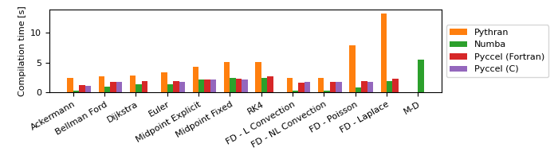
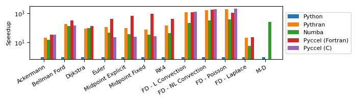
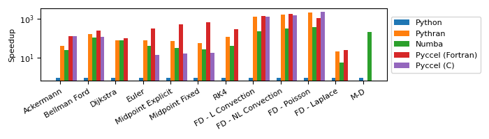
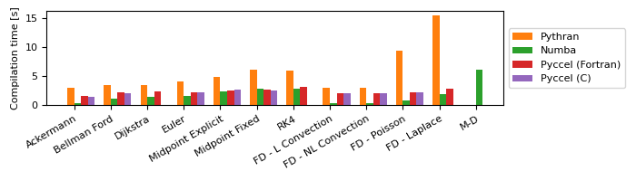
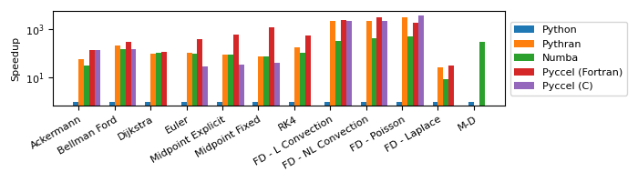
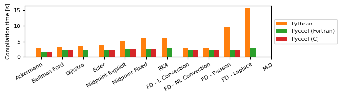
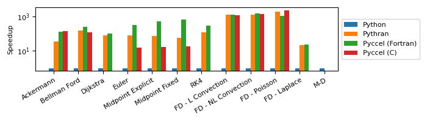

# Benchmarks

Several tests are available for the user to benchmark Pyccel against other common accelerators, notably [pythran](https://pythran.readthedocs.io/en/latest/) and [numba](https://numba.pydata.org/).
The same code is used for all tests, only the decorators change.

The code can be executed by running the script `run_benchmarks.py`.
Additional options can be used with this script to add additional comparisons, change the output format, or change what is generated.

Run `python3 run_benchmarks.py --help` for more details.

The results below are presented for the current state of the development branch of pyccel, as well as the most recent version of pyccel available on pypi.
## Tests used

The tests used can be found in the [benchmark_code/](./benchmark_code) directory

### Ackermann

A basic implementation of the Ackermann function which is one of the simplest and oldest examples of a total computable function that is not primitive recursive.

### Bellman Ford

An algorithm for solving the shortest path problem. The code is adapted from examples written by [J. Burkardt](https://people.sc.fsu.edu/~jburkardt/py_src/py_src.html)

### Djikstra

An algorithm for solving the shortest path problem. The code is adapted from examples written by [J. Burkardt](https://people.sc.fsu.edu/~jburkardt/py_src/py_src.html)

### Euler

Solves an ordinary differential equation using Euler's method. The code is adapted from examples written by [J. Burkardt](https://people.sc.fsu.edu/~jburkardt/py_src/py_src.html)

### Midpoint Explicit

Solves an ordinary differential equation using the explicit midpoint method. The code is adapted from examples written by [J. Burkardt](https://people.sc.fsu.edu/~jburkardt/py_src/py_src.html)

### Midpoint Fixed

Solves an ordinary differential equation using the implicit midpoint method with a fixed number of iterations. The code is adapted from examples written by [J. Burkardt](https://people.sc.fsu.edu/~jburkardt/py_src/py_src.html)

### RK4

Solves an ordinary differential equation using a fourth order Runge-Kutta method. The code is adapted from examples written by [J. Burkardt](https://people.sc.fsu.edu/~jburkardt/py_src/py_src.html)

### FD - Linear Convection

Solves a 1D linear convection problem using Finite Differences methods. The code is adapted from examples written by [L. A. Barba](https://lorenabarba.com/blog/cfd-python-12-steps-to-navier-stokes/)

### FD - Non-Linear Convection

Solves a 1D non-linear convection problem using Finite Differences methods. The code is adapted from examples written by [L. A. Barba](https://lorenabarba.com/blog/cfd-python-12-steps-to-navier-stokes/)

### FD - Poisson

Solves a 2D Poisson problem using Finite Differences methods. The code is adapted from examples written by [L. A. Barba](https://lorenabarba.com/blog/cfd-python-12-steps-to-navier-stokes/)

### FD - Laplace

Solves a 2D Laplace problem using Finite Differences methods. The code is adapted from examples written by [L. A. Barba](https://lorenabarba.com/blog/cfd-python-12-steps-to-navier-stokes/)

### MD

Runs a molecular dynamics simulation. The code is adapted from examples written by [J. Burkardt](https://people.sc.fsu.edu/~jburkardt/py_src/py_src.html)
## Development branch results
### Performance Comparison (as of Tue Nov 22 15:43:53 UTC 2022)
## Compilation time
Algorithm                 | python                    | pythran                   | numba                     | pyccel                    | pyccel_c                 
------------------------- | ------------------------- | ------------------------- | ------------------------- | ------------------------- | -------------------------
Ackermann                 | -                         | 3.27                      | 0.40                      | 1.53                      | 1.51                     
Bellman Ford              | -                         | 3.57                      | 1.13                      | 2.25                      | 2.18                     
Dijkstra                  | -                         | 3.61                      | 1.52                      | 2.42                      | 2.22                     
Euler                     | -                         | 4.26                      | 1.54                      | 2.33                      | 2.28                     
Midpoint Explicit         | -                         | 5.43                      | 2.38                      | 2.70                      | 2.62                     
Midpoint Fixed            | -                         | 6.37                      | 2.75                      | 2.77                      | 2.72                     
RK4                       | -                         | 6.34                      | 2.85                      | 3.44                      | 3.29                     
FD - L Convection         | -                         | 3.15                      | 0.37                      | 2.20                      | 2.15                     
FD - NL Convection        | -                         | 3.15                      | 0.39                      | 2.13                      | 2.24                     
FD - Poisson              | -                         | 9.77                      | 0.89                      | 2.28                      | 2.21                     
FD - Laplace              | -                         | 16.14                     | 2.04                      | 3.07                      | -                        
M-D                       | -                         | -                         | 6.22                      | 3.49                      | 3.19                     

## Execution time
Algorithm                 | python                    | pythran                   | numba                     | pyccel                    | pyccel_c                 
------------------------- | ------------------------- | ------------------------- | ------------------------- | ------------------------- | -------------------------
Ackermann (ms)            | 450.00                    | 13.30                     | 21.60                     | 3.90                      | 3.91                     
Bellman Ford (ns)         | 71100.00                  | 431.00                    | 800.00                    | 263.00                    | 557.00                   
Dijkstra (ns)             | 34600.00                  | 401.00                    | 500.00                    | 326.00                    | 540.00                   
Euler (ms)                | 54.80                     | 0.64                      | 1.33                      | 0.18                      | 3.61                     
Midpoint Explicit (ms)    | 119.00                    | 1.49                      | 3.44                      | 0.20                      | 6.46                     
Midpoint Fixed (ms)       | 582.00                    | 9.46                      | 19.00                     | 0.80                      | 29.80                    
RK4 (ms)                  | 276.00                    | 2.25                      | 6.88                      | 0.30                      | 7.67                     
FD - L Convection (ms)    | 2600.00                   | 2.09                      | 10.90                     | 1.79                      | 1.82                     
FD - NL Convection (ms)   | 3280.00                   | 1.90                      | 10.50                     | 1.84                      | 2.13                     
FD - Poisson (ms)         | 5170.00                   | 2.41                      | 12.40                     | 4.52                      | 2.03                     
FD - Laplace (\textmu s)  | 50.90                     | 2.64                      | 9900.00                   | 2.32                      | -                        
M-D (ms)                  | 55200.00                  | -                         | 257.00                    | 200.00                    | 208.00                   

## Python 3.7 results
### Performance Comparison (as of 1.6.1)
## Compilation time
Algorithm                 | python                    | pythran                   | numba                     | pyccel                    | pyccel_c                 
------------------------- | ------------------------- | ------------------------- | ------------------------- | ------------------------- | -------------------------
Ackermann                 | -                         | 2.44                      | 0.35                      | 1.25                      | 1.14                     
Bellman Ford              | -                         | 2.70                      | 1.01                      | 1.83                      | 1.73                     
Dijkstra                  | -                         | 2.79                      | 1.36                      | 1.94                      | -                        
Euler                     | -                         | 3.33                      | 1.40                      | 1.87                      | 1.80                     
Midpoint Explicit         | -                         | 4.25                      | 2.13                      | 2.23                      | 2.15                     
Midpoint Fixed            | -                         | 5.11                      | 2.42                      | 2.27                      | 2.24                     
RK4                       | -                         | 5.09                      | 2.51                      | 2.65                      | -                        
FD - L Convection         | -                         | 2.41                      | 0.33                      | 1.71                      | 1.73                     
FD - NL Convection        | -                         | 2.45                      | 0.33                      | 1.75                      | 1.76                     
FD - Poisson              | -                         | 7.95                      | 0.80                      | 1.87                      | 1.82                     
FD - Laplace              | -                         | 13.27                     | 1.85                      | 2.31                      | -                        
M-D                       | -                         | -                         | 5.51                      | -                         | -                        

## Execution time
Algorithm                 | python                    | pythran                   | numba                     | pyccel                    | pyccel_c                 
------------------------- | ------------------------- | ------------------------- | ------------------------- | ------------------------- | -------------------------
Ackermann (ms)            | 475.00 $\pm$ 9.00         | 22.00 $\pm$ 0.20          | 32.40 $\pm$ 0.20          | 14.30 $\pm$ 0.00          | 13.60 $\pm$ 0.00         
Bellman Ford (ns)         | 70700.00 $\pm$ 200.00     | 369.00 $\pm$ 1.00         | 540.00 $\pm$ 12.00        | 223.00 $\pm$ 3.00         | 478.00 $\pm$ 4.00        
Dijkstra (ns)             | 33900.00 $\pm$ 300.00     | 371.00 $\pm$ 2.00         | 354.00 $\pm$ 5.00         | 256.00 $\pm$ 1.00         | -                        
Euler (ms)                | 58.90 $\pm$ 0.40          | 0.51 $\pm$ 0.01           | 1.28 $\pm$ 0.02           | 0.14 $\pm$ 0.01           | 2.68 $\pm$ 0.03          
Midpoint Explicit (ms)    | 119.00 $\pm$ 1.00         | 1.20 $\pm$ 0.02           | 3.18 $\pm$ 0.07           | 0.18 $\pm$ 0.01           | 4.82 $\pm$ 0.02          
Midpoint Fixed (ms)       | 590.00 $\pm$ 3.00         | 7.93 $\pm$ 0.08           | 17.50 $\pm$ 0.20          | 0.60 $\pm$ 0.02           | 21.40 $\pm$ 0.20         
RK4 (ms)                  | 278.00 $\pm$ 2.00         | 1.86 $\pm$ 0.01           | 6.37 $\pm$ 0.07           | 0.64 $\pm$ 0.02           | -                        
FD - L Convection (ms)    | 2000.00 $\pm$ 20.00       | 1.66 $\pm$ 0.00           | 9.13 $\pm$ 0.12           | 1.71 $\pm$ 0.00           | 1.50 $\pm$ 0.00          
FD - NL Convection (ms)   | 3030.00 $\pm$ 100.00      | 1.82 $\pm$ 0.01           | 9.44 $\pm$ 0.16           | 1.62 $\pm$ 0.01           | 1.56 $\pm$ 0.00          
FD - Poisson (ms)         | 4370.00 $\pm$ 20.00       | 2.29 $\pm$ 0.01           | 10.90 $\pm$ 0.10          | 3.87 $\pm$ 0.00           | 2.01 $\pm$ 0.00          
FD - Laplace (\textmu s)  | 51.50 $\pm$ 0.40          | 2.43 $\pm$ 0.01           | 8.85 $\pm$ 0.08           | 2.19 $\pm$ 0.01           | -                        
M-D (s)                   | 59.30 $\pm$ 0.50          | -                         | 0.23 $\pm$ 0.00           | -                         | -                        

## Python 3.8 results
### Performance Comparison (as of 1.6.1)
## Compilation time
Algorithm                 | python                    | pythran                   | numba                     | pyccel                    | pyccel_c                 
------------------------- | ------------------------- | ------------------------- | ------------------------- | ------------------------- | -------------------------
Ackermann                 | -                         | 3.14                      | 0.43                      | 1.66                      | 1.41                     
Bellman Ford              | -                         | 3.44                      | 1.15                      | 2.30                      | 2.14                     
Dijkstra                  | -                         | 3.50                      | 1.51                      | 2.42                      | -                        
Euler                     | -                         | 3.99                      | 1.66                      | 2.36                      | 2.18                     
Midpoint Explicit         | -                         | 5.01                      | 2.37                      | 2.59                      | 2.84                     
Midpoint Fixed            | -                         | 6.09                      | 2.75                      | 2.83                      | 2.68                     
RK4                       | -                         | 6.45                      | 2.82                      | 3.23                      | -                        
FD - L Convection         | -                         | 2.89                      | 0.38                      | 2.07                      | 2.02                     
FD - NL Convection        | -                         | 2.87                      | 0.36                      | 2.03                      | 2.17                     
FD - Poisson              | -                         | 9.50                      | 0.84                      | 2.22                      | 2.22                     
FD - Laplace              | -                         | 16.34                     | 2.22                      | 2.66                      | -                        
M-D                       | -                         | -                         | 6.39                      | -                         | -                        

## Execution time
Algorithm                 | python                    | pythran                   | numba                     | pyccel                    | pyccel_c                 
------------------------- | ------------------------- | ------------------------- | ------------------------- | ------------------------- | -------------------------
Ackermann (ms)            | 570.00 $\pm$ 16.00        | 13.80 $\pm$ 0.30          | 21.90 $\pm$ 0.50          | 4.17 $\pm$ 0.16           | 4.16 $\pm$ 0.16          
Bellman Ford (ns)         | 74100.00 $\pm$ 2900.00    | 456.00 $\pm$ 18.00        | 643.00 $\pm$ 8.00         | 283.00 $\pm$ 8.00         | 599.00 $\pm$ 17.00       
Dijkstra (ns)             | 36500.00 $\pm$ 1200.00    | 441.00 $\pm$ 15.00        | 451.00 $\pm$ 11.00        | 343.00 $\pm$ 11.00        | -                        
Euler (ms)                | 53.90 $\pm$ 1.70          | 0.67 $\pm$ 0.01           | 1.34 $\pm$ 0.03           | 0.17 $\pm$ 0.01           | 3.65 $\pm$ 0.08          
Midpoint Explicit (ms)    | 111.00 $\pm$ 4.00         | 1.55 $\pm$ 0.05           | 3.38 $\pm$ 0.07           | 0.21 $\pm$ 0.01           | 6.68 $\pm$ 0.31          
Midpoint Fixed (ms)       | 551.00 $\pm$ 20.00        | 9.63 $\pm$ 0.34           | 19.10 $\pm$ 0.20          | 0.79 $\pm$ 0.04           | 29.30 $\pm$ 0.80         
RK4 (ms)                  | 281.00 $\pm$ 9.00         | 2.25 $\pm$ 0.06           | 6.95 $\pm$ 0.24           | 0.94 $\pm$ 0.04           | -                        
FD - L Convection (ms)    | 2750.00 $\pm$ 50.00       | 2.03 $\pm$ 0.05           | 11.60 $\pm$ 0.40          | 1.95 $\pm$ 0.12           | 2.07 $\pm$ 0.13          
FD - NL Convection (ms)   | 3450.00 $\pm$ 90.00       | 2.09 $\pm$ 0.05           | 10.80 $\pm$ 0.20          | 1.89 $\pm$ 0.05           | 2.21 $\pm$ 0.11          
FD - Poisson (ms)         | 5040.00 $\pm$ 140.00      | 2.33 $\pm$ 0.06           | 12.70 $\pm$ 0.40          | 4.70 $\pm$ 0.16           | 2.13 $\pm$ 0.08          
FD - Laplace (\textmu s)  | 62.10 $\pm$ 1.10          | 2.88 $\pm$ 0.08           | 10.40 $\pm$ 0.40          | 2.50 $\pm$ 0.10           | -                        
M-D (s)                   | 54.80 $\pm$ 1.30          | -                         | 0.26 $\pm$ 0.01           | -                         | -                        

## Python 3.9 results
### Performance Comparison (as of 1.6.1)
## Compilation time
Algorithm                 | python                    | pythran                   | numba                     | pyccel                    | pyccel_c                 
------------------------- | ------------------------- | ------------------------- | ------------------------- | ------------------------- | -------------------------
Ackermann                 | -                         | 3.04                      | 0.42                      | 1.59                      | 1.45                     
Bellman Ford              | -                         | 3.45                      | 1.12                      | 2.27                      | 2.09                     
Dijkstra                  | -                         | 3.54                      | 1.47                      | 2.41                      | -                        
Euler                     | -                         | 4.09                      | 1.55                      | 2.26                      | 2.18                     
Midpoint Explicit         | -                         | 4.89                      | 2.37                      | 2.60                      | 2.66                     
Midpoint Fixed            | -                         | 6.16                      | 2.79                      | 2.68                      | 2.58                     
RK4                       | -                         | 5.90                      | 2.82                      | 3.12                      | -                        
FD - L Convection         | -                         | 3.03                      | 0.37                      | 2.08                      | 2.14                     
FD - NL Convection        | -                         | 2.96                      | 0.37                      | 2.13                      | 2.01                     
FD - Poisson              | -                         | 9.33                      | 0.86                      | 2.24                      | 2.19                     
FD - Laplace              | -                         | 15.45                     | 1.98                      | 2.89                      | -                        
M-D                       | -                         | -                         | 6.05                      | -                         | -                        

## Execution time
Algorithm                 | python                    | pythran                   | numba                     | pyccel                    | pyccel_c                 
------------------------- | ------------------------- | ------------------------- | ------------------------- | ------------------------- | -------------------------
Ackermann (ms)            | 443.00 $\pm$ 7.00         | 13.60 $\pm$ 0.10          | 21.60 $\pm$ 0.30          | 3.95 $\pm$ 0.02           | 3.29 $\pm$ 0.07          
Bellman Ford (ns)         | 69300.00 $\pm$ 1500.00    | 436.00 $\pm$ 5.00         | 649.00 $\pm$ 31.00        | 266.00 $\pm$ 5.00         | 549.00 $\pm$ 16.00       
Dijkstra (ns)             | 34500.00 $\pm$ 200.00     | 409.00 $\pm$ 7.00         | 442.00 $\pm$ 13.00        | 318.00 $\pm$ 6.00         | -                        
Euler (ms)                | 50.70 $\pm$ 1.10          | 0.67 $\pm$ 0.00           | 1.32 $\pm$ 0.02           | 0.16 $\pm$ 0.00           | 3.52 $\pm$ 0.08          
Midpoint Explicit (ms)    | 104.00 $\pm$ 2.00         | 1.53 $\pm$ 0.02           | 3.42 $\pm$ 0.08           | 0.20 $\pm$ 0.01           | 6.51 $\pm$ 0.07          
Midpoint Fixed (ms)       | 531.00 $\pm$ 16.00        | 9.17 $\pm$ 0.18           | 18.80 $\pm$ 0.40          | 0.74 $\pm$ 0.03           | 28.10 $\pm$ 0.50         
RK4 (ms)                  | 258.00 $\pm$ 9.00         | 2.18 $\pm$ 0.04           | 6.84 $\pm$ 0.22           | 0.91 $\pm$ 0.03           | -                        
FD - L Convection (ms)    | 2740.00 $\pm$ 60.00       | 1.76 $\pm$ 0.04           | 11.00 $\pm$ 0.20          | 1.92 $\pm$ 0.08           | 2.01 $\pm$ 0.06          
FD - NL Convection (ms)   | 3300.00 $\pm$ 70.00       | 1.97 $\pm$ 0.04           | 11.00 $\pm$ 0.10          | 1.80 $\pm$ 0.08           | 2.07 $\pm$ 0.06          
FD - Poisson (ms)         | 5050.00 $\pm$ 130.00      | 2.36 $\pm$ 0.05           | 12.40 $\pm$ 0.20          | 4.74 $\pm$ 0.08           | 2.10 $\pm$ 0.02          
FD - Laplace (\textmu s)  | 65.10 $\pm$ 1.10          | 2.69 $\pm$ 0.06           | 10.30 $\pm$ 0.20          | 2.61 $\pm$ 0.07           | -                        
M-D (s)                   | 51.70 $\pm$ 1.10          | -                         | 0.26 $\pm$ 0.01           | -                         | -                        

## Python 3.10 results
### Performance Comparison (as of 1.6.1)
## Compilation time
Algorithm                 | python                    | pythran                   | numba                     | pyccel                    | pyccel_c                 
------------------------- | ------------------------- | ------------------------- | ------------------------- | ------------------------- | -------------------------
Ackermann                 | -                         | 2.26                      | 0.30                      | 1.16                      | 1.07                     
Bellman Ford              | -                         | 2.55                      | 0.86                      | 1.64                      | 1.57                     
Dijkstra                  | -                         | 2.59                      | 1.13                      | 1.71                      | -                        
Euler                     | -                         | 2.99                      | 0.97                      | 1.64                      | 1.60                     
Midpoint Explicit         | -                         | 3.71                      | 1.35                      | 1.97                      | 1.92                     
Midpoint Fixed            | -                         | 4.48                      | 1.44                      | 2.04                      | 2.00                     
RK4                       | -                         | 4.36                      | 1.48                      | 2.36                      | -                        
FD - L Convection         | -                         | 2.26                      | 0.27                      | 1.56                      | 1.55                     
FD - NL Convection        | -                         | 2.26                      | 0.27                      | 1.55                      | 1.55                     
FD - Poisson              | -                         | 6.92                      | 0.62                      | 1.61                      | 1.62                     
FD - Laplace              | -                         | 11.27                     | 1.28                      | 2.07                      | -                        
M-D                       | -                         | -                         | 2.89                      | -                         | -                        

## Execution time
Algorithm                 | python                    | pythran                   | numba                     | pyccel                    | pyccel_c                 
------------------------- | ------------------------- | ------------------------- | ------------------------- | ------------------------- | -------------------------
Ackermann (ms)            | 391.00 $\pm$ 4.00         | 6.67 $\pm$ 0.06           | 12.70 $\pm$ 0.40          | 2.99 $\pm$ 0.01           | 2.99 $\pm$ 0.01          
Bellman Ford (ns)         | 66000.00 $\pm$ 800.00     | 328.00 $\pm$ 9.00         | 441.00 $\pm$ 5.00         | 232.00 $\pm$ 7.00         | 435.00 $\pm$ 7.00        
Dijkstra (ns)             | 30900.00 $\pm$ 400.00     | 321.00 $\pm$ 7.00         | 294.00 $\pm$ 5.00         | 283.00 $\pm$ 8.00         | -                        
Euler (\textmu s)         | 56600.00 $\pm$ 1100.00    | 566.00 $\pm$ 18.00        | 574.00 $\pm$ 3.00         | 146.00 $\pm$ 3.00         | 2070.00 $\pm$ 30.00      
Midpoint Explicit (ms)    | 116.00 $\pm$ 2.00         | 1.30 $\pm$ 0.03           | 1.32 $\pm$ 0.02           | 0.19 $\pm$ 0.00           | 3.55 $\pm$ 0.02          
Midpoint Fixed (ms)       | 585.00 $\pm$ 7.00         | 7.99 $\pm$ 0.18           | 7.75 $\pm$ 0.04           | 0.50 $\pm$ 0.00           | 14.60 $\pm$ 0.20         
RK4 (ms)                  | 294.00 $\pm$ 5.00         | 1.73 $\pm$ 0.03           | 2.81 $\pm$ 0.03           | 0.55 $\pm$ 0.01           | -                        
FD - L Convection (ms)    | 2540.00 $\pm$ 60.00       | 1.13 $\pm$ 0.14           | 8.02 $\pm$ 0.04           | 1.06 $\pm$ 0.01           | 1.13 $\pm$ 0.18          
FD - NL Convection (ms)   | 3230.00 $\pm$ 60.00       | 1.44 $\pm$ 0.06           | 7.98 $\pm$ 0.30           | 1.05 $\pm$ 0.02           | 1.48 $\pm$ 0.17          
FD - Poisson (ms)         | 4900.00 $\pm$ 70.00       | 1.58 $\pm$ 0.01           | 9.93 $\pm$ 0.04           | 2.77 $\pm$ 0.02           | 1.31 $\pm$ 0.02          
FD - Laplace (\textmu s)  | 56.80 $\pm$ 1.00          | 2.21 $\pm$ 0.01           | 6.84 $\pm$ 0.05           | 1.77 $\pm$ 0.03           | -                        
M-D (s)                   | 56.70 $\pm$ 1.30          | -                         | 0.20 $\pm$ 0.00           | -                         | -                        

## Python 3.11 results
### Performance Comparison (as of 1.6.1)
## Compilation time
Algorithm                 | python                    | pythran                   | pyccel                    | pyccel_c                 
------------------------- | ------------------------- | ------------------------- | ------------------------- | -------------------------
Ackermann                 | -                         | 3.13                      | 1.59                      | 1.43                     
Bellman Ford              | -                         | 3.44                      | 2.22                      | 2.12                     
Dijkstra                  | -                         | 3.46                      | 2.33                      | -                        
Euler                     | -                         | 4.06                      | 2.26                      | 2.21                     
Midpoint Explicit         | -                         | 5.08                      | 2.64                      | 2.57                     
Midpoint Fixed            | -                         | 6.08                      | 2.69                      | 2.65                     
RK4                       | -                         | 6.01                      | 3.10                      | -                        
FD - L Convection         | -                         | 3.12                      | 2.10                      | 2.09                     
FD - NL Convection        | -                         | 3.11                      | 2.11                      | 2.11                     
FD - Poisson              | -                         | 9.65                      | 2.25                      | 2.19                     
FD - Laplace              | -                         | 15.71                     | 2.84                      | -                        
M-D                       | -                         | -                         | -                         | -                        

## Execution time
Algorithm                 | python                    | pythran                   | pyccel                    | pyccel_c                 
------------------------- | ------------------------- | ------------------------- | ------------------------- | -------------------------
Ackermann (ms)            | 504.00 $\pm$ 3.00         | 13.60 $\pm$ 0.20          | 3.94 $\pm$ 0.03           | 3.39 $\pm$ 0.05          
Bellman Ford (ns)         | 70800.00 $\pm$ 1500.00    | 443.00 $\pm$ 6.00         | 270.00 $\pm$ 7.00         | 575.00 $\pm$ 6.00        
Dijkstra (ns)             | 32800.00 $\pm$ 500.00     | 417.00 $\pm$ 7.00         | 326.00 $\pm$ 2.00         | -                        
Euler (\textmu s)         | 55000.00 $\pm$ 600.00     | 665.00 $\pm$ 6.00         | 163.00 $\pm$ 4.00         | 3630.00 $\pm$ 30.00      
Midpoint Explicit (ms)    | 111.00 $\pm$ 2.00         | 1.52 $\pm$ 0.01           | 0.21 $\pm$ 0.01           | 6.45 $\pm$ 0.07          
Midpoint Fixed (ms)       | 544.00 $\pm$ 7.00         | 9.49 $\pm$ 0.04           | 0.81 $\pm$ 0.03           | 28.30 $\pm$ 0.30         
RK4 (ms)                  | 274.00 $\pm$ 3.00         | 2.21 $\pm$ 0.01           | 0.90 $\pm$ 0.01           | -                        
FD - L Convection (ms)    | 2420.00 $\pm$ 40.00       | 1.79 $\pm$ 0.03           | 1.91 $\pm$ 0.04           | 2.07 $\pm$ 0.04          
FD - NL Convection (ms)   | 3090.00 $\pm$ 40.00       | 2.26 $\pm$ 0.02           | 1.92 $\pm$ 0.04           | 2.18 $\pm$ 0.04          
FD - Poisson (ms)         | 5040.00 $\pm$ 50.00       | 2.44 $\pm$ 0.01           | 4.66 $\pm$ 0.03           | 2.11 $\pm$ 0.01          
FD - Laplace (\textmu s)  | 63.00 $\pm$ 1.00          | 2.81 $\pm$ 0.04           | 2.68 $\pm$ 0.02           | -                        
M-D (s)                   | 53.70 $\pm$ 1.60          | -                         | -                         | -                        

