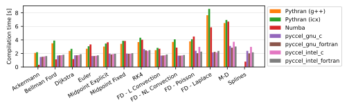
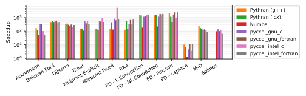
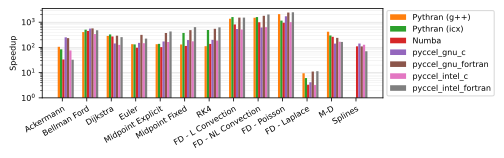
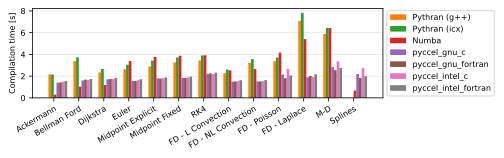
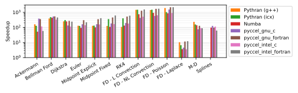
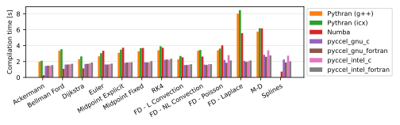
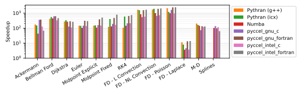

# Benchmarks

Several tests are available for the user to benchmark Pyccel against other common accelerators, notably [pythran](https://pythran.readthedocs.io/en/latest/) and [numba](https://numba.pydata.org/).
The same code is used for all tests, only the decorators change.

The dependencies can be installed using the command `python3 -m pip install .`

The code can be executed by running the script `benchmarks/run_benchmarks.py`.

In order to test pyccel and/or pythran, configuration files must be provided. An example configuration for pythran is found in [`benchmarks/config.pythranrc`](./benchmarks/config.pythranrc). This configuration is the default pythran configuration with the following additional flags:
- `-O3`
- `-march=native`
- `-mtune=native`
- `-mavx`
- `-ffast-math`

Pyccel configurations valid for your machine can be generated using the following command (which may be adapted for another compiler family, see the [pyccel documentation](https://pyccel.github.io/pyccel/docs/compiler.html)):
```
pyccel --compiler-family intel --export-compiler-config pyccel_intel.json
```
This configuration can then be modified to include additional flags or use different compilers. The tests shown below add the following additional flags (which match the flags added to pythran):
- `-O3`
- `-march=native`
- `-mtune=native`
- `-mavx`
- `-ffast-math`

Additional options can be used with this script to add further comparisons, change the output format, or change what is generated.

Run `python3 benchmarks/run_benchmarks.py --help` for more details.

The results below are presented for the current state of the development branch of pyccel, as well as the most recent version of pyccel available on pypi.

A requirements.txt file providing the necessary packages to reproduce the tests run can be found in the `version_specific_results` folder.
The environment can be reproduced using the following commands:
```
python3 -m venv my_virtual_environment
source my_virtual_environment/bin/activate
pip3 install -r requirements.txt
```
## Tests used

The tests used can be found in the [benchmarks/tests](./benchmarks/tests) directory.

### Ackermann

A basic implementation of the Ackermann function which is one of the simplest and oldest examples of a total computable function that is not primitive recursive.

### Bellman Ford

An algorithm for solving the shortest path problem. The code is adapted from examples written by [J. Burkardt](https://people.sc.fsu.edu/~jburkardt/py_src/py_src.html)

### Djikstra

An algorithm for solving the shortest path problem. The code is adapted from examples written by [J. Burkardt](https://people.sc.fsu.edu/~jburkardt/py_src/py_src.html)

### Euler

Solves an ordinary differential equation using Euler's method. The code is adapted from examples written by [J. Burkardt](https://people.sc.fsu.edu/~jburkardt/py_src/py_src.html)

### Midpoint Explicit

Solves an ordinary differential equation using the explicit midpoint method. The code is adapted from examples written by [J. Burkardt](https://people.sc.fsu.edu/~jburkardt/py_src/py_src.html)

### Midpoint Fixed

Solves an ordinary differential equation using the implicit midpoint method with a fixed number of iterations. The code is adapted from examples written by [J. Burkardt](https://people.sc.fsu.edu/~jburkardt/py_src/py_src.html)

### RK4

Solves an ordinary differential equation using a fourth order Runge-Kutta method. The code is adapted from examples written by [J. Burkardt](https://people.sc.fsu.edu/~jburkardt/py_src/py_src.html)

### FD - Linear Convection

Solves a 1D linear convection problem using Finite Differences methods. The code is adapted from examples written by [L. A. Barba](https://lorenabarba.com/blog/cfd-python-12-steps-to-navier-stokes/)

### FD - Non-Linear Convection

Solves a 1D non-linear convection problem using Finite Differences methods. The code is adapted from examples written by [L. A. Barba](https://lorenabarba.com/blog/cfd-python-12-steps-to-navier-stokes/)

### FD - Poisson

Solves a 2D Poisson problem using Finite Differences methods. The code is adapted from examples written by [L. A. Barba](https://lorenabarba.com/blog/cfd-python-12-steps-to-navier-stokes/)

### FD - Laplace

Solves a 2D Laplace problem using Finite Differences methods. The code is adapted from examples written by [L. A. Barba](https://lorenabarba.com/blog/cfd-python-12-steps-to-navier-stokes/)

### MD

Runs a molecular dynamics simulation. The code is adapted from examples written by [J. Burkardt](https://people.sc.fsu.edu/~jburkardt/py_src/py_src.html)

### Splines

Evaluates a non-uniform spline saved as a class instance at a large number of test points. The code uses Algorithm A2.2 from the NURBS book (Piegl, Les, and Wayne Tiller. The NURBS book. Springer Science & Business Media, 2012.).
## Development branch results
### Performance Comparison (as of Mon Mar  9 09:49:01 UTC 2026)
## Compilation time
Algorithm                 | python                    | pythran_gnu               | pythran_intel             | numba                     | pyccel_gnu_c              | pyccel_gnu_fortran        | pyccel_intel_c            | pyccel_intel_fortran     
------------------------- | ------------------------- | ------------------------- | ------------------------- | ------------------------- | ------------------------- | ------------------------- | ------------------------- | -------------------------
Ackermann                 | -                         | 2.10                      | 2.20                      | 0.32                      | 1.48                      | 1.51                      | 1.52                      | 1.66                     
Bellman Ford              | -                         | 3.52                      | 3.84                      | 1.12                      | 1.66                      | 1.65                      | 1.69                      | 1.77                     
Dijkstra                  | -                         | 2.40                      | 2.76                      | 1.18                      | 1.73                      | 1.73                      | 1.76                      | 1.88                     
Euler                     | -                         | 2.72                      | 3.15                      | 3.31                      | 1.63                      | 1.62                      | 1.67                      | 1.74                     
Midpoint Explicit         | -                         | 3.07                      | 3.55                      | 3.67                      | 1.86                      | 1.98                      | 1.90                      | 1.97                     
Midpoint Fixed            | -                         | 3.38                      | 3.88                      | 3.82                      | 1.96                      | 1.95                      | 1.98                      | 2.09                     
RK4                       | -                         | 3.66                      | 4.13                      | 3.85                      | 2.40                      | 2.35                      | 2.31                      | 2.46                     
FD - L Convection         | -                         | 2.41                      | 2.81                      | 2.60                      | 1.58                      | 1.59                      | 1.71                      | 1.70                     
FD - NL Convection        | -                         | 3.45                      | 3.74                      | 2.69                      | 1.60                      | 1.59                      | 1.62                      | 1.75                     
FD - Poisson              | -                         | 3.61                      | 3.89                      | 4.22                      | 2.22                      | 1.89                      | 2.75                      | 2.13                     
FD - Laplace              | -                         | 7.20                      | 8.00                      | 5.53                      | 2.05                      | 2.05                      | 1.97                      | 2.20                     
M-D                       | -                         | 6.13                      | 6.60                      | 6.38                      | 2.94                      | 2.71                      | 3.49                      | 2.93                     
Splines                   | -                         | -                         | -                         | 0.77                      | 2.27                      | 1.89                      | 2.81                      | 2.05                     

## Execution time
Algorithm                 | python                    | pythran_gnu               | pythran_intel             | numba                     | pyccel_gnu_c              | pyccel_gnu_fortran        | pyccel_intel_c            | pyccel_intel_fortran     
------------------------- | ------------------------- | ------------------------- | ------------------------- | ------------------------- | ------------------------- | ------------------------- | ------------------------- | -------------------------
Ackermann (ms)            | 478.00                    | 2.70                      | 3.67                      | 8.57                      | 1.33                      | 1.27                      | 3.70                      | 9.28                     
Bellman Ford (ms)         | 2040.00                   | 4.60                      | 3.50                      | 4.07                      | 3.26                      | 3.30                      | 5.48                      | 4.16                     
Dijkstra (ms)             | 5660.00                   | 17.50                     | 15.20                     | 19.20                     | 35.90                     | 17.90                     | 39.50                     | 20.00                    
Euler (ms)                | 3760.00                   | 26.00                     | 28.30                     | 35.70                     | 23.40                     | 10.70                     | 24.30                     | 14.70                    
Midpoint Explicit (ms)    | 7580.00                   | 53.60                     | 50.80                     | 68.80                     | 40.50                     | 19.90                     | 42.40                     | 15.60                    
Midpoint Fixed (ms)       | 37900.00                  | 269.00                    | 93.10                     | 309.00                    | 180.00                    | 75.30                     | 201.00                    | 51.00                    
RK4 (ms)                  | 18700.00                  | 156.00                    | 35.50                     | 124.00                    | 86.40                     | 32.00                     | 90.40                     | 30.00                    
FD - L Convection (ms)    | 2370.00                   | 1.52                      | 1.60                      | 2.82                      | 4.28                      | 1.77                      | 4.55                      | 1.55                     
FD - NL Convection (ms)   | 3050.00                   | 1.99                      | 1.70                      | 2.88                      | 4.69                      | 1.53                      | 4.42                      | 1.45                     
FD - Poisson (ms)         | 6460.00                   | 3.01                      | 5.56                      | 6.49                      | 3.74                      | 2.65                      | 6.51                      | 2.57                     
FD - Laplace (ms)         | 708.00                    | 64.10                     | 105.00                    | 189.00                    | 151.00                    | 61.30                     | 193.00                    | 55.50                    
M-D (ms)                  | 8600.00                   | 35.40                     | 50.40                     | 56.80                     | 106.00                    | 62.10                     | 89.10                     | 90.60                    
Splines (ms)              | 1730.00                   | -                         | -                         | 17.90                     | 13.60                     | 19.60                     | 15.10                     | 27.80                    



## Python 3.10 results
### Performance Comparison (as of 2.2.1)
## Compilation time
Algorithm                 | python                    | pythran_gnu               | pythran_intel             | numba                     | pyccel_gnu_c              | pyccel_gnu_fortran        | pyccel_intel_c            | pyccel_intel_fortran     
------------------------- | ------------------------- | ------------------------- | ------------------------- | ------------------------- | ------------------------- | ------------------------- | ------------------------- | -------------------------
Ackermann                 | -                         | 2.06                      | 2.09                      | 0.34                      | 1.40                      | 1.44                      | 1.45                      | 1.52                     
Bellman Ford              | -                         | 3.45                      | 3.76                      | 1.02                      | 1.60                      | 1.59                      | 1.63                      | 1.69                     
Dijkstra                  | -                         | 2.41                      | 2.70                      | 1.16                      | 1.68                      | 1.69                      | 1.73                      | 1.85                     
Euler                     | -                         | 2.65                      | 3.10                      | 3.34                      | 1.56                      | 1.56                      | 1.60                      | 1.68                     
Midpoint Explicit         | -                         | 2.98                      | 3.46                      | 3.80                      | 1.79                      | 1.80                      | 1.82                      | 1.92                     
Midpoint Fixed            | -                         | 3.39                      | 3.84                      | 3.90                      | 1.86                      | 1.84                      | 1.87                      | 1.95                     
RK4                       | -                         | 3.51                      | 4.02                      | 3.93                      | 2.22                      | 2.28                      | 2.23                      | 2.37                     
FD - L Convection         | -                         | 2.34                      | 2.64                      | 2.57                      | 1.52                      | 1.52                      | 1.55                      | 1.63                     
FD - NL Convection        | -                         | 3.29                      | 3.61                      | 2.72                      | 1.52                      | 1.53                      | 1.55                      | 1.63                     
FD - Poisson              | -                         | 3.51                      | 3.84                      | 4.47                      | 2.15                      | 1.82                      | 2.64                      | 2.06                     
FD - Laplace              | -                         | 6.97                      | 7.83                      | 5.71                      | 1.92                      | 1.98                      | 1.90                      | 2.11                     
M-D                       | -                         | 6.17                      | 6.48                      | 6.44                      | 2.88                      | 2.65                      | 3.44                      | 2.82                     
Splines                   | -                         | -                         | -                         | 0.66                      | 2.21                      | 1.83                      | 2.73                      | 1.99                     

## Execution time
Algorithm                 | python                    | pythran_gnu               | pythran_intel             | numba                     | pyccel_gnu_c              | pyccel_gnu_fortran        | pyccel_intel_c            | pyccel_intel_fortran     
------------------------- | ------------------------- | ------------------------- | ------------------------- | ------------------------- | ------------------------- | ------------------------- | ------------------------- | -------------------------
Ackermann (ms)            | 314.00 $\pm$ 4.00         | 2.94 $\pm$ 0.04           | 3.67 $\pm$ 0.01           | 8.96 $\pm$ 0.50           | 1.23 $\pm$ 0.00           | 1.33 $\pm$ 0.00           | 4.37 $\pm$ 0.02           | 9.27 $\pm$ 0.13          
Bellman Ford (ms)         | 1840.00 $\pm$ 40.00       | 4.53 $\pm$ 0.02           | 3.62 $\pm$ 0.06           | 4.08 $\pm$ 0.04           | 3.30 $\pm$ 0.03           | 3.25 $\pm$ 0.02           | 5.36 $\pm$ 0.01           | 3.83 $\pm$ 0.01          
Dijkstra (ms)             | 5060.00 $\pm$ 50.00       | 17.90 $\pm$ 0.30          | 15.40 $\pm$ 0.10          | 18.40 $\pm$ 0.60          | 35.40 $\pm$ 0.70          | 17.60 $\pm$ 0.90          | 40.30 $\pm$ 0.40          | 20.10 $\pm$ 0.20         
Euler (ms)                | 3420.00 $\pm$ 50.00       | 25.70 $\pm$ 0.50          | 26.10 $\pm$ 0.50          | 35.50 $\pm$ 0.50          | 22.90 $\pm$ 1.10          | 10.90 $\pm$ 0.40          | 23.30 $\pm$ 0.30          | 15.40 $\pm$ 0.50         
Midpoint Explicit (ms)    | 6930.00 $\pm$ 40.00       | 52.80 $\pm$ 3.90          | 52.30 $\pm$ 5.10          | 66.60 $\pm$ 0.60          | 41.00 $\pm$ 1.90          | 19.20 $\pm$ 0.50          | 42.70 $\pm$ 0.60          | 15.50 $\pm$ 0.30         
Midpoint Fixed (ms)       | 34900.00 $\pm$ 200.00     | 270.00 $\pm$ 4.00         | 95.40 $\pm$ 7.10          | 306.00 $\pm$ 1.00         | 179.00 $\pm$ 0.00         | 72.20 $\pm$ 0.40          | 208.00 $\pm$ 18.00        | 50.60 $\pm$ 0.50         
RK4 (ms)                  | 17100.00 $\pm$ 100.00     | 152.00 $\pm$ 2.00         | 35.40 $\pm$ 0.70          | 125.00 $\pm$ 4.00         | 86.00 $\pm$ 0.40          | 31.60 $\pm$ 0.50          | 90.70 $\pm$ 1.70          | 27.90 $\pm$ 0.40         
FD - L Convection (ms)    | 2290.00 $\pm$ 20.00       | 1.67 $\pm$ 0.03           | 1.48 $\pm$ 0.03           | 2.85 $\pm$ 0.04           | 4.29 $\pm$ 0.02           | 1.54 $\pm$ 0.05           | 3.97 $\pm$ 0.04           | 1.52 $\pm$ 0.05          
FD - NL Convection (ms)   | 2890.00 $\pm$ 20.00       | 1.90 $\pm$ 0.06           | 1.81 $\pm$ 0.03           | 2.88 $\pm$ 0.01           | 4.73 $\pm$ 0.19           | 1.63 $\pm$ 0.06           | 4.52 $\pm$ 0.03           | 1.52 $\pm$ 0.02          
FD - Poisson (ms)         | 6290.00 $\pm$ 40.00       | 2.90 $\pm$ 0.05           | 5.52 $\pm$ 0.10           | 6.66 $\pm$ 0.04           | 3.68 $\pm$ 0.02           | 2.60 $\pm$ 0.02           | 6.30 $\pm$ 0.03           | 2.54 $\pm$ 0.03          
FD - Laplace (ms)         | 633.00 $\pm$ 4.00         | 67.50 $\pm$ 0.80          | 103.00 $\pm$ 1.00         | 190.00 $\pm$ 1.00         | 151.00 $\pm$ 0.00         | 56.70 $\pm$ 0.20          | 194.00 $\pm$ 2.00         | 58.30 $\pm$ 2.40         
M-D (ms)                  | 15000.00 $\pm$ 100.00     | 36.50 $\pm$ 2.30          | 50.70 $\pm$ 0.40          | 57.10 $\pm$ 0.30          | 106.00 $\pm$ 0.00         | 62.30 $\pm$ 0.20          | 88.80 $\pm$ 0.10          | 90.60 $\pm$ 0.10         
Splines (ms)              | 1960.00 $\pm$ 40.00       | -                         | -                         | 17.70 $\pm$ 0.10          | 13.60 $\pm$ 0.00          | 17.60 $\pm$ 0.10          | 15.10 $\pm$ 0.00          | 27.80 $\pm$ 0.10         



## Python 3.11 results
### Performance Comparison (as of 2.2.1)
## Compilation time
Algorithm                 | python                    | pythran_gnu               | pythran_intel             | numba                     | pyccel_gnu_c              | pyccel_gnu_fortran        | pyccel_intel_c            | pyccel_intel_fortran     
------------------------- | ------------------------- | ------------------------- | ------------------------- | ------------------------- | ------------------------- | ------------------------- | ------------------------- | -------------------------
Ackermann                 | -                         | 2.13                      | 2.10                      | 0.30                      | 1.41                      | 1.43                      | 1.45                      | 1.52                     
Bellman Ford              | -                         | 3.36                      | 3.70                      | 1.05                      | 1.59                      | 1.61                      | 1.63                      | 1.71                     
Dijkstra                  | -                         | 2.35                      | 2.63                      | 1.12                      | 1.68                      | 1.71                      | 1.73                      | 1.83                     
Euler                     | -                         | 2.70                      | 3.16                      | 3.52                      | 1.69                      | 1.64                      | 1.63                      | 1.73                     
Midpoint Explicit         | -                         | 2.96                      | 3.57                      | 3.95                      | 1.80                      | 1.82                      | 1.84                      | 1.89                     
Midpoint Fixed            | -                         | 3.27                      | 3.70                      | 3.90                      | 1.85                      | 1.81                      | 1.86                      | 1.94                     
RK4                       | -                         | 3.51                      | 3.96                      | 4.05                      | 2.30                      | 2.26                      | 2.33                      | 2.56                     
FD - L Convection         | -                         | 2.45                      | 2.66                      | 2.57                      | 1.50                      | 1.54                      | 1.55                      | 1.65                     
FD - NL Convection        | -                         | 3.27                      | 3.68                      | 2.71                      | 1.52                      | 1.53                      | 1.54                      | 1.63                     
FD - Poisson              | -                         | 3.64                      | 3.77                      | 4.20                      | 2.17                      | 1.84                      | 2.68                      | 2.08                     
FD - Laplace              | -                         | 6.94                      | 7.87                      | 5.42                      | 1.94                      | 1.94                      | 1.88                      | 2.08                     
M-D                       | -                         | 5.83                      | 6.45                      | 6.40                      | 2.81                      | 2.56                      | 3.35                      | 2.72                     
Splines                   | -                         | -                         | -                         | 0.67                      | 2.17                      | 1.83                      | 2.78                      | 1.99                     

## Execution time
Algorithm                 | python                    | pythran_gnu               | pythran_intel             | numba                     | pyccel_gnu_c              | pyccel_gnu_fortran        | pyccel_intel_c            | pyccel_intel_fortran     
------------------------- | ------------------------- | ------------------------- | ------------------------- | ------------------------- | ------------------------- | ------------------------- | ------------------------- | -------------------------
Ackermann (ms)            | 476.00 $\pm$ 7.00         | 2.93 $\pm$ 0.03           | 3.67 $\pm$ 0.01           | 9.29 $\pm$ 0.46           | 1.24 $\pm$ 0.00           | 1.32 $\pm$ 0.00           | 4.07 $\pm$ 0.07           | 9.33 $\pm$ 0.15          
Bellman Ford (ms)         | 1770.00 $\pm$ 20.00       | 4.52 $\pm$ 0.01           | 3.60 $\pm$ 0.03           | 4.07 $\pm$ 0.04           | 3.32 $\pm$ 0.09           | 3.29 $\pm$ 0.09           | 5.41 $\pm$ 0.09           | 3.85 $\pm$ 0.01          
Dijkstra (ms)             | 4850.00 $\pm$ 40.00       | 19.00 $\pm$ 0.20          | 15.00 $\pm$ 0.10          | 18.90 $\pm$ 0.50          | 34.70 $\pm$ 0.40          | 17.70 $\pm$ 0.20          | 39.30 $\pm$ 0.30          | 19.20 $\pm$ 0.20         
Euler (ms)                | 3340.00 $\pm$ 20.00       | 25.80 $\pm$ 0.40          | 27.30 $\pm$ 1.30          | 35.90 $\pm$ 0.90          | 22.90 $\pm$ 0.70          | 11.00 $\pm$ 0.60          | 23.80 $\pm$ 0.80          | 15.50 $\pm$ 0.50         
Midpoint Explicit (ms)    | 6780.00 $\pm$ 80.00       | 52.20 $\pm$ 0.70          | 51.60 $\pm$ 0.60          | 67.20 $\pm$ 0.40          | 40.40 $\pm$ 0.40          | 19.40 $\pm$ 0.40          | 42.80 $\pm$ 0.70          | 16.40 $\pm$ 1.20         
Midpoint Fixed (ms)       | 33900.00 $\pm$ 300.00     | 268.00 $\pm$ 3.00         | 94.20 $\pm$ 0.50          | 307.00 $\pm$ 5.00         | 178.00 $\pm$ 1.00         | 73.40 $\pm$ 1.60          | 201.00 $\pm$ 1.00         | 50.30 $\pm$ 0.40         
RK4 (ms)                  | 16900.00 $\pm$ 100.00     | 157.00 $\pm$ 7.00         | 35.30 $\pm$ 0.60          | 125.00 $\pm$ 2.00         | 85.80 $\pm$ 1.70          | 32.60 $\pm$ 0.50          | 91.50 $\pm$ 0.50          | 28.00 $\pm$ 0.40         
FD - L Convection (ms)    | 2090.00 $\pm$ 20.00       | 1.47 $\pm$ 0.09           | 1.53 $\pm$ 0.06           | 2.84 $\pm$ 0.04           | 4.72 $\pm$ 0.39           | 1.68 $\pm$ 0.10           | 4.11 $\pm$ 0.20           | 1.52 $\pm$ 0.02          
FD - NL Convection (ms)   | 2620.00 $\pm$ 20.00       | 2.00 $\pm$ 0.02           | 1.81 $\pm$ 0.06           | 2.90 $\pm$ 0.06           | 4.69 $\pm$ 0.00           | 1.63 $\pm$ 0.06           | 4.49 $\pm$ 0.05           | 1.53 $\pm$ 0.01          
FD - Poisson (ms)         | 5750.00 $\pm$ 100.00      | 3.03 $\pm$ 0.06           | 5.54 $\pm$ 0.04           | 6.67 $\pm$ 0.07           | 3.80 $\pm$ 0.03           | 2.69 $\pm$ 0.04           | 6.36 $\pm$ 0.03           | 2.60 $\pm$ 0.03          
FD - Laplace (ms)         | 707.00 $\pm$ 15.00        | 64.60 $\pm$ 1.50          | 104.00 $\pm$ 1.00         | 190.00 $\pm$ 1.00         | 151.00 $\pm$ 0.00         | 61.10 $\pm$ 0.50          | 193.00 $\pm$ 1.00         | 59.80 $\pm$ 0.50         
M-D (ms)                  | 8060.00 $\pm$ 150.00      | 34.70 $\pm$ 0.30          | 50.40 $\pm$ 0.30          | 57.00 $\pm$ 0.10          | 106.00 $\pm$ 0.00         | 62.30 $\pm$ 0.30          | 89.20 $\pm$ 0.10          | 90.70 $\pm$ 0.10         
Splines (ms)              | 1670.00 $\pm$ 30.00       | -                         | -                         | 18.10 $\pm$ 0.20          | 13.70 $\pm$ 0.10          | 17.80 $\pm$ 0.10          | 15.20 $\pm$ 0.10          | 27.90 $\pm$ 0.20         



## Python 3.12 results
### Performance Comparison (as of 2.2.1)
## Compilation time
Algorithm                 | python                    | pythran_gnu               | pythran_intel             | numba                     | pyccel_gnu_c              | pyccel_gnu_fortran        | pyccel_intel_c            | pyccel_intel_fortran     
------------------------- | ------------------------- | ------------------------- | ------------------------- | ------------------------- | ------------------------- | ------------------------- | ------------------------- | -------------------------
Ackermann                 | -                         | 2.08                      | 2.27                      | 0.31                      | 1.48                      | 1.54                      | 1.50                      | 1.61                     
Bellman Ford              | -                         | 3.51                      | 3.76                      | 1.12                      | 1.65                      | 1.67                      | 1.68                      | 1.79                     
Dijkstra                  | -                         | 2.43                      | 2.80                      | 1.24                      | 1.76                      | 1.77                      | 1.76                      | 1.91                     
Euler                     | -                         | 2.83                      | 3.31                      | 3.41                      | 1.67                      | 1.66                      | 1.68                      | 1.78                     
Midpoint Explicit         | -                         | 3.03                      | 3.48                      | 3.65                      | 1.85                      | 1.87                      | 1.87                      | 1.95                     
Midpoint Fixed            | -                         | 3.41                      | 3.87                      | 3.89                      | 1.94                      | 1.95                      | 1.97                      | 2.04                     
RK4                       | -                         | 3.56                      | 4.08                      | 3.85                      | 2.34                      | 2.36                      | 2.37                      | 2.41                     
FD - L Convection         | -                         | 2.37                      | 2.75                      | 2.58                      | 1.57                      | 1.57                      | 1.60                      | 1.69                     
FD - NL Convection        | -                         | 3.45                      | 3.74                      | 2.68                      | 1.58                      | 1.58                      | 1.59                      | 1.69                     
FD - Poisson              | -                         | 3.50                      | 3.85                      | 4.18                      | 2.20                      | 1.89                      | 2.68                      | 2.14                     
FD - Laplace              | -                         | 7.03                      | 7.78                      | 5.46                      | 1.98                      | 2.01                      | 1.98                      | 2.16                     
M-D                       | -                         | 5.92                      | 6.50                      | 6.28                      | 2.92                      | 2.68                      | 3.45                      | 2.83                     
Splines                   | -                         | -                         | -                         | 0.76                      | 2.24                      | 1.94                      | 2.75                      | 2.03                     

## Execution time
Algorithm                 | python                    | pythran_gnu               | pythran_intel             | numba                     | pyccel_gnu_c              | pyccel_gnu_fortran        | pyccel_intel_c            | pyccel_intel_fortran     
------------------------- | ------------------------- | ------------------------- | ------------------------- | ------------------------- | ------------------------- | ------------------------- | ------------------------- | -------------------------
Ackermann (ms)            | 487.00 $\pm$ 6.00         | 2.71 $\pm$ 0.02           | 3.67 $\pm$ 0.01           | 9.28 $\pm$ 0.44           | 1.33 $\pm$ 0.01           | 1.28 $\pm$ 0.01           | 3.72 $\pm$ 0.04           | 9.30 $\pm$ 0.21          
Bellman Ford (ms)         | 2100.00 $\pm$ 10.00       | 4.64 $\pm$ 0.14           | 3.65 $\pm$ 0.31           | 4.07 $\pm$ 0.04           | 3.29 $\pm$ 0.03           | 3.25 $\pm$ 0.02           | 5.40 $\pm$ 0.03           | 4.18 $\pm$ 0.01          
Dijkstra (ms)             | 5600.00 $\pm$ 40.00       | 17.70 $\pm$ 0.10          | 15.50 $\pm$ 0.10          | 19.90 $\pm$ 0.60          | 36.50 $\pm$ 0.30          | 17.00 $\pm$ 0.10          | 40.10 $\pm$ 0.20          | 20.90 $\pm$ 0.40         
Euler (ms)                | 3740.00 $\pm$ 20.00       | 26.60 $\pm$ 0.50          | 26.00 $\pm$ 0.50          | 36.50 $\pm$ 0.50          | 23.60 $\pm$ 0.80          | 11.20 $\pm$ 0.40          | 23.80 $\pm$ 0.40          | 14.90 $\pm$ 0.40         
Midpoint Explicit (ms)    | 7620.00 $\pm$ 100.00      | 52.70 $\pm$ 0.40          | 51.90 $\pm$ 2.00          | 68.70 $\pm$ 2.30          | 40.70 $\pm$ 0.60          | 18.90 $\pm$ 0.30          | 43.20 $\pm$ 1.00          | 15.90 $\pm$ 0.50         
Midpoint Fixed (ms)       | 37900.00 $\pm$ 600.00     | 271.00 $\pm$ 17.00        | 93.20 $\pm$ 0.50          | 311.00 $\pm$ 2.00         | 178.00 $\pm$ 1.00         | 72.50 $\pm$ 0.30          | 201.00 $\pm$ 0.00         | 51.10 $\pm$ 0.70         
RK4 (ms)                  | 19000.00 $\pm$ 100.00     | 157.00 $\pm$ 4.00         | 36.10 $\pm$ 1.10          | 126.00 $\pm$ 2.00         | 86.90 $\pm$ 0.60          | 32.00 $\pm$ 0.40          | 91.70 $\pm$ 1.10          | 29.20 $\pm$ 0.40         
FD - L Convection (ms)    | 2300.00 $\pm$ 50.00       | 1.46 $\pm$ 0.06           | 1.62 $\pm$ 0.03           | 2.84 $\pm$ 0.02           | 4.55 $\pm$ 0.36           | 1.54 $\pm$ 0.07           | 4.54 $\pm$ 0.02           | 1.33 $\pm$ 0.02          
FD - NL Convection (ms)   | 2890.00 $\pm$ 30.00       | 2.00 $\pm$ 0.03           | 1.73 $\pm$ 0.04           | 2.90 $\pm$ 0.03           | 4.69 $\pm$ 0.01           | 1.67 $\pm$ 0.06           | 4.49 $\pm$ 0.04           | 1.39 $\pm$ 0.03          
FD - Poisson (ms)         | 6460.00 $\pm$ 60.00       | 2.98 $\pm$ 0.05           | 5.52 $\pm$ 0.04           | 6.64 $\pm$ 0.08           | 3.74 $\pm$ 0.03           | 2.61 $\pm$ 0.03           | 6.45 $\pm$ 0.03           | 2.53 $\pm$ 0.03          
FD - Laplace (ms)         | 694.00 $\pm$ 7.00         | 65.20 $\pm$ 1.70          | 107.00 $\pm$ 1.00         | 191.00 $\pm$ 1.00         | 151.00 $\pm$ 0.00         | 56.60 $\pm$ 0.30          | 193.00 $\pm$ 1.00         | 60.50 $\pm$ 0.90         
M-D (ms)                  | 8680.00 $\pm$ 100.00      | 35.20 $\pm$ 0.10          | 50.40 $\pm$ 0.10          | 57.00 $\pm$ 0.30          | 106.00 $\pm$ 0.00         | 62.90 $\pm$ 1.80          | 88.90 $\pm$ 0.10          | 90.70 $\pm$ 0.20         
Splines (ms)              | 1780.00 $\pm$ 20.00       | -                         | -                         | 17.80 $\pm$ 0.20          | 13.60 $\pm$ 0.00          | 17.60 $\pm$ 0.00          | 15.10 $\pm$ 0.00          | 28.20 $\pm$ 1.40         


## Python 3.13 results
### Performance Comparison (as of 2.2.1)
## Compilation time
Algorithm                 | python                    | pythran_gnu               | pythran_intel             | numba                     | pyccel_gnu_c              | pyccel_gnu_fortran        | pyccel_intel_c            | pyccel_intel_fortran     
------------------------- | ------------------------- | ------------------------- | ------------------------- | ------------------------- | ------------------------- | ------------------------- | ------------------------- | -------------------------
Ackermann                 | -                         | 1.97                      | 2.10                      | 0.28                      | 1.45                      | 1.48                      | 1.47                      | 1.55                     
Bellman Ford              | -                         | 3.35                      | 3.55                      | 1.09                      | 1.62                      | 1.63                      | 1.65                      | 1.72                     
Dijkstra                  | -                         | 2.30                      | 2.64                      | 1.14                      | 1.71                      | 1.71                      | 1.77                      | 1.88                     
Euler                     | -                         | 2.66                      | 3.05                      | 3.35                      | 1.64                      | 1.62                      | 1.67                      | 1.75                     
Midpoint Explicit         | -                         | 3.10                      | 3.49                      | 3.74                      | 1.84                      | 1.88                      | 1.89                      | 1.92                     
Midpoint Fixed            | -                         | 3.29                      | 3.68                      | 3.71                      | 1.91                      | 1.89                      | 1.91                      | 2.05                     
RK4                       | -                         | 3.42                      | 3.93                      | 3.73                      | 2.22                      | 2.26                      | 2.22                      | 2.35                     
FD - L Convection         | -                         | 2.27                      | 2.70                      | 2.53                      | 1.56                      | 1.57                      | 1.60                      | 1.67                     
FD - NL Convection        | -                         | 3.36                      | 3.46                      | 2.63                      | 1.62                      | 1.57                      | 1.66                      | 1.68                     
FD - Poisson              | -                         | 3.41                      | 3.63                      | 4.03                      | 2.20                      | 1.85                      | 2.81                      | 2.14                     
FD - Laplace              | -                         | 8.02                      | 8.46                      | 5.56                      | 2.09                      | 1.96                      | 2.04                      | 2.13                     
M-D                       | -                         | 5.77                      | 6.19                      | 6.17                      | 2.85                      | 2.60                      | 3.41                      | 2.77                     
Splines                   | -                         | -                         | -                         | 0.73                      | 2.26                      | 1.88                      | 2.74                      | 2.02                     

## Execution time
Algorithm                 | python                    | pythran_gnu               | pythran_intel             | numba                     | pyccel_gnu_c              | pyccel_gnu_fortran        | pyccel_intel_c            | pyccel_intel_fortran     
------------------------- | ------------------------- | ------------------------- | ------------------------- | ------------------------- | ------------------------- | ------------------------- | ------------------------- | -------------------------
Ackermann (ms)            | 540.00 $\pm$ 10.00        | 3.08 $\pm$ 0.02           | 3.55 $\pm$ 0.01           | 12.40 $\pm$ 0.00          | 1.51 $\pm$ 0.04           | 1.46 $\pm$ 0.03           | 4.18 $\pm$ 0.12           | 7.90 $\pm$ 0.81          
Bellman Ford (ms)         | 2000.00 $\pm$ 50.00       | 4.81 $\pm$ 0.08           | 3.65 $\pm$ 0.08           | 4.48 $\pm$ 0.04           | 3.24 $\pm$ 0.01           | 3.22 $\pm$ 0.03           | 6.05 $\pm$ 0.09           | 4.29 $\pm$ 0.01          
Dijkstra (ms)             | 4930.00 $\pm$ 60.00       | 17.90 $\pm$ 0.20          | 14.50 $\pm$ 0.10          | 18.40 $\pm$ 0.50          | 38.60 $\pm$ 0.60          | 17.10 $\pm$ 0.10          | 44.50 $\pm$ 0.30          | 18.70 $\pm$ 0.40         
Euler (ms)                | 3780.00 $\pm$ 50.00       | 25.60 $\pm$ 0.60          | 26.40 $\pm$ 1.70          | 36.30 $\pm$ 0.70          | 25.90 $\pm$ 0.60          | 12.10 $\pm$ 0.50          | 27.40 $\pm$ 0.50          | 12.90 $\pm$ 0.60         
Midpoint Explicit (ms)    | 7640.00 $\pm$ 60.00       | 51.30 $\pm$ 0.80          | 49.70 $\pm$ 1.20          | 70.70 $\pm$ 1.00          | 47.50 $\pm$ 5.30          | 19.70 $\pm$ 0.70          | 50.80 $\pm$ 5.30          | 15.10 $\pm$ 0.50         
Midpoint Fixed (ms)       | 38200.00 $\pm$ 300.00     | 310.00 $\pm$ 36.00        | 94.00 $\pm$ 0.80          | 292.00 $\pm$ 3.00         | 200.00 $\pm$ 1.00         | 80.80 $\pm$ 1.10          | 229.00 $\pm$ 1.00         | 48.30 $\pm$ 1.20         
RK4 (ms)                  | 19000.00 $\pm$ 200.00     | 178.00 $\pm$ 8.00         | 32.00 $\pm$ 1.00          | 131.00 $\pm$ 2.00         | 90.50 $\pm$ 5.90          | 29.40 $\pm$ 1.70          | 89.40 $\pm$ 0.50          | 25.60 $\pm$ 0.40         
FD - L Convection (ms)    | 2570.00 $\pm$ 50.00       | 1.52 $\pm$ 0.14           | 1.64 $\pm$ 0.07           | 3.07 $\pm$ 0.04           | 4.74 $\pm$ 0.00           | 1.63 $\pm$ 0.03           | 4.42 $\pm$ 0.04           | 1.52 $\pm$ 0.05          
FD - NL Convection (ms)   | 3210.00 $\pm$ 30.00       | 1.85 $\pm$ 0.06           | 1.66 $\pm$ 0.05           | 3.19 $\pm$ 0.03           | 4.94 $\pm$ 0.00           | 1.67 $\pm$ 0.09           | 4.40 $\pm$ 0.04           | 1.57 $\pm$ 0.04          
FD - Poisson (ms)         | 6490.00 $\pm$ 90.00       | 3.04 $\pm$ 0.04           | 5.35 $\pm$ 0.05           | 6.57 $\pm$ 0.09           | 3.97 $\pm$ 0.02           | 2.67 $\pm$ 0.01           | 6.81 $\pm$ 0.03           | 2.64 $\pm$ 0.03          
FD - Laplace (ms)         | 775.00 $\pm$ 14.00        | 67.40 $\pm$ 2.60          | 95.50 $\pm$ 0.80          | 211.00 $\pm$ 6.00         | 167.00 $\pm$ 4.00         | 57.40 $\pm$ 1.90          | 208.00 $\pm$ 1.00         | 55.60 $\pm$ 1.10         
M-D (ms)                  | 8330.00 $\pm$ 80.00       | 41.50 $\pm$ 0.80          | 50.20 $\pm$ 0.10          | 57.50 $\pm$ 0.40          | 113.00 $\pm$ 2.00         | 61.90 $\pm$ 0.10          | 70.00 $\pm$ 1.10          | 64.10 $\pm$ 1.20         
Splines (ms)              | 1890.00 $\pm$ 50.00       | -                         | -                         | 18.40 $\pm$ 0.20          | 13.70 $\pm$ 0.10          | 19.40 $\pm$ 0.10          | 16.00 $\pm$ 0.00          | 29.70 $\pm$ 0.20         



## Python 3.14 results
### Performance Comparison (as of 2.2.1)
## Compilation time
Algorithm                 | python                    | pythran_gnu               | pythran_intel             | numba                     | pyccel_gnu_c              | pyccel_gnu_fortran        | pyccel_intel_c            | pyccel_intel_fortran     
------------------------- | ------------------------- | ------------------------- | ------------------------- | ------------------------- | ------------------------- | ------------------------- | ------------------------- | -------------------------
Ackermann                 | -                         | 2.07                      | 2.20                      | 0.31                      | 1.50                      | 1.53                      | 1.53                      | 1.60                     
Bellman Ford              | -                         | 3.41                      | 3.81                      | 1.00                      | 1.72                      | 1.70                      | 1.71                      | 1.81                     
Dijkstra                  | -                         | 2.39                      | 2.77                      | 1.13                      | 1.79                      | 1.80                      | 1.84                      | 2.06                     
Euler                     | -                         | 2.94                      | 3.50                      | 3.21                      | 1.65                      | 1.64                      | 1.71                      | 1.78                     
Midpoint Explicit         | -                         | 2.96                      | 3.45                      | 3.59                      | 1.88                      | 1.87                      | 1.89                      | 2.00                     
Midpoint Fixed            | -                         | 3.31                      | 3.75                      | 3.73                      | 1.95                      | 1.97                      | 1.97                      | 2.05                     
RK4                       | -                         | 3.40                      | 3.89                      | 3.66                      | 2.38                      | 2.45                      | 2.34                      | 2.44                     
FD - L Convection         | -                         | 2.44                      | 2.86                      | 2.67                      | 1.60                      | 1.58                      | 1.61                      | 1.69                     
FD - NL Convection        | -                         | 3.31                      | 3.60                      | 2.58                      | 1.60                      | 1.63                      | 1.68                      | 1.75                     
FD - Poisson              | -                         | 3.43                      | 3.80                      | 4.11                      | 2.20                      | 1.85                      | 2.67                      | 2.08                     
FD - Laplace              | -                         | 6.79                      | 7.77                      | 5.25                      | 2.05                      | 2.14                      | 2.04                      | 2.25                     
M-D                       | -                         | 5.82                      | 6.65                      | 6.34                      | 2.94                      | 2.67                      | 3.45                      | 2.83                     
Splines                   | -                         | -                         | -                         | 0.72                      | 2.24                      | 1.87                      | 2.76                      | 2.03                     

## Execution time
Algorithm                 | python                    | pythran_gnu               | pythran_intel             | numba                     | pyccel_gnu_c              | pyccel_gnu_fortran        | pyccel_intel_c            | pyccel_intel_fortran     
------------------------- | ------------------------- | ------------------------- | ------------------------- | ------------------------- | ------------------------- | ------------------------- | ------------------------- | -------------------------
Ackermann (ms)            | 505.00 $\pm$ 6.00         | 2.70 $\pm$ 0.01           | 3.67 $\pm$ 0.01           | 9.14 $\pm$ 0.47           | 1.33 $\pm$ 0.00           | 1.33 $\pm$ 0.00           | 4.09 $\pm$ 0.10           | 9.62 $\pm$ 0.23          
Bellman Ford (ms)         | 2170.00 $\pm$ 50.00       | 4.52 $\pm$ 0.01           | 3.55 $\pm$ 0.10           | 4.05 $\pm$ 0.03           | 3.28 $\pm$ 0.02           | 3.27 $\pm$ 0.03           | 5.38 $\pm$ 0.03           | 4.16 $\pm$ 0.01          
Dijkstra (ms)             | 5080.00 $\pm$ 70.00       | 17.60 $\pm$ 0.10          | 15.10 $\pm$ 0.10          | 18.60 $\pm$ 0.30          | 35.00 $\pm$ 0.10          | 17.60 $\pm$ 0.20          | 40.00 $\pm$ 0.40          | 20.80 $\pm$ 0.20         
Euler (ms)                | 3740.00 $\pm$ 40.00       | 26.20 $\pm$ 0.40          | 26.30 $\pm$ 0.60          | 35.90 $\pm$ 0.40          | 22.70 $\pm$ 0.70          | 11.30 $\pm$ 0.40          | 23.90 $\pm$ 0.50          | 15.20 $\pm$ 0.50         
Midpoint Explicit (ms)    | 7640.00 $\pm$ 100.00      | 52.90 $\pm$ 0.90          | 51.10 $\pm$ 0.70          | 68.50 $\pm$ 1.00          | 39.90 $\pm$ 0.50          | 19.10 $\pm$ 0.50          | 42.80 $\pm$ 0.70          | 16.50 $\pm$ 0.70         
Midpoint Fixed (ms)       | 38500.00 $\pm$ 600.00     | 269.00 $\pm$ 6.00         | 92.70 $\pm$ 0.60          | 311.00 $\pm$ 2.00         | 178.00 $\pm$ 1.00         | 73.20 $\pm$ 2.10          | 201.00 $\pm$ 1.00         | 50.40 $\pm$ 0.40         
RK4 (ms)                  | 19200.00 $\pm$ 300.00     | 157.00 $\pm$ 1.00         | 35.40 $\pm$ 0.50          | 132.00 $\pm$ 2.00         | 86.50 $\pm$ 0.80          | 31.90 $\pm$ 0.50          | 93.50 $\pm$ 7.30          | 28.00 $\pm$ 0.50         
FD - L Convection (ms)    | 2580.00 $\pm$ 20.00       | 1.66 $\pm$ 0.01           | 1.65 $\pm$ 0.04           | 2.88 $\pm$ 0.05           | 4.45 $\pm$ 0.31           | 1.65 $\pm$ 0.05           | 4.54 $\pm$ 0.02           | 1.51 $\pm$ 0.02          
FD - NL Convection (ms)   | 3260.00 $\pm$ 30.00       | 2.02 $\pm$ 0.03           | 1.65 $\pm$ 0.02           | 2.94 $\pm$ 0.15           | 4.69 $\pm$ 0.00           | 1.65 $\pm$ 0.04           | 4.12 $\pm$ 0.16           | 1.43 $\pm$ 0.05          
FD - Poisson (ms)         | 6960.00 $\pm$ 80.00       | 3.11 $\pm$ 0.25           | 5.61 $\pm$ 0.11           | 6.61 $\pm$ 0.06           | 3.74 $\pm$ 0.03           | 2.58 $\pm$ 0.04           | 6.34 $\pm$ 0.05           | 2.52 $\pm$ 0.04          
FD - Laplace (ms)         | 738.00 $\pm$ 18.00        | 64.20 $\pm$ 1.80          | 106.00 $\pm$ 1.00         | 190.00 $\pm$ 2.00         | 152.00 $\pm$ 3.00         | 62.00 $\pm$ 0.90          | 197.00 $\pm$ 0.00         | 55.50 $\pm$ 0.60         
M-D (ms)                  | 8950.00 $\pm$ 70.00       | 34.60 $\pm$ 0.40          | 50.10 $\pm$ 0.20          | 57.00 $\pm$ 0.10          | 106.00 $\pm$ 0.00         | 62.90 $\pm$ 1.40          | 88.80 $\pm$ 0.30          | 90.70 $\pm$ 0.10         
Splines (ms)              | 1930.00 $\pm$ 30.00       | -                         | -                         | 16.70 $\pm$ 0.80          | 13.60 $\pm$ 0.00          | 17.60 $\pm$ 0.00          | 15.10 $\pm$ 0.10          | 27.70 $\pm$ 0.10         


