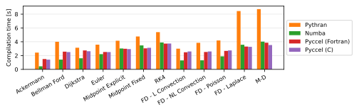

# Benchmarks

Several tests are available for the user to benchmark Pyccel against other common accelerators, notably [pythran](https://pythran.readthedocs.io/en/latest/) and [numba](https://numba.pydata.org/).
The same code is used for all tests, only the decorators change.

The dependencies can be installed using the command `python3 -m pip install .`

The code can be executed by running the script `benchmarks/run_benchmarks.py`.

In order to test pyccel and/or pythran, configuration files must be provided. An example configuration for pythran is found in [`benchmarks/config.pythranrc`](./benchmarks/config.pythranrc). This configuration is the default pythran configuration with the following additional flags:
- `-O3`
- `-march=native`
- `-mtune=native`
- `-mavx`
- `-ffast-math`
Pyccel configurations valid for your machine can be generated using the following command (which may be adapted for c generation or other compiler languages, see the [pyccel documentation](https://github.com/pyccel/pyccel/blob/master/tutorial/compiler.md)):
```
pyccel --language=fortran --export-compile-info pyccel_fortran.json
```
This configuration can then be modified to include additional flags or use different compilers. The tests shown below add the following additional flags (which match the flags added to pythran):
- `-O3`
- `-march=native`
- `-mtune=native`
- `-mavx`
- `-ffast-math`

Additional options can be used with this script to add further comparisons, change the output format, or change what is generated.

Run `python3 benchmarks/run_benchmarks.py --help` for more details.

The results below are presented for the current state of the development branch of pyccel, as well as the most recent version of pyccel available on pypi.

A requirements.txt file providing the necessary packages to reproduce the tests run can be found in the `version_specific_results` folder.
The environment can be reproduced using the following commands:
```
python3 -m venv my_virtual_environment
source my_virtual_environment/bin/activate
pip3 install -r requirements.txt
```
## Tests used

The tests used can be found in the [benchmarks/tests](./benchmarks/tests) directory.

### Ackermann

A basic implementation of the Ackermann function which is one of the simplest and oldest examples of a total computable function that is not primitive recursive.

### Bellman Ford

An algorithm for solving the shortest path problem. The code is adapted from examples written by [J. Burkardt](https://people.sc.fsu.edu/~jburkardt/py_src/py_src.html)

### Djikstra

An algorithm for solving the shortest path problem. The code is adapted from examples written by [J. Burkardt](https://people.sc.fsu.edu/~jburkardt/py_src/py_src.html)

### Euler

Solves an ordinary differential equation using Euler's method. The code is adapted from examples written by [J. Burkardt](https://people.sc.fsu.edu/~jburkardt/py_src/py_src.html)

### Midpoint Explicit

Solves an ordinary differential equation using the explicit midpoint method. The code is adapted from examples written by [J. Burkardt](https://people.sc.fsu.edu/~jburkardt/py_src/py_src.html)

### Midpoint Fixed

Solves an ordinary differential equation using the implicit midpoint method with a fixed number of iterations. The code is adapted from examples written by [J. Burkardt](https://people.sc.fsu.edu/~jburkardt/py_src/py_src.html)

### RK4

Solves an ordinary differential equation using a fourth order Runge-Kutta method. The code is adapted from examples written by [J. Burkardt](https://people.sc.fsu.edu/~jburkardt/py_src/py_src.html)

### FD - Linear Convection

Solves a 1D linear convection problem using Finite Differences methods. The code is adapted from examples written by [L. A. Barba](https://lorenabarba.com/blog/cfd-python-12-steps-to-navier-stokes/)

### FD - Non-Linear Convection

Solves a 1D non-linear convection problem using Finite Differences methods. The code is adapted from examples written by [L. A. Barba](https://lorenabarba.com/blog/cfd-python-12-steps-to-navier-stokes/)

### FD - Poisson

Solves a 2D Poisson problem using Finite Differences methods. The code is adapted from examples written by [L. A. Barba](https://lorenabarba.com/blog/cfd-python-12-steps-to-navier-stokes/)

### FD - Laplace

Solves a 2D Laplace problem using Finite Differences methods. The code is adapted from examples written by [L. A. Barba](https://lorenabarba.com/blog/cfd-python-12-steps-to-navier-stokes/)

### MD

Runs a molecular dynamics simulation. The code is adapted from examples written by [J. Burkardt](https://people.sc.fsu.edu/~jburkardt/py_src/py_src.html)
## Development branch results
### Performance Comparison (as of Wed Sep  6 17:58:10 UTC 2023)
## Compilation time
Algorithm                 | python                    | pythran                   | numba                     | pyccel_fortran            | pyccel_c                 
------------------------- | ------------------------- | ------------------------- | ------------------------- | ------------------------- | -------------------------
Ackermann                 | -                         | 2.50                      | 0.40                      | 1.27                      | 1.22                     
Bellman Ford              | -                         | 3.56                      | 1.20                      | 2.24                      | 2.19                     
Dijkstra                  | -                         | 2.80                      | 1.38                      | 2.33                      | 2.22                     
Euler                     | -                         | 3.09                      | 1.83                      | 2.20                      | 2.24                     
Midpoint Explicit         | -                         | 3.46                      | 2.53                      | 2.51                      | 2.55                     
Midpoint Fixed            | -                         | 3.99                      | 2.68                      | 2.58                      | 2.65                     
RK4                       | -                         | 4.67                      | 3.08                      | 3.28                      | 3.15                     
FD - L Convection         | -                         | 2.64                      | 0.98                      | 2.14                      | 2.15                     
FD - NL Convection        | -                         | 3.38                      | 1.05                      | 2.17                      | 2.19                     
FD - Poisson              | -                         | 3.62                      | 1.51                      | 2.32                      | 2.35                     
FD - Laplace              | -                         | 7.10                      | 2.88                      | 2.75                      | 2.81                     
M-D                       | -                         | 7.23                      | 3.37                      | 3.27                      | 2.98                     

## Execution time
Algorithm                 | python                    | pythran                   | numba                     | pyccel_fortran            | pyccel_c                 
------------------------- | ------------------------- | ------------------------- | ------------------------- | ------------------------- | -------------------------
Ackermann (ms)            | 442.00                    | 9.52                      | 28.00                     | 3.17                      | 3.30                     
Bellman Ford (ms)         | 2810.00                   | 7.71                      | 6.36                      | 3.82                      | 6.44                     
Dijkstra (ms)             | 7370.00                   | 45.40                     | 38.50                     | 35.80                     | 47.70                    
Euler (ms)                | 4790.00                   | 40.60                     | 111.00                    | 18.00                     | 240.00                   
Midpoint Explicit (ms)    | 9780.00                   | 78.90                     | 208.00                    | 27.10                     | 469.00                   
Midpoint Fixed (s)        | 49.20                     | 0.66                      | 1.06                      | 0.10                      | 2.32                     
RK4 (ms)                  | 24300.00                  | 200.00                    | 407.00                    | 42.70                     | 758.00                   
FD - L Convection (ms)    | 3110.00                   | 2.89                      | 3.84                      | 1.73                      | 2.84                     
FD - NL Convection (ms)   | 3820.00                   | 3.39                      | 3.42                      | 1.81                      | 2.86                     
FD - Poisson (ms)         | 8910.00                   | 5.70                      | 9.74                      | 3.68                      | 4.90                     
FD - Laplace (ms)         | 687.00                    | 232.00                    | 376.00                    | 73.30                     | 414.00                   
M-D (ms)                  | 19300.00                  | 52.90                     | 73.10                     | 106.00                    | 110.00                   


## Python 3.7 results
### Performance Comparison (as of 1.9.1)
## Compilation time
Algorithm                 | python                    | pythran                   | numba                     | pyccel_fortran            | pyccel_c                 
------------------------- | ------------------------- | ------------------------- | ------------------------- | ------------------------- | -------------------------
Ackermann                 | -                         | 2.11                      | 0.37                      | 1.31                      | 1.25                     
Bellman Ford              | -                         | 3.42                      | 1.22                      | 2.31                      | 2.25                     
Dijkstra                  | -                         | 2.63                      | 1.37                      | 2.37                      | 2.27                     
Euler                     | -                         | 2.97                      | 1.85                      | 2.27                      | 2.29                     
Midpoint Explicit         | -                         | 3.48                      | 2.66                      | 2.68                      | 2.70                     
Midpoint Fixed            | -                         | 3.96                      | 2.90                      | 2.69                      | 2.73                     
RK4                       | -                         | 4.47                      | 3.23                      | 3.35                      | 3.30                     
FD - L Convection         | -                         | 2.54                      | 1.07                      | 2.21                      | 2.26                     
FD - NL Convection        | -                         | 3.27                      | 1.15                      | 2.23                      | 2.28                     
FD - Poisson              | -                         | 3.51                      | 1.61                      | 2.42                      | 2.42                     
FD - Laplace              | -                         | 7.15                      | 3.11                      | 2.91                      | 2.93                     
M-D                       | -                         | 7.47                      | 3.57                      | 3.42                      | 3.12                     

## Execution time
Algorithm                 | python                    | pythran                   | numba                     | pyccel_fortran            | pyccel_c                 
------------------------- | ------------------------- | ------------------------- | ------------------------- | ------------------------- | -------------------------
Ackermann (ms)            | 509.00 $\pm$ 5.00         | 7.92 $\pm$ 0.03           | 31.00 $\pm$ 0.40          | 2.98 $\pm$ 0.00           | 3.31 $\pm$ 0.00          
Bellman Ford (ms)         | 2860.00 $\pm$ 150.00      | 5.95 $\pm$ 0.05           | 9.70 $\pm$ 0.02           | 3.83 $\pm$ 0.01           | 6.45 $\pm$ 0.02          
Dijkstra (ms)             | 7810.00 $\pm$ 60.00       | 47.70 $\pm$ 0.10          | 43.70 $\pm$ 0.40          | 37.80 $\pm$ 0.10          | 49.50 $\pm$ 0.10         
Euler (ms)                | 5800.00 $\pm$ 70.00       | 44.20 $\pm$ 0.30          | 116.00 $\pm$ 1.00         | 21.20 $\pm$ 0.70          | 239.00 $\pm$ 6.00        
Midpoint Explicit (ms)    | 11800.00 $\pm$ 200.00     | 87.80 $\pm$ 0.60          | 292.00 $\pm$ 2.00         | 32.10 $\pm$ 1.70          | 473.00 $\pm$ 2.00        
Midpoint Fixed (s)        | 59.60 $\pm$ 1.50          | 0.68 $\pm$ 0.00           | 1.60 $\pm$ 0.02           | 0.11 $\pm$ 0.01           | 2.33 $\pm$ 0.02          
RK4 (ms)                  | 26600.00 $\pm$ 500.00     | 202.00 $\pm$ 3.00         | 578.00 $\pm$ 1.00         | 46.80 $\pm$ 1.00          | 763.00 $\pm$ 2.00        
FD - L Convection (ms)    | 3190.00 $\pm$ 50.00       | 2.88 $\pm$ 0.02           | 13.90 $\pm$ 0.00          | 1.73 $\pm$ 0.03           | 2.73 $\pm$ 0.16          
FD - NL Convection (ms)   | 4330.00 $\pm$ 50.00       | 3.41 $\pm$ 0.01           | 14.70 $\pm$ 0.00          | 1.76 $\pm$ 0.05           | 2.58 $\pm$ 0.01          
FD - Poisson (ms)         | 9410.00 $\pm$ 210.00      | 6.41 $\pm$ 0.01           | 18.70 $\pm$ 0.10          | 3.70 $\pm$ 0.01           | 4.91 $\pm$ 0.01          
FD - Laplace (ms)         | 703.00 $\pm$ 8.00         | 232.00 $\pm$ 1.00         | 386.00 $\pm$ 2.00         | 77.40 $\pm$ 1.70          | 403.00 $\pm$ 3.00        
M-D (ms)                  | 21900.00 $\pm$ 500.00     | 52.80 $\pm$ 0.00          | 88.30 $\pm$ 1.30          | 106.00 $\pm$ 0.00         | 110.00 $\pm$ 0.00        



## Python 3.8 results
### Performance Comparison (as of 1.9.1)
## Compilation time
Algorithm                 | python                    | pythran_gnu               | pythran_intel             | numba                     | pyccel_fortran_gnu        | pyccel_c_gnu              | pyccel_fortran_intel      | pyccel_c_intel           
------------------------- | ------------------------- | ------------------------- | ------------------------- | ------------------------- | ------------------------- | ------------------------- | ------------------------- | -------------------------
Ackermann                 | -                         | 2.13                      | 2.01                      | 0.42                      | 1.34                      | 1.26                      | -                         | -                        
Bellman Ford              | -                         | 3.54                      | 3.57                      | 1.28                      | 2.31                      | 2.27                      | -                         | -                        
Dijkstra                  | -                         | 2.72                      | 2.77                      | 1.46                      | 2.40                      | 2.28                      | -                         | -                        

## Execution time
Algorithm                 | python                    | pythran_gnu               | pythran_intel             | numba                     | pyccel_fortran_gnu        | pyccel_c_gnu              | pyccel_fortran_intel      | pyccel_c_intel           
------------------------- | ------------------------- | ------------------------- | ------------------------- | ------------------------- | ------------------------- | ------------------------- | ------------------------- | -------------------------
Ackermann (ms)            | 475.00 $\pm$ 4.00         | 9.55 $\pm$ 0.07           | 9.52 $\pm$ 0.00           | 28.20 $\pm$ 0.20          | 3.17 $\pm$ 0.00           | 2.95 $\pm$ 0.00           | -                         | -                        
Bellman Ford (ms)         | 2870.00 $\pm$ 30.00       | 7.72 $\pm$ 0.01           | 7.72 $\pm$ 0.01           | 6.36 $\pm$ 0.00           | 3.84 $\pm$ 0.01           | 6.46 $\pm$ 0.03           | -                         | -                        
Dijkstra (ms)             | 7420.00 $\pm$ 40.00       | 48.70 $\pm$ 0.40          | 48.50 $\pm$ 0.40          | 42.10 $\pm$ 0.60          | 36.80 $\pm$ 0.40          | 51.50 $\pm$ 0.40          | -                         | -                        


## Python 3.9 results
### Performance Comparison (as of 1.9.1)
## Compilation time
Algorithm                 | python                    | pythran_gnu               | pythran_intel             | numba                     | pyccel_fortran_gnu        | pyccel_c_gnu              | pyccel_fortran_intel      | pyccel_c_intel           
------------------------- | ------------------------- | ------------------------- | ------------------------- | ------------------------- | ------------------------- | ------------------------- | ------------------------- | -------------------------
Ackermann                 | -                         | 1.97                      | 1.84                      | 0.38                      | 1.19                      | 1.14                      | -                         | -                        
Bellman Ford              | -                         | 3.26                      | 3.28                      | 1.16                      | 2.14                      | 2.11                      | -                         | -                        
Dijkstra                  | -                         | 2.50                      | 2.52                      | 1.34                      | 2.30                      | 2.14                      | -                         | -                        

## Execution time
Algorithm                 | python                    | pythran_gnu               | pythran_intel             | numba                     | pyccel_fortran_gnu        | pyccel_c_gnu              | pyccel_fortran_intel      | pyccel_c_intel           
------------------------- | ------------------------- | ------------------------- | ------------------------- | ------------------------- | ------------------------- | ------------------------- | ------------------------- | -------------------------
Ackermann (ms)            | 374.00 $\pm$ 1.00         | 9.91 $\pm$ 0.03           | 9.89 $\pm$ 0.00           | 27.10 $\pm$ 0.20          | 3.20 $\pm$ 0.00           | 3.24 $\pm$ 0.00           | -                         | -                        
Bellman Ford (ms)         | 2590.00 $\pm$ 20.00       | 6.73 $\pm$ 0.01           | 6.73 $\pm$ 0.00           | 6.33 $\pm$ 0.01           | 4.45 $\pm$ 0.01           | 6.58 $\pm$ 0.01           | -                         | -                        
Dijkstra (ms)             | 6740.00 $\pm$ 20.00       | 39.60 $\pm$ 0.70          | 42.70 $\pm$ 2.10          | 34.20 $\pm$ 0.60          | 32.60 $\pm$ 1.80          | 48.70 $\pm$ 0.30          | -                         | -                        


## Python 3.10 results
### Performance Comparison (as of 1.9.1)
## Compilation time
Algorithm                 | python                    | pythran_gnu               | pythran_intel             | numba                     | pyccel_fortran_gnu        | pyccel_c_gnu              | pyccel_fortran_intel      | pyccel_c_intel           
------------------------- | ------------------------- | ------------------------- | ------------------------- | ------------------------- | ------------------------- | ------------------------- | ------------------------- | -------------------------
Ackermann                 | -                         | 2.57                      | 2.21                      | 0.42                      | 1.31                      | 1.25                      | -                         | -                        
Bellman Ford              | -                         | 3.64                      | 3.66                      | 1.24                      | 2.28                      | 2.24                      | -                         | -                        
Dijkstra                  | -                         | 2.86                      | 2.87                      | 1.42                      | 2.38                      | 2.29                      | -                         | -                        

## Execution time
Algorithm                 | python                    | pythran_gnu               | pythran_intel             | numba                     | pyccel_fortran_gnu        | pyccel_c_gnu              | pyccel_fortran_intel      | pyccel_c_intel           
------------------------- | ------------------------- | ------------------------- | ------------------------- | ------------------------- | ------------------------- | ------------------------- | ------------------------- | -------------------------
Ackermann (ms)            | 445.00 $\pm$ 3.00         | 8.03 $\pm$ 0.01           | 8.03 $\pm$ 0.02           | 28.10 $\pm$ 0.10          | 3.17 $\pm$ 0.00           | 3.30 $\pm$ 0.00           | -                         | -                        
Bellman Ford (ms)         | 2850.00 $\pm$ 40.00       | 7.72 $\pm$ 0.02           | 7.71 $\pm$ 0.00           | 6.36 $\pm$ 0.00           | 3.84 $\pm$ 0.00           | 6.45 $\pm$ 0.01           | -                         | -                        
Dijkstra (ms)             | 7450.00 $\pm$ 60.00       | 48.00 $\pm$ 0.40          | 48.30 $\pm$ 0.30          | 42.00 $\pm$ 0.70          | 36.50 $\pm$ 0.40          | 50.40 $\pm$ 0.50          | -                         | -                        


## Python 3.11 results
### Performance Comparison (as of 1.9.1)
## Compilation time
Algorithm                 | python                    | pythran_gnu               | pythran_intel             | numba                     | pyccel_fortran_gnu        | pyccel_c_gnu              | pyccel_fortran_intel      | pyccel_c_intel           
------------------------- | ------------------------- | ------------------------- | ------------------------- | ------------------------- | ------------------------- | ------------------------- | ------------------------- | -------------------------
Ackermann                 | -                         | 3.11                      | 2.71                      | 0.46                      | 1.59                      | 1.53                      | -                         | -                        
Bellman Ford              | -                         | 4.32                      | 4.32                      | 1.45                      | 2.70                      | 2.82                      | -                         | -                        
Dijkstra                  | -                         | 3.33                      | 3.43                      | 1.65                      | 3.07                      | 2.87                      | -                         | -                        

## Execution time
Algorithm                 | python                    | pythran_gnu               | pythran_intel             | numba                     | pyccel_fortran_gnu        | pyccel_c_gnu              | pyccel_fortran_intel      | pyccel_c_intel           
------------------------- | ------------------------- | ------------------------- | ------------------------- | ------------------------- | ------------------------- | ------------------------- | ------------------------- | -------------------------
Ackermann (ms)            | 473.00 $\pm$ 17.00        | 8.75 $\pm$ 0.34           | 9.15 $\pm$ 0.27           | 29.70 $\pm$ 1.00          | 2.36 $\pm$ 0.11           | 2.28 $\pm$ 0.09           | -                         | -                        
Bellman Ford (ms)         | 3120.00 $\pm$ 90.00       | 6.77 $\pm$ 0.23           | 7.18 $\pm$ 0.35           | 7.56 $\pm$ 0.21           | 5.15 $\pm$ 0.12           | 10.00 $\pm$ 0.50          | -                         | -                        
Dijkstra (ms)             | 8940.00 $\pm$ 390.00      | 46.80 $\pm$ 1.30          | 50.40 $\pm$ 1.50          | 53.90 $\pm$ 1.90          | 49.90 $\pm$ 2.10          | 78.20 $\pm$ 2.10          | -                         | -                        


