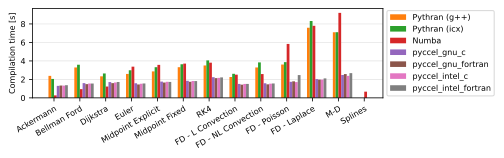

# Benchmarks

Several tests are available for the user to benchmark Pyccel against other common accelerators, notably [pythran](https://pythran.readthedocs.io/en/latest/) and [numba](https://numba.pydata.org/).
The same code is used for all tests, only the decorators change.

The dependencies can be installed using the command `python3 -m pip install .`

The code can be executed by running the script `benchmarks/run_benchmarks.py`.

In order to test pyccel and/or pythran, configuration files must be provided. An example configuration for pythran is found in [`benchmarks/config.pythranrc`](./benchmarks/config.pythranrc). This configuration is the default pythran configuration with the following additional flags:
- `-O3`
- `-march=native`
- `-mtune=native`
- `-mavx`
- `-ffast-math`
Pyccel configurations valid for your machine can be generated using the following command (which may be adapted for c generation or other compiler languages, see the [pyccel documentation](https://github.com/pyccel/pyccel/blob/master/tutorial/compiler.md)):
```
pyccel --language=fortran --export-compile-info pyccel_fortran.json
```
This configuration can then be modified to include additional flags or use different compilers. The tests shown below add the following additional flags (which match the flags added to pythran):
- `-O3`
- `-march=native`
- `-mtune=native`
- `-mavx`
- `-ffast-math`

Additional options can be used with this script to add further comparisons, change the output format, or change what is generated.

Run `python3 benchmarks/run_benchmarks.py --help` for more details.

The results below are presented for the current state of the development branch of pyccel, as well as the most recent version of pyccel available on pypi.

A requirements.txt file providing the necessary packages to reproduce the tests run can be found in the `version_specific_results` folder.
The environment can be reproduced using the following commands:
```
python3 -m venv my_virtual_environment
source my_virtual_environment/bin/activate
pip3 install -r requirements.txt
```
## Tests used

The tests used can be found in the [benchmarks/tests](./benchmarks/tests) directory.

### Ackermann

A basic implementation of the Ackermann function which is one of the simplest and oldest examples of a total computable function that is not primitive recursive.

### Bellman Ford

An algorithm for solving the shortest path problem. The code is adapted from examples written by [J. Burkardt](https://people.sc.fsu.edu/~jburkardt/py_src/py_src.html)

### Djikstra

An algorithm for solving the shortest path problem. The code is adapted from examples written by [J. Burkardt](https://people.sc.fsu.edu/~jburkardt/py_src/py_src.html)

### Euler

Solves an ordinary differential equation using Euler's method. The code is adapted from examples written by [J. Burkardt](https://people.sc.fsu.edu/~jburkardt/py_src/py_src.html)

### Midpoint Explicit

Solves an ordinary differential equation using the explicit midpoint method. The code is adapted from examples written by [J. Burkardt](https://people.sc.fsu.edu/~jburkardt/py_src/py_src.html)

### Midpoint Fixed

Solves an ordinary differential equation using the implicit midpoint method with a fixed number of iterations. The code is adapted from examples written by [J. Burkardt](https://people.sc.fsu.edu/~jburkardt/py_src/py_src.html)

### RK4

Solves an ordinary differential equation using a fourth order Runge-Kutta method. The code is adapted from examples written by [J. Burkardt](https://people.sc.fsu.edu/~jburkardt/py_src/py_src.html)

### FD - Linear Convection

Solves a 1D linear convection problem using Finite Differences methods. The code is adapted from examples written by [L. A. Barba](https://lorenabarba.com/blog/cfd-python-12-steps-to-navier-stokes/)

### FD - Non-Linear Convection

Solves a 1D non-linear convection problem using Finite Differences methods. The code is adapted from examples written by [L. A. Barba](https://lorenabarba.com/blog/cfd-python-12-steps-to-navier-stokes/)

### FD - Poisson

Solves a 2D Poisson problem using Finite Differences methods. The code is adapted from examples written by [L. A. Barba](https://lorenabarba.com/blog/cfd-python-12-steps-to-navier-stokes/)

### FD - Laplace

Solves a 2D Laplace problem using Finite Differences methods. The code is adapted from examples written by [L. A. Barba](https://lorenabarba.com/blog/cfd-python-12-steps-to-navier-stokes/)

### MD

Runs a molecular dynamics simulation. The code is adapted from examples written by [J. Burkardt](https://people.sc.fsu.edu/~jburkardt/py_src/py_src.html)
## Development branch results
### Performance Comparison (as of Wed May  3 09:16:09 UTC 2023)
## Compilation time
Algorithm                 | python                    | pythran                   | numba                     | pyccel_fortran            | pyccel_c                 
------------------------- | ------------------------- | ------------------------- | ------------------------- | ------------------------- | -------------------------
Ackermann                 | -                         | 2.36                      | 0.38                      | 1.25                      | 1.20                     
Bellman Ford              | -                         | 3.40                      | 1.16                      | 2.13                      | 2.12                     
Dijkstra                  | -                         | 2.62                      | 1.32                      | 2.18                      | 2.13                     
Euler                     | -                         | 3.01                      | 1.79                      | 2.11                      | 2.14                     
Midpoint Explicit         | -                         | 3.34                      | 2.48                      | 2.43                      | 2.46                     
Midpoint Fixed            | -                         | 3.92                      | 2.62                      | 2.50                      | 2.54                     
RK4                       | -                         | 4.47                      | 3.00                      | 3.12                      | 3.08                     
FD - L Convection         | -                         | 2.56                      | 0.95                      | 2.08                      | 2.10                     
FD - NL Convection        | -                         | 3.32                      | 1.02                      | 2.10                      | 2.14                     
FD - Poisson              | -                         | 3.46                      | 1.47                      | 2.25                      | 2.26                     
FD - Laplace              | -                         | 6.76                      | 2.81                      | 2.72                      | 2.70                     
M-D                       | -                         | 6.89                      | 3.29                      | 3.07                      | 2.88                     

## Execution time
Algorithm                 | python                    | pythran                   | numba                     | pyccel_fortran            | pyccel_c                 
------------------------- | ------------------------- | ------------------------- | ------------------------- | ------------------------- | -------------------------
Ackermann (ms)            | 385.00                    | 9.80                      | 26.60                     | 3.13                      | 3.23                     
Bellman Ford (ms)         | 2560.00                   | 6.72                      | 6.32                      | 4.45                      | 6.57                     
Dijkstra (ms)             | 6580.00                   | 37.20                     | 30.80                     | 29.90                     | 46.60                    
Euler (ms)                | 4900.00                   | 38.00                     | 107.00                    | 17.00                     | 201.00                   
Midpoint Explicit (ms)    | 10000.00                  | 74.30                     | 209.00                    | 27.00                     | 399.00                   
Midpoint Fixed (s)        | 50.50                     | 0.61                      | 1.14                      | 0.10                      | 1.97                     
RK4 (ms)                  | 25500.00                  | 238.00                    | 403.00                    | 41.40                     | 663.00                   
FD - L Convection (ms)    | 2720.00                   | 2.82                      | 3.11                      | 2.59                      | 2.54                     
FD - NL Convection (ms)   | 3250.00                   | 3.09                      | 3.34                      | 2.46                      | 2.98                     
FD - Poisson (ms)         | 8520.00                   | 5.78                      | 10.10                     | 4.26                      | 5.30                     
FD - Laplace (ms)         | 688.00                    | 251.00                    | 385.00                    | 81.10                     | 368.00                   
M-D (ms)                  | 19800.00                  | 65.00                     | 77.90                     | 120.00                    | 121.00                   



## Python 3.7 results
### Performance Comparison (as of 1.7.4)
## Compilation time
Algorithm                 | python                    | pythran                   | numba                     | pyccel_fortran            | pyccel_c                 
------------------------- | ------------------------- | ------------------------- | ------------------------- | ------------------------- | -------------------------
Ackermann                 | -                         | 2.05                      | 0.36                      | 1.26                      | 1.19                     
Bellman Ford              | -                         | 3.26                      | 1.16                      | 2.12                      | 2.11                     
Dijkstra                  | -                         | 2.55                      | 1.29                      | 2.15                      | 2.09                     
Euler                     | -                         | 2.85                      | 1.76                      | 2.08                      | 2.10                     
Midpoint Explicit         | -                         | 3.24                      | 2.50                      | 2.45                      | 2.48                     
Midpoint Fixed            | -                         | 3.83                      | 2.85                      | 2.50                      | 2.55                     
RK4                       | -                         | 4.29                      | 3.19                      | 3.11                      | 3.08                     
FD - L Convection         | -                         | 2.43                      | 1.00                      | 2.05                      | 2.08                     
FD - NL Convection        | -                         | 3.16                      | 1.08                      | 2.07                      | 2.09                     
FD - Poisson              | -                         | 3.33                      | 1.53                      | 2.23                      | 2.24                     
FD - Laplace              | -                         | 6.91                      | 2.98                      | 2.70                      | 2.76                     
M-D                       | -                         | 7.00                      | 3.43                      | 3.13                      | 2.91                     

## Execution time
Algorithm                 | python                    | pythran                   | numba                     | pyccel_fortran            | pyccel_c                 
------------------------- | ------------------------- | ------------------------- | ------------------------- | ------------------------- | -------------------------
Ackermann (ms)            | 497.00 $\pm$ 46.00        | 7.94 $\pm$ 0.09           | 30.90 $\pm$ 0.30          | 2.86 $\pm$ 0.00           | 2.86 $\pm$ 0.00          
Bellman Ford (ms)         | 2630.00 $\pm$ 60.00       | 5.93 $\pm$ 0.00           | 9.69 $\pm$ 0.00           | 3.86 $\pm$ 0.00           | 6.48 $\pm$ 0.00          
Dijkstra (ms)             | 7370.00 $\pm$ 70.00       | 43.20 $\pm$ 0.80          | 38.50 $\pm$ 0.90          | 34.50 $\pm$ 0.60          | 47.70 $\pm$ 0.60         
Euler (ms)                | 5770.00 $\pm$ 170.00      | 43.20 $\pm$ 2.90          | 117.00 $\pm$ 1.00         | 18.70 $\pm$ 0.40          | 236.00 $\pm$ 2.00        
Midpoint Explicit (ms)    | 11600.00 $\pm$ 200.00     | 81.90 $\pm$ 1.40          | 297.00 $\pm$ 4.00         | 30.10 $\pm$ 1.50          | 468.00 $\pm$ 2.00        
Midpoint Fixed (s)        | 57.20 $\pm$ 1.00          | 0.67 $\pm$ 0.00           | 1.60 $\pm$ 0.01           | 0.10 $\pm$ 0.00           | 2.31 $\pm$ 0.00          
RK4 (ms)                  | 26400.00 $\pm$ 500.00     | 201.00 $\pm$ 1.00         | 588.00 $\pm$ 12.00        | 44.00 $\pm$ 0.80          | 748.00 $\pm$ 4.00        
FD - L Convection (ms)    | 2950.00 $\pm$ 40.00       | 2.88 $\pm$ 0.02           | 13.80 $\pm$ 0.00          | 2.58 $\pm$ 0.01           | 2.48 $\pm$ 0.01          
FD - NL Convection (ms)   | 4030.00 $\pm$ 50.00       | 3.40 $\pm$ 0.01           | 14.70 $\pm$ 0.00          | 2.54 $\pm$ 0.02           | 2.58 $\pm$ 0.01          
FD - Poisson (ms)         | 8960.00 $\pm$ 190.00      | 5.97 $\pm$ 0.00           | 18.70 $\pm$ 0.00          | 3.83 $\pm$ 0.01           | 4.90 $\pm$ 0.02          
FD - Laplace (ms)         | 710.00 $\pm$ 7.00         | 233.00 $\pm$ 2.00         | 385.00 $\pm$ 2.00         | 78.10 $\pm$ 1.20          | 390.00 $\pm$ 3.00        
M-D (ms)                  | 21200.00 $\pm$ 500.00     | 52.80 $\pm$ 0.00          | 88.40 $\pm$ 0.50          | 106.00 $\pm$ 0.00         | 110.00 $\pm$ 0.00        


## Python 3.8 results
### Performance Comparison (as of 1.7.4)
## Compilation time
Algorithm                 | python                    | pythran                   | numba                     | pyccel_fortran            | pyccel_c                 
------------------------- | ------------------------- | ------------------------- | ------------------------- | ------------------------- | -------------------------
Ackermann                 | -                         | 1.98                      | 0.39                      | 1.26                      | 1.22                     
Bellman Ford              | -                         | 3.31                      | 1.21                      | 2.20                      | 2.17                     
Dijkstra                  | -                         | 2.49                      | 1.36                      | 2.24                      | 2.19                     
Euler                     | -                         | 2.89                      | 1.80                      | 2.15                      | 2.21                     
Midpoint Explicit         | -                         | 3.23                      | 2.50                      | 2.49                      | 2.53                     
Midpoint Fixed            | -                         | 3.80                      | 2.63                      | 2.54                      | 2.62                     
RK4                       | -                         | 4.21                      | 3.00                      | 3.07                      | 3.10                     
FD - L Convection         | -                         | 2.37                      | 0.96                      | 2.08                      | 2.10                     
FD - NL Convection        | -                         | 3.12                      | 1.02                      | 2.09                      | 2.13                     
FD - Poisson              | -                         | 3.31                      | 1.47                      | 2.30                      | 2.27                     
FD - Laplace              | -                         | 6.66                      | 2.81                      | 2.69                      | 2.74                     
M-D                       | -                         | 6.84                      | 3.34                      | 3.12                      | 2.96                     

## Execution time
Algorithm                 | python                    | pythran                   | numba                     | pyccel_fortran            | pyccel_c                 
------------------------- | ------------------------- | ------------------------- | ------------------------- | ------------------------- | -------------------------
Ackermann (ms)            | 407.00 $\pm$ 3.00         | 9.82 $\pm$ 0.04           | 27.20 $\pm$ 0.20          | 3.14 $\pm$ 0.00           | 3.27 $\pm$ 0.00          
Bellman Ford (ms)         | 2510.00 $\pm$ 10.00       | 6.74 $\pm$ 0.03           | 6.34 $\pm$ 0.01           | 4.46 $\pm$ 0.00           | 6.58 $\pm$ 0.01          
Dijkstra (ms)             | 6680.00 $\pm$ 30.00       | 39.70 $\pm$ 0.40          | 33.70 $\pm$ 0.60          | 30.60 $\pm$ 0.40          | 48.50 $\pm$ 0.40         
Euler (ms)                | 4910.00 $\pm$ 30.00       | 38.70 $\pm$ 0.80          | 110.00 $\pm$ 4.00         | 19.40 $\pm$ 0.80          | 202.00 $\pm$ 2.00        
Midpoint Explicit (ms)    | 10000.00 $\pm$ 100.00     | 74.80 $\pm$ 0.40          | 211.00 $\pm$ 2.00         | 29.30 $\pm$ 1.00          | 402.00 $\pm$ 6.00        
Midpoint Fixed (s)        | 50.70 $\pm$ 0.40          | 0.61 $\pm$ 0.00           | 1.09 $\pm$ 0.00           | 0.10 $\pm$ 0.00           | 1.98 $\pm$ 0.01          
RK4 (ms)                  | 25000.00 $\pm$ 100.00     | 218.00 $\pm$ 2.00         | 410.00 $\pm$ 10.00        | 42.70 $\pm$ 2.70          | 661.00 $\pm$ 5.00        
FD - L Convection (ms)    | 2930.00 $\pm$ 10.00       | 2.83 $\pm$ 0.00           | 3.31 $\pm$ 0.24           | 2.61 $\pm$ 0.12           | 2.99 $\pm$ 0.00          
FD - NL Convection (ms)   | 3690.00 $\pm$ 20.00       | 3.08 $\pm$ 0.00           | 3.35 $\pm$ 0.04           | 2.50 $\pm$ 0.05           | 2.98 $\pm$ 0.02          
FD - Poisson (ms)         | 8410.00 $\pm$ 120.00      | 5.78 $\pm$ 0.00           | 10.10 $\pm$ 0.00          | 4.33 $\pm$ 0.00           | 5.32 $\pm$ 0.01          
FD - Laplace (ms)         | 691.00 $\pm$ 5.00         | 251.00 $\pm$ 1.00         | 389.00 $\pm$ 2.00         | 82.30 $\pm$ 0.90          | 368.00 $\pm$ 1.00        
M-D (ms)                  | 20000.00 $\pm$ 100.00     | 65.10 $\pm$ 0.00          | 78.40 $\pm$ 0.50          | 120.00 $\pm$ 0.00         | 122.00 $\pm$ 0.00        


## Python 3.9 results
### Performance Comparison (as of 1.7.4)
## Compilation time
Algorithm                 | python                    | pythran                   | numba                     | pyccel_fortran            | pyccel_c                 
------------------------- | ------------------------- | ------------------------- | ------------------------- | ------------------------- | -------------------------
Ackermann                 | -                         | 2.63                      | 0.51                      | 1.60                      | 1.50                     
Bellman Ford              | -                         | 4.01                      | 1.48                      | 2.58                      | 2.52                     
Dijkstra                  | -                         | 3.18                      | 1.77                      | 2.69                      | 2.60                     
Euler                     | -                         | 3.80                      | 2.31                      | 2.54                      | 2.68                     
Midpoint Explicit         | -                         | 4.09                      | 3.02                      | 3.02                      | 3.19                     
Midpoint Fixed            | -                         | 4.91                      | 3.23                      | 3.06                      | 3.24                     
RK4                       | -                         | 5.40                      | 3.85                      | 3.70                      | 3.72                     
FD - L Convection         | -                         | 3.11                      | 1.21                      | 2.53                      | 2.57                     
FD - NL Convection        | -                         | 4.16                      | 1.28                      | 2.45                      | 2.55                     
FD - Poisson              | -                         | 4.31                      | 1.83                      | 2.78                      | 2.80                     
FD - Laplace              | -                         | 8.90                      | 3.56                      | 3.29                      | 3.31                     
M-D                       | -                         | 8.79                      | 4.02                      | 3.82                      | 3.62                     

## Execution time
Algorithm                 | python                    | pythran                   | numba                     | pyccel_fortran            | pyccel_c                 
------------------------- | ------------------------- | ------------------------- | ------------------------- | ------------------------- | -------------------------
Ackermann (ms)            | 470.00 $\pm$ 15.00        | 8.87 $\pm$ 0.26           | 30.00 $\pm$ 0.60          | 2.32 $\pm$ 0.08           | 2.31 $\pm$ 0.08          
Bellman Ford (ms)         | 3190.00 $\pm$ 60.00       | 8.21 $\pm$ 0.32           | 7.40 $\pm$ 0.31           | 4.98 $\pm$ 0.29           | 9.62 $\pm$ 0.26          
Dijkstra (ms)             | 8140.00 $\pm$ 150.00      | 43.80 $\pm$ 1.20          | 46.60 $\pm$ 1.40          | 37.60 $\pm$ 1.00          | 55.40 $\pm$ 1.80         
Euler (ms)                | 5560.00 $\pm$ 100.00      | 57.50 $\pm$ 4.60          | 128.00 $\pm$ 4.00         | 28.60 $\pm$ 1.70          | 258.00 $\pm$ 9.00        
Midpoint Explicit (ms)    | 11300.00 $\pm$ 200.00     | 104.00 $\pm$ 3.00         | 245.00 $\pm$ 12.00        | 47.60 $\pm$ 2.00          | 525.00 $\pm$ 15.00       
Midpoint Fixed (s)        | 57.30 $\pm$ 1.40          | 0.75 $\pm$ 0.02           | 1.24 $\pm$ 0.04           | 0.14 $\pm$ 0.01           | 2.48 $\pm$ 0.05          
RK4 (ms)                  | 27300.00 $\pm$ 500.00     | 252.00 $\pm$ 20.00        | 445.00 $\pm$ 14.00        | 57.10 $\pm$ 2.90          | 863.00 $\pm$ 63.00       
FD - L Convection (ms)    | 3700.00 $\pm$ 70.00       | 3.67 $\pm$ 0.10           | 3.98 $\pm$ 0.07           | 3.13 $\pm$ 0.08           | 3.65 $\pm$ 0.07          
FD - NL Convection (ms)   | 4610.00 $\pm$ 90.00       | 4.47 $\pm$ 0.16           | 4.29 $\pm$ 0.06           | 3.08 $\pm$ 0.06           | 3.39 $\pm$ 0.09          
FD - Poisson (ms)         | 9720.00 $\pm$ 160.00      | 13.10 $\pm$ 0.40          | 13.90 $\pm$ 0.40          | 7.80 $\pm$ 0.37           | 9.93 $\pm$ 0.19          
FD - Laplace (ms)         | 1070.00 $\pm$ 10.00       | 376.00 $\pm$ 17.00        | 540.00 $\pm$ 10.00        | 170.00 $\pm$ 4.00         | 481.00 $\pm$ 10.00       
M-D (ms)                  | 21400.00 $\pm$ 300.00     | 72.90 $\pm$ 1.30          | 102.00 $\pm$ 2.00         | 126.00 $\pm$ 2.00         | 133.00 $\pm$ 5.00        


## Python 3.10 results
### Performance Comparison (as of 1.7.4)
## Compilation time
Algorithm                 | python                    | pythran                   | numba                     | pyccel_fortran            | pyccel_c                 
------------------------- | ------------------------- | ------------------------- | ------------------------- | ------------------------- | -------------------------
Ackermann                 | -                         | 2.34                      | 0.38                      | 1.25                      | 1.20                     
Bellman Ford              | -                         | 3.38                      | 1.17                      | 2.13                      | 2.11                     
Dijkstra                  | -                         | 2.63                      | 1.34                      | 2.20                      | 2.14                     
Euler                     | -                         | 2.97                      | 1.77                      | 2.10                      | 2.14                     
Midpoint Explicit         | -                         | 3.32                      | 2.46                      | 2.43                      | 2.47                     
Midpoint Fixed            | -                         | 3.91                      | 2.58                      | 2.48                      | 2.55                     
RK4                       | -                         | 4.33                      | 2.95                      | 3.05                      | 3.06                     
FD - L Convection         | -                         | 2.55                      | 0.95                      | 2.06                      | 2.09                     
FD - NL Convection        | -                         | 3.26                      | 1.00                      | 2.08                      | 2.11                     
FD - Poisson              | -                         | 3.42                      | 1.45                      | 2.25                      | 2.26                     
FD - Laplace              | -                         | 6.65                      | 2.78                      | 2.67                      | 2.70                     
M-D                       | -                         | 6.82                      | 3.26                      | 3.04                      | 2.86                     

## Execution time
Algorithm                 | python                    | pythran                   | numba                     | pyccel_fortran            | pyccel_c                 
------------------------- | ------------------------- | ------------------------- | ------------------------- | ------------------------- | -------------------------
Ackermann (ms)            | 385.00 $\pm$ 4.00         | 9.80 $\pm$ 0.01           | 27.10 $\pm$ 0.30          | 3.14 $\pm$ 0.00           | 3.26 $\pm$ 0.00          
Bellman Ford (ms)         | 2570.00 $\pm$ 20.00       | 6.73 $\pm$ 0.01           | 6.32 $\pm$ 0.01           | 4.45 $\pm$ 0.01           | 6.58 $\pm$ 0.01          
Dijkstra (ms)             | 6610.00 $\pm$ 30.00       | 38.40 $\pm$ 0.60          | 32.20 $\pm$ 0.50          | 30.20 $\pm$ 0.50          | 48.10 $\pm$ 0.60         
Euler (ms)                | 5010.00 $\pm$ 40.00       | 37.60 $\pm$ 0.50          | 108.00 $\pm$ 1.00         | 17.90 $\pm$ 0.50          | 201.00 $\pm$ 3.00        
Midpoint Explicit (ms)    | 10100.00 $\pm$ 100.00     | 77.10 $\pm$ 3.10          | 212.00 $\pm$ 5.00         | 27.80 $\pm$ 0.60          | 398.00 $\pm$ 3.00        
Midpoint Fixed (s)        | 51.40 $\pm$ 0.30          | 0.61 $\pm$ 0.00           | 1.09 $\pm$ 0.02           | 0.10 $\pm$ 0.00           | 2.01 $\pm$ 0.04          
RK4 (ms)                  | 25700.00 $\pm$ 100.00     | 219.00 $\pm$ 2.00         | 407.00 $\pm$ 5.00         | 40.80 $\pm$ 2.20          | 659.00 $\pm$ 5.00        
FD - L Convection (ms)    | 2770.00 $\pm$ 40.00       | 2.81 $\pm$ 0.00           | 3.21 $\pm$ 0.17           | 2.62 $\pm$ 0.11           | 2.61 $\pm$ 0.21          
FD - NL Convection (ms)   | 3310.00 $\pm$ 20.00       | 3.26 $\pm$ 0.03           | 3.35 $\pm$ 0.06           | 2.47 $\pm$ 0.06           | 2.63 $\pm$ 0.29          
FD - Poisson (ms)         | 9000.00 $\pm$ 180.00      | 5.78 $\pm$ 0.01           | 10.10 $\pm$ 0.00          | 4.33 $\pm$ 0.00           | 5.31 $\pm$ 0.01          
FD - Laplace (ms)         | 644.00 $\pm$ 119.00       | 251.00 $\pm$ 1.00         | 389.00 $\pm$ 3.00         | 81.80 $\pm$ 0.60          | 365.00 $\pm$ 1.00        
M-D (ms)                  | 20100.00 $\pm$ 100.00     | 65.00 $\pm$ 0.00          | 78.30 $\pm$ 0.50          | 120.00 $\pm$ 0.00         | 126.00 $\pm$ 12.00       


## Python 3.11 results
### Performance Comparison (as of 1.7.4)
## Compilation time
Algorithm                 | python                    | pythran                   | numba                     | pyccel_fortran            | pyccel_c                 
------------------------- | ------------------------- | ------------------------- | ------------------------- | ------------------------- | -------------------------
Ackermann                 | -                         | 2.35                      | 0.33                      | 1.23                      | 1.18                     
Bellman Ford              | -                         | 3.25                      | 1.10                      | 2.12                      | 2.09                     
Dijkstra                  | -                         | 2.45                      | 1.21                      | 2.19                      | 2.14                     
Euler                     | -                         | 2.86                      | 1.65                      | 2.11                      | 2.14                     
Midpoint Explicit         | -                         | 3.17                      | 2.29                      | 2.41                      | 2.46                     
Midpoint Fixed            | -                         | 3.72                      | 2.41                      | 2.53                      | 2.56                     
RK4                       | -                         | 4.17                      | 2.70                      | 2.98                      | 2.99                     
FD - L Convection         | -                         | 2.46                      | 0.89                      | 2.05                      | 2.07                     
FD - NL Convection        | -                         | 3.18                      | 0.93                      | 2.06                      | 2.10                     
FD - Poisson              | -                         | 3.30                      | 1.34                      | 2.21                      | 2.23                     
FD - Laplace              | -                         | 6.63                      | 2.54                      | 2.63                      | 2.67                     
M-D                       | -                         | 6.69                      | 3.10                      | 2.99                      | 2.84                     

## Execution time
Algorithm                 | python                    | pythran                   | numba                     | pyccel_fortran            | pyccel_c                 
------------------------- | ------------------------- | ------------------------- | ------------------------- | ------------------------- | -------------------------
Ackermann (ms)            | 399.00 $\pm$ 3.00         | 9.80 $\pm$ 0.00           | 27.00 $\pm$ 0.20          | 3.33 $\pm$ 0.01           | 3.26 $\pm$ 0.00          
Bellman Ford (ms)         | 2540.00 $\pm$ 50.00       | 6.73 $\pm$ 0.01           | 6.33 $\pm$ 0.02           | 4.45 $\pm$ 0.00           | 6.57 $\pm$ 0.00          
Dijkstra (ms)             | 6340.00 $\pm$ 40.00       | 39.30 $\pm$ 0.70          | 31.30 $\pm$ 0.50          | 29.40 $\pm$ 0.60          | 47.40 $\pm$ 0.40         
Euler (ms)                | 4870.00 $\pm$ 40.00       | 38.60 $\pm$ 1.30          | 108.00 $\pm$ 0.00         | 18.10 $\pm$ 0.60          | 204.00 $\pm$ 10.00       
Midpoint Explicit (ms)    | 9740.00 $\pm$ 60.00       | 76.20 $\pm$ 2.20          | 210.00 $\pm$ 2.00         | 27.20 $\pm$ 0.60          | 400.00 $\pm$ 3.00        
Midpoint Fixed (s)        | 49.10 $\pm$ 0.40          | 0.61 $\pm$ 0.03           | 1.09 $\pm$ 0.00           | 0.10 $\pm$ 0.00           | 1.98 $\pm$ 0.02          
RK4 (ms)                  | 24300.00 $\pm$ 100.00     | 221.00 $\pm$ 6.00         | 401.00 $\pm$ 2.00         | 40.20 $\pm$ 0.90          | 663.00 $\pm$ 8.00        
FD - L Convection (ms)    | 2560.00 $\pm$ 30.00       | 2.81 $\pm$ 0.01           | 3.25 $\pm$ 0.19           | 2.56 $\pm$ 0.03           | 2.62 $\pm$ 0.33          
FD - NL Convection (ms)   | 3130.00 $\pm$ 30.00       | 3.10 $\pm$ 0.00           | 3.39 $\pm$ 0.14           | 2.54 $\pm$ 0.02           | 2.64 $\pm$ 0.16          
FD - Poisson (ms)         | 7930.00 $\pm$ 110.00      | 5.78 $\pm$ 0.00           | 10.10 $\pm$ 0.00          | 4.28 $\pm$ 0.00           | 5.30 $\pm$ 0.01          
FD - Laplace (ms)         | 682.00 $\pm$ 3.00         | 250.00 $\pm$ 1.00         | 390.00 $\pm$ 5.00         | 81.50 $\pm$ 0.40          | 365.00 $\pm$ 1.00        
M-D (ms)                  | 19300.00 $\pm$ 100.00     | 65.00 $\pm$ 0.00          | 78.70 $\pm$ 1.20          | 120.00 $\pm$ 0.00         | 121.00 $\pm$ 0.00        


