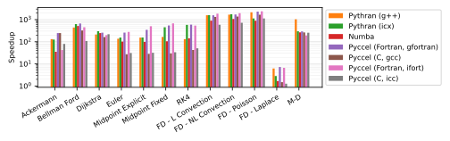

# Benchmarks

Several tests are available for the user to benchmark Pyccel against other common accelerators, notably [pythran](https://pythran.readthedocs.io/en/latest/) and [numba](https://numba.pydata.org/).
The same code is used for all tests, only the decorators change.

The dependencies can be installed using the command `python3 -m pip install .`

The code can be executed by running the script `benchmarks/run_benchmarks.py`.

In order to test pyccel and/or pythran, configuration files must be provided. An example configuration for pythran is found in [`benchmarks/config.pythranrc`](./benchmarks/config.pythranrc). This configuration is the default pythran configuration with the following additional flags:
- `-O3`
- `-march=native`
- `-mtune=native`
- `-mavx`
- `-ffast-math`
Pyccel configurations valid for your machine can be generated using the following command (which may be adapted for c generation or other compiler languages, see the [pyccel documentation](https://github.com/pyccel/pyccel/blob/master/tutorial/compiler.md)):
```
pyccel --language=fortran --export-compile-info pyccel_fortran.json
```
This configuration can then be modified to include additional flags or use different compilers. The tests shown below add the following additional flags (which match the flags added to pythran):
- `-O3`
- `-march=native`
- `-mtune=native`
- `-mavx`
- `-ffast-math`

Additional options can be used with this script to add further comparisons, change the output format, or change what is generated.

Run `python3 benchmarks/run_benchmarks.py --help` for more details.

The results below are presented for the current state of the development branch of pyccel, as well as the most recent version of pyccel available on pypi.

A requirements.txt file providing the necessary packages to reproduce the tests run can be found in the `version_specific_results` folder.
The environment can be reproduced using the following commands:
```
python3 -m venv my_virtual_environment
source my_virtual_environment/bin/activate
pip3 install -r requirements.txt
```
## Tests used

The tests used can be found in the [benchmarks/tests](./benchmarks/tests) directory.

### Ackermann

A basic implementation of the Ackermann function which is one of the simplest and oldest examples of a total computable function that is not primitive recursive.

### Bellman Ford

An algorithm for solving the shortest path problem. The code is adapted from examples written by [J. Burkardt](https://people.sc.fsu.edu/~jburkardt/py_src/py_src.html)

### Djikstra

An algorithm for solving the shortest path problem. The code is adapted from examples written by [J. Burkardt](https://people.sc.fsu.edu/~jburkardt/py_src/py_src.html)

### Euler

Solves an ordinary differential equation using Euler's method. The code is adapted from examples written by [J. Burkardt](https://people.sc.fsu.edu/~jburkardt/py_src/py_src.html)

### Midpoint Explicit

Solves an ordinary differential equation using the explicit midpoint method. The code is adapted from examples written by [J. Burkardt](https://people.sc.fsu.edu/~jburkardt/py_src/py_src.html)

### Midpoint Fixed

Solves an ordinary differential equation using the implicit midpoint method with a fixed number of iterations. The code is adapted from examples written by [J. Burkardt](https://people.sc.fsu.edu/~jburkardt/py_src/py_src.html)

### RK4

Solves an ordinary differential equation using a fourth order Runge-Kutta method. The code is adapted from examples written by [J. Burkardt](https://people.sc.fsu.edu/~jburkardt/py_src/py_src.html)

### FD - Linear Convection

Solves a 1D linear convection problem using Finite Differences methods. The code is adapted from examples written by [L. A. Barba](https://lorenabarba.com/blog/cfd-python-12-steps-to-navier-stokes/)

### FD - Non-Linear Convection

Solves a 1D non-linear convection problem using Finite Differences methods. The code is adapted from examples written by [L. A. Barba](https://lorenabarba.com/blog/cfd-python-12-steps-to-navier-stokes/)

### FD - Poisson

Solves a 2D Poisson problem using Finite Differences methods. The code is adapted from examples written by [L. A. Barba](https://lorenabarba.com/blog/cfd-python-12-steps-to-navier-stokes/)

### FD - Laplace

Solves a 2D Laplace problem using Finite Differences methods. The code is adapted from examples written by [L. A. Barba](https://lorenabarba.com/blog/cfd-python-12-steps-to-navier-stokes/)

### MD

Runs a molecular dynamics simulation. The code is adapted from examples written by [J. Burkardt](https://people.sc.fsu.edu/~jburkardt/py_src/py_src.html)
## Development branch results
### Performance Comparison (as of Wed Aug 23 15:06:44 UTC 2023)
## Compilation time
Algorithm                 | python                    | pythran                   | numba                     | pyccel_fortran            | pyccel_c                 
------------------------- | ------------------------- | ------------------------- | ------------------------- | ------------------------- | -------------------------
Ackermann                 | -                         | 2.60                      | 0.41                      | 1.35                      | 1.28                     
Bellman Ford              | -                         | 3.70                      | 1.27                      | 2.36                      | 2.30                     
Dijkstra                  | -                         | 2.98                      | 1.46                      | 2.40                      | 2.30                     
Euler                     | -                         | 3.26                      | 1.90                      | 2.31                      | 2.43                     
Midpoint Explicit         | -                         | 3.60                      | 2.60                      | 2.62                      | 2.64                     
Midpoint Fixed            | -                         | 4.17                      | 2.75                      | 2.65                      | 2.73                     
RK4                       | -                         | 5.01                      | 3.25                      | 3.44                      | 3.28                     
FD - L Convection         | -                         | 2.79                      | 1.02                      | 2.24                      | 2.27                     
FD - NL Convection        | -                         | 3.54                      | 1.10                      | 2.24                      | 2.26                     
FD - Poisson              | -                         | 3.72                      | 1.61                      | 2.37                      | 2.40                     
FD - Laplace              | -                         | 7.44                      | 2.97                      | 2.89                      | 2.92                     
M-D                       | -                         | 7.73                      | 3.48                      | 3.36                      | 3.07                     

## Execution time
Algorithm                 | python                    | pythran                   | numba                     | pyccel_fortran            | pyccel_c                 
------------------------- | ------------------------- | ------------------------- | ------------------------- | ------------------------- | -------------------------
Ackermann (ms)            | 454.00                    | 9.52                      | 28.30                     | 3.18                      | 2.94                     
Bellman Ford (ms)         | 2930.00                   | 7.72                      | 6.37                      | 3.85                      | 6.47                     
Dijkstra (ms)             | 7360.00                   | 48.70                     | 40.10                     | 35.30                     | 49.60                    
Euler (ms)                | 4860.00                   | 41.90                     | 112.00                    | 20.70                     | 238.00                   
Midpoint Explicit (ms)    | 10600.00                  | 80.40                     | 208.00                    | 31.10                     | 469.00                   
Midpoint Fixed (s)        | 48.90                     | 0.67                      | 1.05                      | 0.10                      | 2.33                     
RK4 (ms)                  | 24000.00                  | 201.00                    | 381.00                    | 47.00                     | 773.00                   
FD - L Convection (ms)    | 3090.00                   | 2.87                      | 3.57                      | 1.74                      | 2.50                     
FD - NL Convection (ms)   | 4330.00                   | 3.37                      | 3.38                      | 1.70                      | 2.86                     
FD - Poisson (ms)         | 9040.00                   | 6.07                      | 10.00                     | 3.68                      | 4.89                     
FD - Laplace (ms)         | 729.00                    | 239.00                    | 374.00                    | 74.50                     | 415.00                   
M-D (ms)                  | 19300.00                  | 53.00                     | 74.20                     | 106.00                    | 110.00                   


## Python 3.7 results
### Performance Comparison (as of 1.9.0)
## Compilation time
Algorithm                 | python                    | pythran                   | numba                     | pyccel_fortran            | pyccel_c                 
------------------------- | ------------------------- | ------------------------- | ------------------------- | ------------------------- | -------------------------
Ackermann                 | -                         | 2.10                      | 0.37                      | 1.32                      | 1.25                     
Bellman Ford              | -                         | 3.41                      | 1.20                      | 2.32                      | 2.25                     
Dijkstra                  | -                         | 2.64                      | 1.34                      | 2.39                      | 2.25                     
Euler                     | -                         | 3.01                      | 1.85                      | 2.26                      | 2.27                     
Midpoint Explicit         | -                         | 3.45                      | 2.64                      | 2.67                      | 2.70                     
Midpoint Fixed            | -                         | 3.97                      | 2.93                      | 2.66                      | 2.72                     
RK4                       | -                         | 4.57                      | 3.32                      | 3.32                      | 3.30                     
FD - L Convection         | -                         | 2.48                      | 1.07                      | 2.17                      | 2.22                     
FD - NL Convection        | -                         | 3.23                      | 1.14                      | 2.22                      | 2.26                     
FD - Poisson              | -                         | 3.48                      | 1.57                      | 2.39                      | 2.41                     
FD - Laplace              | -                         | 7.38                      | 3.09                      | 2.88                      | 2.94                     
M-D                       | -                         | 7.48                      | 3.56                      | 3.43                      | 3.14                     

## Execution time
Algorithm                 | python                    | pythran                   | numba                     | pyccel_fortran            | pyccel_c                 
------------------------- | ------------------------- | ------------------------- | ------------------------- | ------------------------- | -------------------------
Ackermann (ms)            | 506.00 $\pm$ 7.00         | 7.91 $\pm$ 0.04           | 31.10 $\pm$ 0.40          | 3.10 $\pm$ 0.01           | 3.12 $\pm$ 0.01          
Bellman Ford (ms)         | 2810.00 $\pm$ 60.00       | 5.92 $\pm$ 0.02           | 9.70 $\pm$ 0.01           | 3.86 $\pm$ 0.00           | 6.47 $\pm$ 0.01          
Dijkstra (ms)             | 7820.00 $\pm$ 80.00       | 48.30 $\pm$ 0.60          | 46.30 $\pm$ 1.10          | 38.10 $\pm$ 0.80          | 52.00 $\pm$ 0.80         
Euler (ms)                | 5760.00 $\pm$ 80.00       | 44.10 $\pm$ 0.60          | 116.00 $\pm$ 1.00         | 19.80 $\pm$ 0.80          | 241.00 $\pm$ 6.00        
Midpoint Explicit (ms)    | 11900.00 $\pm$ 200.00     | 87.90 $\pm$ 0.50          | 293.00 $\pm$ 4.00         | 31.00 $\pm$ 0.80          | 474.00 $\pm$ 2.00        
Midpoint Fixed (s)        | 58.50 $\pm$ 1.00          | 0.69 $\pm$ 0.01           | 1.60 $\pm$ 0.03           | 0.10 $\pm$ 0.00           | 2.35 $\pm$ 0.02          
RK4 (ms)                  | 26600.00 $\pm$ 300.00     | 203.00 $\pm$ 3.00         | 582.00 $\pm$ 12.00        | 46.80 $\pm$ 0.70          | 771.00 $\pm$ 10.00       
FD - L Convection (ms)    | 3210.00 $\pm$ 70.00       | 2.88 $\pm$ 0.02           | 13.90 $\pm$ 0.00          | 1.71 $\pm$ 0.04           | 2.72 $\pm$ 0.16          
FD - NL Convection (ms)   | 4380.00 $\pm$ 130.00      | 3.41 $\pm$ 0.01           | 14.70 $\pm$ 0.00          | 1.76 $\pm$ 0.06           | 2.58 $\pm$ 0.00          
FD - Poisson (ms)         | 9490.00 $\pm$ 220.00      | 6.40 $\pm$ 0.00           | 18.70 $\pm$ 0.00          | 3.71 $\pm$ 0.01           | 4.89 $\pm$ 0.02          
FD - Laplace (ms)         | 704.00 $\pm$ 5.00         | 234.00 $\pm$ 1.00         | 387.00 $\pm$ 3.00         | 76.30 $\pm$ 2.20          | 417.00 $\pm$ 2.00        
M-D (ms)                  | 21600.00 $\pm$ 200.00     | 52.90 $\pm$ 0.00          | 88.50 $\pm$ 0.50          | 106.00 $\pm$ 0.00         | 110.00 $\pm$ 0.00        


## Python 3.8 results
### Performance Comparison (as of 1.9.0)
## Compilation time
Algorithm                 | python                    | pythran                   | numba                     | pyccel_fortran            | pyccel_c                 
------------------------- | ------------------------- | ------------------------- | ------------------------- | ------------------------- | -------------------------
Ackermann                 | -                         | 2.40                      | 0.47                      | 1.59                      | 1.41                     
Bellman Ford              | -                         | 4.02                      | 1.38                      | 2.65                      | 2.58                     
Dijkstra                  | -                         | 2.92                      | 1.59                      | 2.69                      | 2.57                     
Euler                     | -                         | 3.40                      | 2.14                      | 2.51                      | 2.53                     
Midpoint Explicit         | -                         | 3.79                      | 2.86                      | 3.22                      | 3.45                     
Midpoint Fixed            | -                         | 4.91                      | 3.23                      | 3.01                      | 3.01                     
RK4                       | -                         | 5.00                      | 3.48                      | 3.64                      | 3.59                     
FD - L Convection         | -                         | 2.78                      | 1.11                      | 2.51                      | 2.57                     
FD - NL Convection        | -                         | 3.64                      | 1.18                      | 2.47                      | 2.50                     
FD - Poisson              | -                         | 3.90                      | 1.71                      | 2.67                      | 2.68                     
FD - Laplace              | -                         | 8.00                      | 3.31                      | 3.18                      | 3.23                     
M-D                       | -                         | 8.07                      | 3.80                      | 3.77                      | 3.48                     

## Execution time
Algorithm                 | python                    | pythran                   | numba                     | pyccel_fortran            | pyccel_c                 
------------------------- | ------------------------- | ------------------------- | ------------------------- | ------------------------- | -------------------------
Ackermann (ms)            | 538.00 $\pm$ 14.00        | 2.96 $\pm$ 0.05           | 17.20 $\pm$ 0.70          | 2.54 $\pm$ 0.02           | 2.48 $\pm$ 0.03          
Bellman Ford (ms)         | 3320.00 $\pm$ 90.00       | 9.15 $\pm$ 0.13           | 7.47 $\pm$ 0.16           | 4.50 $\pm$ 0.05           | 7.60 $\pm$ 0.15          
Dijkstra (ms)             | 8730.00 $\pm$ 130.00      | 53.00 $\pm$ 1.00          | 45.10 $\pm$ 2.20          | 40.20 $\pm$ 1.10          | 54.90 $\pm$ 1.50         
Euler (ms)                | 5570.00 $\pm$ 90.00       | 47.30 $\pm$ 0.90          | 133.00 $\pm$ 2.00         | 21.60 $\pm$ 0.80          | 277.00 $\pm$ 4.00        
Midpoint Explicit (ms)    | 11200.00 $\pm$ 100.00     | 92.70 $\pm$ 2.00          | 242.00 $\pm$ 5.00         | 38.00 $\pm$ 0.90          | 567.00 $\pm$ 14.00       
Midpoint Fixed (s)        | 57.90 $\pm$ 1.50          | 0.80 $\pm$ 0.01           | 1.21 $\pm$ 0.02           | 0.12 $\pm$ 0.00           | 2.69 $\pm$ 0.04          
RK4 (ms)                  | 26500.00 $\pm$ 200.00     | 230.00 $\pm$ 2.00         | 442.00 $\pm$ 9.00         | 51.80 $\pm$ 1.10          | 877.00 $\pm$ 10.00       
FD - L Convection (ms)    | 3840.00 $\pm$ 80.00       | 3.28 $\pm$ 0.06           | 3.87 $\pm$ 0.14           | 1.80 $\pm$ 0.06           | 2.93 $\pm$ 0.04          
FD - NL Convection (ms)   | 4800.00 $\pm$ 100.00      | 3.88 $\pm$ 0.06           | 3.99 $\pm$ 0.13           | 1.97 $\pm$ 0.09           | 3.01 $\pm$ 0.19          
FD - Poisson (ms)         | 10100.00 $\pm$ 100.00     | 6.46 $\pm$ 0.11           | 11.50 $\pm$ 0.30          | 4.25 $\pm$ 0.04           | 5.69 $\pm$ 0.07          
FD - Laplace (ms)         | 839.00 $\pm$ 8.00         | 266.00 $\pm$ 3.00         | 438.00 $\pm$ 5.00         | 87.80 $\pm$ 2.50          | 481.00 $\pm$ 4.00        
M-D (ms)                  | 22100.00 $\pm$ 200.00     | 61.20 $\pm$ 0.80          | 84.90 $\pm$ 0.80          | 123.00 $\pm$ 1.00         | 128.00 $\pm$ 1.00        



## Python 3.9 results
### Performance Comparison (as of 1.9.0)
## Compilation time
Algorithm                 | python                    | pythran                   | numba                     | pyccel_fortran            | pyccel_c                 
------------------------- | ------------------------- | ------------------------- | ------------------------- | ------------------------- | -------------------------
Ackermann                 | -                         | 2.11                      | 0.41                      | 1.28                      | 1.22                     
Bellman Ford              | -                         | 3.47                      | 1.22                      | 2.23                      | 2.20                     
Dijkstra                  | -                         | 2.62                      | 1.38                      | 2.35                      | 2.22                     
Euler                     | -                         | 2.99                      | 1.83                      | 2.20                      | 2.23                     
Midpoint Explicit         | -                         | 3.35                      | 2.54                      | 2.55                      | 2.61                     
Midpoint Fixed            | -                         | 4.02                      | 2.76                      | 2.62                      | 2.65                     
RK4                       | -                         | 4.50                      | 3.14                      | 3.27                      | 3.26                     
FD - L Convection         | -                         | 2.56                      | 0.98                      | 2.15                      | 2.18                     
FD - NL Convection        | -                         | 3.35                      | 1.04                      | 2.17                      | 2.23                     
FD - Poisson              | -                         | 3.52                      | 1.51                      | 2.37                      | 2.34                     
FD - Laplace              | -                         | 7.00                      | 2.90                      | 2.77                      | 2.82                     
M-D                       | -                         | 7.40                      | 3.38                      | 3.35                      | 3.08                     

## Execution time
Algorithm                 | python                    | pythran                   | numba                     | pyccel_fortran            | pyccel_c                 
------------------------- | ------------------------- | ------------------------- | ------------------------- | ------------------------- | -------------------------
Ackermann (ms)            | 429.00 $\pm$ 1.00         | 8.03 $\pm$ 0.02           | 28.20 $\pm$ 0.20          | 3.16 $\pm$ 0.00           | 3.31 $\pm$ 0.03          
Bellman Ford (ms)         | 2870.00 $\pm$ 40.00       | 7.71 $\pm$ 0.00           | 6.37 $\pm$ 0.01           | 3.85 $\pm$ 0.04           | 6.49 $\pm$ 0.08          
Dijkstra (ms)             | 7360.00 $\pm$ 30.00       | 47.10 $\pm$ 0.60          | 39.30 $\pm$ 0.80          | 36.30 $\pm$ 0.70          | 49.60 $\pm$ 0.90         
Euler (ms)                | 4610.00 $\pm$ 40.00       | 41.00 $\pm$ 0.60          | 112.00 $\pm$ 1.00         | 19.70 $\pm$ 1.10          | 236.00 $\pm$ 3.00        
Midpoint Explicit (ms)    | 9430.00 $\pm$ 40.00       | 80.80 $\pm$ 0.70          | 208.00 $\pm$ 1.00         | 29.40 $\pm$ 0.80          | 480.00 $\pm$ 18.00       
Midpoint Fixed (s)        | 46.60 $\pm$ 0.40          | 0.67 $\pm$ 0.00           | 1.06 $\pm$ 0.02           | 0.10 $\pm$ 0.00           | 2.34 $\pm$ 0.02          
RK4 (ms)                  | 23000.00 $\pm$ 300.00     | 202.00 $\pm$ 1.00         | 387.00 $\pm$ 10.00        | 47.00 $\pm$ 1.20          | 766.00 $\pm$ 15.00       
FD - L Convection (ms)    | 3340.00 $\pm$ 30.00       | 2.87 $\pm$ 0.02           | 3.34 $\pm$ 0.11           | 1.75 $\pm$ 0.07           | 2.79 $\pm$ 0.01          
FD - NL Convection (ms)   | 4180.00 $\pm$ 20.00       | 3.40 $\pm$ 0.01           | 3.43 $\pm$ 0.07           | 1.78 $\pm$ 0.09           | 2.57 $\pm$ 0.06          
FD - Poisson (ms)         | 8880.00 $\pm$ 80.00       | 5.68 $\pm$ 0.01           | 10.00 $\pm$ 0.10          | 3.71 $\pm$ 0.02           | 4.96 $\pm$ 0.01          
FD - Laplace (ms)         | 707.00 $\pm$ 7.00         | 234.00 $\pm$ 2.00         | 380.00 $\pm$ 3.00         | 76.70 $\pm$ 2.20          | 417.00 $\pm$ 2.00        
M-D (ms)                  | 18700.00 $\pm$ 100.00     | 52.90 $\pm$ 0.00          | 73.90 $\pm$ 1.10          | 106.00 $\pm$ 0.00         | 110.00 $\pm$ 0.00        


## Python 3.10 results
### Performance Comparison (as of 1.9.0)
## Compilation time
Algorithm                 | python                    | pythran                   | numba                     | pyccel_fortran            | pyccel_c                 
------------------------- | ------------------------- | ------------------------- | ------------------------- | ------------------------- | -------------------------
Ackermann                 | -                         | 3.35                      | 0.57                      | 1.63                      | 1.63                     
Bellman Ford              | -                         | 4.72                      | 1.66                      | 2.97                      | 2.96                     
Dijkstra                  | -                         | 3.71                      | 1.88                      | 3.10                      | 2.85                     
Euler                     | -                         | 4.16                      | 2.50                      | 2.84                      | 2.88                     
Midpoint Explicit         | -                         | 4.77                      | 3.51                      | 3.33                      | 3.38                     
Midpoint Fixed            | -                         | 5.56                      | 3.58                      | 3.47                      | 3.40                     
RK4                       | -                         | 6.19                      | 4.34                      | 4.15                      | 4.10                     
FD - L Convection         | -                         | 3.61                      | 1.31                      | 2.85                      | 2.86                     
FD - NL Convection        | -                         | 4.66                      | 1.49                      | 2.74                      | 2.92                     
FD - Poisson              | -                         | 4.94                      | 2.02                      | 3.16                      | 3.16                     
FD - Laplace              | -                         | 9.62                      | 3.88                      | 3.62                      | 3.63                     
M-D                       | -                         | 9.83                      | 4.49                      | 4.34                      | 3.95                     

## Execution time
Algorithm                 | python                    | pythran                   | numba                     | pyccel_fortran            | pyccel_c                 
------------------------- | ------------------------- | ------------------------- | ------------------------- | ------------------------- | -------------------------
Ackermann (ms)            | 538.00 $\pm$ 20.00        | 9.68 $\pm$ 0.39           | 32.50 $\pm$ 1.10          | 2.51 $\pm$ 0.07           | 2.56 $\pm$ 0.07          
Bellman Ford (ms)         | 3550.00 $\pm$ 60.00       | 7.75 $\pm$ 0.27           | 8.23 $\pm$ 0.30           | 5.33 $\pm$ 0.17           | 10.30 $\pm$ 0.30         
Dijkstra (ms)             | 9020.00 $\pm$ 120.00      | 49.50 $\pm$ 2.00          | 52.10 $\pm$ 3.00          | 41.90 $\pm$ 1.20          | 62.40 $\pm$ 2.40         
Euler (ms)                | 6400.00 $\pm$ 340.00      | 50.80 $\pm$ 2.50          | 140.00 $\pm$ 7.00         | 26.50 $\pm$ 1.60          | 288.00 $\pm$ 11.00       
Midpoint Explicit (ms)    | 12700.00 $\pm$ 500.00     | 101.00 $\pm$ 6.00         | 276.00 $\pm$ 10.00        | 41.40 $\pm$ 2.70          | 577.00 $\pm$ 16.00       
Midpoint Fixed (s)        | 62.70 $\pm$ 1.60          | 0.83 $\pm$ 0.03           | 1.34 $\pm$ 0.03           | 0.13 $\pm$ 0.00           | 2.83 $\pm$ 0.12          
RK4 (ms)                  | 31600.00 $\pm$ 1700.00    | 252.00 $\pm$ 8.00         | 502.00 $\pm$ 19.00        | 57.80 $\pm$ 7.20          | 943.00 $\pm$ 15.00       
FD - L Convection (ms)    | 4050.00 $\pm$ 50.00       | 4.03 $\pm$ 0.14           | 4.61 $\pm$ 0.15           | 3.43 $\pm$ 0.36           | 4.81 $\pm$ 0.59          
FD - NL Convection (ms)   | 4990.00 $\pm$ 80.00       | 4.95 $\pm$ 0.14           | 5.01 $\pm$ 0.14           | 3.38 $\pm$ 0.28           | 5.86 $\pm$ 0.65          
FD - Poisson (ms)         | 11000.00 $\pm$ 100.00     | 10.70 $\pm$ 0.40          | 14.40 $\pm$ 0.70          | 8.71 $\pm$ 0.32           | 12.00 $\pm$ 0.30         
FD - Laplace (ms)         | 1190.00 $\pm$ 20.00       | 361.00 $\pm$ 10.00        | 578.00 $\pm$ 9.00         | 198.00 $\pm$ 5.00         | 568.00 $\pm$ 9.00        
M-D (ms)                  | 24200.00 $\pm$ 200.00     | 68.40 $\pm$ 2.20          | 106.00 $\pm$ 3.00         | 143.00 $\pm$ 5.00         | 147.00 $\pm$ 4.00        


## Python 3.11 results
### Performance Comparison (as of 1.9.0)
## Compilation time
Algorithm                 | python                    | pythran                   | numba                     | pyccel_fortran            | pyccel_c                 
------------------------- | ------------------------- | ------------------------- | ------------------------- | ------------------------- | -------------------------
Ackermann                 | -                         | 2.37                      | 0.34                      | 1.20                      | 1.16                     
Bellman Ford              | -                         | 3.30                      | 1.11                      | 2.18                      | 2.14                     
Dijkstra                  | -                         | 2.53                      | 1.27                      | 2.25                      | 2.14                     
Euler                     | -                         | 2.89                      | 1.67                      | 2.11                      | 2.15                     
Midpoint Explicit         | -                         | 3.24                      | 2.31                      | 2.42                      | 2.47                     
Midpoint Fixed            | -                         | 3.72                      | 2.45                      | 2.48                      | 2.52                     
RK4                       | -                         | 4.25                      | 2.80                      | 3.06                      | 3.01                     
FD - L Convection         | -                         | 2.49                      | 0.90                      | 2.07                      | 2.11                     
FD - NL Convection        | -                         | 3.18                      | 0.94                      | 2.08                      | 2.14                     
FD - Poisson              | -                         | 3.39                      | 1.39                      | 2.26                      | 2.28                     
FD - Laplace              | -                         | 6.67                      | 2.62                      | 2.65                      | 2.68                     
M-D                       | -                         | 6.82                      | 3.12                      | 3.09                      | 2.87                     

## Execution time
Algorithm                 | python                    | pythran                   | numba                     | pyccel_fortran            | pyccel_c                 
------------------------- | ------------------------- | ------------------------- | ------------------------- | ------------------------- | -------------------------
Ackermann (ms)            | 403.00 $\pm$ 7.00         | 9.89 $\pm$ 0.00           | 27.30 $\pm$ 0.10          | 3.20 $\pm$ 0.00           | 3.27 $\pm$ 0.02          
Bellman Ford (ms)         | 2630.00 $\pm$ 60.00       | 6.73 $\pm$ 0.00           | 6.33 $\pm$ 0.01           | 4.45 $\pm$ 0.00           | 6.58 $\pm$ 0.01          
Dijkstra (ms)             | 6420.00 $\pm$ 30.00       | 40.60 $\pm$ 0.50          | 33.90 $\pm$ 0.60          | 30.90 $\pm$ 0.50          | 48.40 $\pm$ 0.30         
Euler (ms)                | 4970.00 $\pm$ 30.00       | 39.40 $\pm$ 0.80          | 110.00 $\pm$ 6.00         | 17.50 $\pm$ 0.80          | 202.00 $\pm$ 3.00        
Midpoint Explicit (ms)    | 10100.00 $\pm$ 0.00       | 76.70 $\pm$ 2.30          | 212.00 $\pm$ 4.00         | 32.50 $\pm$ 12.50         | 398.00 $\pm$ 5.00        
Midpoint Fixed (s)        | 49.40 $\pm$ 0.30          | 0.61 $\pm$ 0.00           | 1.10 $\pm$ 0.03           | 0.10 $\pm$ 0.00           | 1.97 $\pm$ 0.01          
RK4 (ms)                  | 24900.00 $\pm$ 100.00     | 219.00 $\pm$ 2.00         | 402.00 $\pm$ 4.00         | 41.70 $\pm$ 0.80          | 665.00 $\pm$ 22.00       
FD - L Convection (ms)    | 2660.00 $\pm$ 10.00       | 2.92 $\pm$ 0.06           | 3.18 $\pm$ 0.14           | 1.69 $\pm$ 0.01           | 2.62 $\pm$ 0.13          
FD - NL Convection (ms)   | 3260.00 $\pm$ 40.00       | 3.34 $\pm$ 0.00           | 3.41 $\pm$ 0.14           | 1.61 $\pm$ 0.01           | 2.63 $\pm$ 0.32          
FD - Poisson (ms)         | 8180.00 $\pm$ 140.00      | 5.78 $\pm$ 0.00           | 10.10 $\pm$ 0.10          | 4.24 $\pm$ 0.01           | 5.32 $\pm$ 0.01          
FD - Laplace (ms)         | 363.00 $\pm$ 1.00         | 251.00 $\pm$ 1.00         | 391.00 $\pm$ 4.00         | 77.20 $\pm$ 0.80          | 365.00 $\pm$ 1.00        
M-D (ms)                  | 20000.00 $\pm$ 100.00     | 65.00 $\pm$ 0.00          | 78.00 $\pm$ 0.20          | 120.00 $\pm$ 0.00         | 122.00 $\pm$ 0.00        


