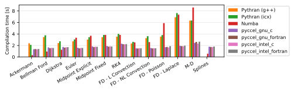

# Benchmarks

Several tests are available for the user to benchmark Pyccel against other common accelerators, notably [pythran](https://pythran.readthedocs.io/en/latest/) and [numba](https://numba.pydata.org/).
The same code is used for all tests, only the decorators change.

The dependencies can be installed using the command `python3 -m pip install .`

The code can be executed by running the script `benchmarks/run_benchmarks.py`.

In order to test pyccel and/or pythran, configuration files must be provided. An example configuration for pythran is found in [`benchmarks/config.pythranrc`](./benchmarks/config.pythranrc). This configuration is the default pythran configuration with the following additional flags:
- `-O3`
- `-march=native`
- `-mtune=native`
- `-mavx`
- `-ffast-math`
Pyccel configurations valid for your machine can be generated using the following command (which may be adapted for c generation or other compiler languages, see the [pyccel documentation](https://github.com/pyccel/pyccel/blob/master/tutorial/compiler.md)):
```
pyccel --language=fortran --export-compile-info pyccel_fortran.json
```
This configuration can then be modified to include additional flags or use different compilers. The tests shown below add the following additional flags (which match the flags added to pythran):
- `-O3`
- `-march=native`
- `-mtune=native`
- `-mavx`
- `-ffast-math`

Additional options can be used with this script to add further comparisons, change the output format, or change what is generated.

Run `python3 benchmarks/run_benchmarks.py --help` for more details.

The results below are presented for the current state of the development branch of pyccel, as well as the most recent version of pyccel available on pypi.

A requirements.txt file providing the necessary packages to reproduce the tests run can be found in the `version_specific_results` folder.
The environment can be reproduced using the following commands:
```
python3 -m venv my_virtual_environment
source my_virtual_environment/bin/activate
pip3 install -r requirements.txt
```
## Tests used

The tests used can be found in the [benchmarks/tests](./benchmarks/tests) directory.

### Ackermann

A basic implementation of the Ackermann function which is one of the simplest and oldest examples of a total computable function that is not primitive recursive.

### Bellman Ford

An algorithm for solving the shortest path problem. The code is adapted from examples written by [J. Burkardt](https://people.sc.fsu.edu/~jburkardt/py_src/py_src.html)

### Djikstra

An algorithm for solving the shortest path problem. The code is adapted from examples written by [J. Burkardt](https://people.sc.fsu.edu/~jburkardt/py_src/py_src.html)

### Euler

Solves an ordinary differential equation using Euler's method. The code is adapted from examples written by [J. Burkardt](https://people.sc.fsu.edu/~jburkardt/py_src/py_src.html)

### Midpoint Explicit

Solves an ordinary differential equation using the explicit midpoint method. The code is adapted from examples written by [J. Burkardt](https://people.sc.fsu.edu/~jburkardt/py_src/py_src.html)

### Midpoint Fixed

Solves an ordinary differential equation using the implicit midpoint method with a fixed number of iterations. The code is adapted from examples written by [J. Burkardt](https://people.sc.fsu.edu/~jburkardt/py_src/py_src.html)

### RK4

Solves an ordinary differential equation using a fourth order Runge-Kutta method. The code is adapted from examples written by [J. Burkardt](https://people.sc.fsu.edu/~jburkardt/py_src/py_src.html)

### FD - Linear Convection

Solves a 1D linear convection problem using Finite Differences methods. The code is adapted from examples written by [L. A. Barba](https://lorenabarba.com/blog/cfd-python-12-steps-to-navier-stokes/)

### FD - Non-Linear Convection

Solves a 1D non-linear convection problem using Finite Differences methods. The code is adapted from examples written by [L. A. Barba](https://lorenabarba.com/blog/cfd-python-12-steps-to-navier-stokes/)

### FD - Poisson

Solves a 2D Poisson problem using Finite Differences methods. The code is adapted from examples written by [L. A. Barba](https://lorenabarba.com/blog/cfd-python-12-steps-to-navier-stokes/)

### FD - Laplace

Solves a 2D Laplace problem using Finite Differences methods. The code is adapted from examples written by [L. A. Barba](https://lorenabarba.com/blog/cfd-python-12-steps-to-navier-stokes/)

### MD

Runs a molecular dynamics simulation. The code is adapted from examples written by [J. Burkardt](https://people.sc.fsu.edu/~jburkardt/py_src/py_src.html)
## Development branch results
### Performance Comparison (as of Wed May  3 09:16:09 UTC 2023)
## Compilation time
Algorithm                 | python                    | pythran                   | numba                     | pyccel_fortran            | pyccel_c                 
------------------------- | ------------------------- | ------------------------- | ------------------------- | ------------------------- | -------------------------
Ackermann                 | -                         | 2.36                      | 0.38                      | 1.25                      | 1.20                     
Bellman Ford              | -                         | 3.40                      | 1.16                      | 2.13                      | 2.12                     
Dijkstra                  | -                         | 2.62                      | 1.32                      | 2.18                      | 2.13                     
Euler                     | -                         | 3.01                      | 1.79                      | 2.11                      | 2.14                     
Midpoint Explicit         | -                         | 3.34                      | 2.48                      | 2.43                      | 2.46                     
Midpoint Fixed            | -                         | 3.92                      | 2.62                      | 2.50                      | 2.54                     
RK4                       | -                         | 4.47                      | 3.00                      | 3.12                      | 3.08                     
FD - L Convection         | -                         | 2.56                      | 0.95                      | 2.08                      | 2.10                     
FD - NL Convection        | -                         | 3.32                      | 1.02                      | 2.10                      | 2.14                     
FD - Poisson              | -                         | 3.46                      | 1.47                      | 2.25                      | 2.26                     
FD - Laplace              | -                         | 6.76                      | 2.81                      | 2.72                      | 2.70                     
M-D                       | -                         | 6.89                      | 3.29                      | 3.07                      | 2.88                     

## Execution time
Algorithm                 | python                    | pythran                   | numba                     | pyccel_fortran            | pyccel_c                 
------------------------- | ------------------------- | ------------------------- | ------------------------- | ------------------------- | -------------------------
Ackermann (ms)            | 385.00                    | 9.80                      | 26.60                     | 3.13                      | 3.23                     
Bellman Ford (ms)         | 2560.00                   | 6.72                      | 6.32                      | 4.45                      | 6.57                     
Dijkstra (ms)             | 6580.00                   | 37.20                     | 30.80                     | 29.90                     | 46.60                    
Euler (ms)                | 4900.00                   | 38.00                     | 107.00                    | 17.00                     | 201.00                   
Midpoint Explicit (ms)    | 10000.00                  | 74.30                     | 209.00                    | 27.00                     | 399.00                   
Midpoint Fixed (s)        | 50.50                     | 0.61                      | 1.14                      | 0.10                      | 1.97                     
RK4 (ms)                  | 25500.00                  | 238.00                    | 403.00                    | 41.40                     | 663.00                   
FD - L Convection (ms)    | 2720.00                   | 2.82                      | 3.11                      | 2.59                      | 2.54                     
FD - NL Convection (ms)   | 3250.00                   | 3.09                      | 3.34                      | 2.46                      | 2.98                     
FD - Poisson (ms)         | 8520.00                   | 5.78                      | 10.10                     | 4.26                      | 5.30                     
FD - Laplace (ms)         | 688.00                    | 251.00                    | 385.00                    | 81.10                     | 368.00                   
M-D (ms)                  | 19800.00                  | 65.00                     | 77.90                     | 120.00                    | 121.00                   


## Python 3.7 results
### Performance Comparison (as of 1.8.0)
## Compilation time
Algorithm                 | python                    | pythran                   | numba                     | pyccel_fortran            | pyccel_c                 
------------------------- | ------------------------- | ------------------------- | ------------------------- | ------------------------- | -------------------------
Ackermann                 | -                         | 2.03                      | 0.35                      | 1.21                      | 1.16                     
Bellman Ford              | -                         | 3.22                      | 1.15                      | 2.15                      | 2.10                     
Dijkstra                  | -                         | 2.45                      | 1.29                      | 2.23                      | 2.13                     
Euler                     | -                         | 2.82                      | 1.79                      | 2.10                      | 2.14                     
Midpoint Explicit         | -                         | 3.16                      | 2.50                      | 2.45                      | 2.48                     
Midpoint Fixed            | -                         | 3.77                      | 2.74                      | 2.52                      | 2.56                     
RK4                       | -                         | 4.21                      | 3.13                      | 3.09                      | 3.06                     
FD - L Convection         | -                         | 2.36                      | 1.01                      | 2.06                      | 2.08                     
FD - NL Convection        | -                         | 3.09                      | 1.09                      | 2.08                      | 2.13                     
FD - Poisson              | -                         | 3.27                      | 1.54                      | 2.25                      | 2.29                     
FD - Laplace              | -                         | 6.73                      | 2.98                      | 2.73                      | 2.74                     
M-D                       | -                         | 6.89                      | 3.44                      | 3.20                      | 2.93                     

## Execution time
Algorithm                 | python                    | pythran                   | numba                     | pyccel_fortran            | pyccel_c                 
------------------------- | ------------------------- | ------------------------- | ------------------------- | ------------------------- | -------------------------
Ackermann (ms)            | 448.00 $\pm$ 5.00         | 9.64 $\pm$ 0.06           | 32.30 $\pm$ 0.30          | 3.29 $\pm$ 0.01           | 3.27 $\pm$ 0.00          
Bellman Ford (ms)         | 2610.00 $\pm$ 160.00      | 6.59 $\pm$ 0.03           | 10.50 $\pm$ 0.00          | 4.45 $\pm$ 0.01           | 6.58 $\pm$ 0.00          
Dijkstra (ms)             | 7380.00 $\pm$ 330.00      | 36.70 $\pm$ 0.50          | 34.40 $\pm$ 0.60          | 30.60 $\pm$ 0.40          | 58.00 $\pm$ 32.60        
Euler (ms)                | 5890.00 $\pm$ 110.00      | 39.80 $\pm$ 0.70          | 125.00 $\pm$ 1.00         | 18.90 $\pm$ 0.70          | 204.00 $\pm$ 7.00        
Midpoint Explicit (ms)    | 11900.00 $\pm$ 200.00     | 77.50 $\pm$ 1.10          | 314.00 $\pm$ 2.00         | 28.90 $\pm$ 0.40          | 401.00 $\pm$ 2.00        
Midpoint Fixed (s)        | 59.90 $\pm$ 1.00          | 0.62 $\pm$ 0.00           | 1.76 $\pm$ 0.02           | 0.10 $\pm$ 0.00           | 1.98 $\pm$ 0.01          
RK4 (ms)                  | 27800.00 $\pm$ 500.00     | 223.00 $\pm$ 3.00         | 642.00 $\pm$ 13.00        | 42.60 $\pm$ 0.70          | 659.00 $\pm$ 3.00        
FD - L Convection (ms)    | 2680.00 $\pm$ 10.00       | 2.83 $\pm$ 0.00           | 13.80 $\pm$ 0.00          | 1.61 $\pm$ 0.02           | 2.99 $\pm$ 0.00          
FD - NL Convection (ms)   | 3780.00 $\pm$ 50.00       | 3.67 $\pm$ 0.12           | 14.80 $\pm$ 0.10          | 1.57 $\pm$ 0.02           | 2.52 $\pm$ 0.00          
FD - Poisson (ms)         | 8750.00 $\pm$ 200.00      | 5.89 $\pm$ 0.00           | 19.00 $\pm$ 0.10          | 4.19 $\pm$ 0.00           | 5.31 $\pm$ 0.01          
FD - Laplace (ms)         | 681.00 $\pm$ 2.00         | 251.00 $\pm$ 1.00         | 401.00 $\pm$ 3.00         | 78.10 $\pm$ 1.20          | 317.00 $\pm$ 1.00        
M-D (ms)                  | 22800.00 $\pm$ 300.00     | 64.30 $\pm$ 0.00          | 91.20 $\pm$ 0.30          | 120.00 $\pm$ 0.00         | 122.00 $\pm$ 0.00        


## Python 3.8 results
### Performance Comparison (as of 1.8.0)
## Compilation time
Algorithm                 | python                    | pythran                   | numba                     | pyccel_fortran            | pyccel_c                 
------------------------- | ------------------------- | ------------------------- | ------------------------- | ------------------------- | -------------------------
Ackermann                 | -                         | 2.15                      | 0.41                      | 1.27                      | 1.21                     
Bellman Ford              | -                         | 3.40                      | 1.23                      | 2.20                      | 2.17                     
Dijkstra                  | -                         | 2.60                      | 1.39                      | 2.27                      | 2.15                     
Euler                     | -                         | 2.97                      | 1.81                      | 2.12                      | 2.14                     
Midpoint Explicit         | -                         | 3.30                      | 2.54                      | 2.50                      | 2.51                     
Midpoint Fixed            | -                         | 3.83                      | 2.66                      | 2.55                      | 2.57                     
RK4                       | -                         | 4.43                      | 3.08                      | 3.11                      | 3.08                     
FD - L Convection         | -                         | 2.44                      | 0.96                      | 2.06                      | 2.08                     
FD - NL Convection        | -                         | 3.27                      | 1.02                      | 2.09                      | 2.11                     
FD - Poisson              | -                         | 3.43                      | 1.52                      | 2.26                      | 2.27                     
FD - Laplace              | -                         | 7.03                      | 2.90                      | 2.73                      | 2.75                     
M-D                       | -                         | 7.14                      | 3.33                      | 3.21                      | 2.95                     

## Execution time
Algorithm                 | python                    | pythran                   | numba                     | pyccel_fortran            | pyccel_c                 
------------------------- | ------------------------- | ------------------------- | ------------------------- | ------------------------- | -------------------------
Ackermann (ms)            | 445.00 $\pm$ 4.00         | 8.05 $\pm$ 0.04           | 28.10 $\pm$ 0.10          | 3.09 $\pm$ 0.01           | 2.95 $\pm$ 0.00          
Bellman Ford (ms)         | 2680.00 $\pm$ 80.00       | 7.72 $\pm$ 0.01           | 6.36 $\pm$ 0.01           | 3.85 $\pm$ 0.01           | 6.48 $\pm$ 0.01          
Dijkstra (ms)             | 6970.00 $\pm$ 40.00       | 46.40 $\pm$ 0.40          | 39.40 $\pm$ 1.00          | 35.40 $\pm$ 0.60          | 49.00 $\pm$ 0.50         
Euler (ms)                | 4650.00 $\pm$ 70.00       | 40.30 $\pm$ 0.40          | 112.00 $\pm$ 0.00         | 20.70 $\pm$ 0.80          | 237.00 $\pm$ 5.00        
Midpoint Explicit (ms)    | 9490.00 $\pm$ 70.00       | 78.70 $\pm$ 1.20          | 208.00 $\pm$ 3.00         | 30.80 $\pm$ 0.70          | 468.00 $\pm$ 1.00        
Midpoint Fixed (s)        | 47.30 $\pm$ 0.70          | 0.65 $\pm$ 0.00           | 1.05 $\pm$ 0.01           | 0.10 $\pm$ 0.00           | 2.31 $\pm$ 0.00          
RK4 (ms)                  | 22400.00 $\pm$ 100.00     | 200.00 $\pm$ 0.00         | 386.00 $\pm$ 6.00         | 45.30 $\pm$ 0.60          | 748.00 $\pm$ 9.00        
FD - L Convection (ms)    | 3200.00 $\pm$ 90.00       | 4.51 $\pm$ 0.01           | 3.36 $\pm$ 0.14           | 1.77 $\pm$ 0.06           | 2.82 $\pm$ 0.01          
FD - NL Convection (ms)   | 4000.00 $\pm$ 80.00       | 3.40 $\pm$ 0.01           | 3.39 $\pm$ 0.06           | 1.76 $\pm$ 0.08           | 2.87 $\pm$ 0.01          
FD - Poisson (ms)         | 8270.00 $\pm$ 100.00      | 5.91 $\pm$ 0.19           | 9.83 $\pm$ 0.10           | 3.73 $\pm$ 0.00           | 4.91 $\pm$ 0.00          
FD - Laplace (ms)         | 711.00 $\pm$ 6.00         | 233.00 $\pm$ 2.00         | 381.00 $\pm$ 3.00         | 76.40 $\pm$ 1.40          | 340.00 $\pm$ 2.00        
M-D (ms)                  | 18500.00 $\pm$ 300.00     | 53.00 $\pm$ 0.10          | 73.90 $\pm$ 0.70          | 106.00 $\pm$ 0.00         | 110.00 $\pm$ 0.00        


## Python 3.9 results
### Performance Comparison (as of 1.8.0)
## Compilation time
Algorithm                 | python                    | pythran                   | numba                     | pyccel_fortran            | pyccel_c                 
------------------------- | ------------------------- | ------------------------- | ------------------------- | ------------------------- | -------------------------
Ackermann                 | -                         | 2.76                      | 0.54                      | 1.60                      | 1.57                     
Bellman Ford              | -                         | 4.22                      | 1.46                      | 2.65                      | 2.63                     
Dijkstra                  | -                         | 3.34                      | 1.72                      | 2.95                      | 2.83                     
Euler                     | -                         | 3.55                      | 2.18                      | 2.43                      | 2.69                     
Midpoint Explicit         | -                         | 4.21                      | 3.20                      | 3.12                      | 3.18                     
Midpoint Fixed            | -                         | 5.13                      | 3.39                      | 3.11                      | 3.27                     
RK4                       | -                         | 5.32                      | 3.57                      | 3.93                      | 3.73                     
FD - L Convection         | -                         | 3.26                      | 1.12                      | 2.55                      | 2.51                     
FD - NL Convection        | -                         | 4.40                      | 1.65                      | 2.66                      | 2.82                     
FD - Poisson              | -                         | 4.65                      | 1.93                      | 2.86                      | 2.98                     
FD - Laplace              | -                         | 9.05                      | 3.40                      | 3.24                      | 3.18                     
M-D                       | -                         | 8.77                      | 4.02                      | 3.71                      | 3.50                     

## Execution time
Algorithm                 | python                    | pythran                   | numba                     | pyccel_fortran            | pyccel_c                 
------------------------- | ------------------------- | ------------------------- | ------------------------- | ------------------------- | -------------------------
Ackermann (ms)            | 520.00 $\pm$ 8.00         | 9.06 $\pm$ 0.23           | 31.50 $\pm$ 1.20          | 2.34 $\pm$ 0.08           | 2.43 $\pm$ 0.08          
Bellman Ford (ms)         | 3260.00 $\pm$ 110.00      | 6.92 $\pm$ 0.38           | 7.38 $\pm$ 0.36           | 5.05 $\pm$ 0.24           | 9.67 $\pm$ 0.30          
Dijkstra (ms)             | 8560.00 $\pm$ 250.00      | 46.90 $\pm$ 1.60          | 49.70 $\pm$ 1.80          | 43.00 $\pm$ 1.80          | 60.70 $\pm$ 2.20         
Euler (ms)                | 5200.00 $\pm$ 210.00      | 51.70 $\pm$ 9.40          | 122.00 $\pm$ 6.00         | 24.60 $\pm$ 1.80          | 273.00 $\pm$ 8.00        
Midpoint Explicit (ms)    | 10600.00 $\pm$ 400.00     | 92.50 $\pm$ 4.30          | 256.00 $\pm$ 7.00         | 40.20 $\pm$ 2.00          | 535.00 $\pm$ 13.00       
Midpoint Fixed (s)        | 55.10 $\pm$ 1.40          | 0.93 $\pm$ 0.23           | 1.26 $\pm$ 0.04           | 0.13 $\pm$ 0.01           | 2.65 $\pm$ 0.07          
RK4 (ms)                  | 27000.00 $\pm$ 1300.00    | 224.00 $\pm$ 11.00        | 468.00 $\pm$ 18.00        | 51.30 $\pm$ 3.20          | 890.00 $\pm$ 37.00       
FD - L Convection (ms)    | 3900.00 $\pm$ 130.00      | 3.62 $\pm$ 0.14           | 4.75 $\pm$ 0.61           | 2.98 $\pm$ 0.09           | 4.74 $\pm$ 0.50          
FD - NL Convection (ms)   | 4640.00 $\pm$ 190.00      | 4.77 $\pm$ 0.17           | 5.02 $\pm$ 0.26           | 2.77 $\pm$ 0.22           | 5.07 $\pm$ 0.06          
FD - Poisson (ms)         | 10000.00 $\pm$ 200.00     | 10.30 $\pm$ 0.50          | 14.10 $\pm$ 0.90          | 8.46 $\pm$ 0.16           | 11.60 $\pm$ 0.20         
FD - Laplace (ms)         | 1170.00 $\pm$ 20.00       | 349.00 $\pm$ 8.00         | 568.00 $\pm$ 23.00        | 193.00 $\pm$ 5.00         | 561.00 $\pm$ 9.00        
M-D (ms)                  | 21400.00 $\pm$ 900.00     | 63.50 $\pm$ 3.90          | 105.00 $\pm$ 4.00         | 137.00 $\pm$ 3.00         | 142.00 $\pm$ 3.00        


## Python 3.10 results
### Performance Comparison (as of 1.8.0)
## Compilation time
Algorithm                 | python                    | pythran                   | numba                     | pyccel_fortran            | pyccel_c                 
------------------------- | ------------------------- | ------------------------- | ------------------------- | ------------------------- | -------------------------
Ackermann                 | -                         | 3.19                      | 0.53                      | 1.49                      | 1.41                     
Bellman Ford              | -                         | 4.38                      | 1.51                      | 2.61                      | 2.60                     
Dijkstra                  | -                         | 3.27                      | 1.62                      | 2.80                      | 2.63                     
Euler                     | -                         | 3.89                      | 2.26                      | 2.59                      | 2.65                     
Midpoint Explicit         | -                         | 4.22                      | 3.04                      | 2.89                      | 2.96                     
Midpoint Fixed            | -                         | 4.99                      | 3.19                      | 2.95                      | 3.05                     
RK4                       | -                         | 5.54                      | 3.61                      | 3.75                      | 3.80                     
FD - L Convection         | -                         | 3.28                      | 1.24                      | 2.54                      | 2.55                     
FD - NL Convection        | -                         | 4.14                      | 1.33                      | 2.51                      | 2.53                     
FD - Poisson              | -                         | 4.33                      | 1.80                      | 2.69                      | 2.74                     
FD - Laplace              | -                         | 8.66                      | 3.31                      | 3.24                      | 3.35                     
M-D                       | -                         | 8.85                      | 3.87                      | 3.77                      | 3.38                     

## Execution time
Algorithm                 | python                    | pythran                   | numba                     | pyccel_fortran            | pyccel_c                 
------------------------- | ------------------------- | ------------------------- | ------------------------- | ------------------------- | -------------------------
Ackermann (ms)            | 491.00 $\pm$ 18.00        | 8.51 $\pm$ 0.38           | 28.90 $\pm$ 1.70          | 2.23 $\pm$ 0.12           | 2.25 $\pm$ 0.13          
Bellman Ford (ms)         | 3170.00 $\pm$ 40.00       | 6.79 $\pm$ 0.28           | 7.27 $\pm$ 0.31           | 4.92 $\pm$ 0.16           | 9.60 $\pm$ 0.42          
Dijkstra (ms)             | 8260.00 $\pm$ 170.00      | 44.60 $\pm$ 1.90          | 47.40 $\pm$ 2.70          | 40.60 $\pm$ 1.70          | 56.90 $\pm$ 3.20         
Euler (ms)                | 5490.00 $\pm$ 130.00      | 51.30 $\pm$ 7.90          | 122.00 $\pm$ 5.00         | 22.90 $\pm$ 1.30          | 264.00 $\pm$ 10.00       
Midpoint Explicit (ms)    | 11600.00 $\pm$ 600.00     | 89.20 $\pm$ 3.50          | 241.00 $\pm$ 11.00        | 36.70 $\pm$ 3.20          | 521.00 $\pm$ 19.00       
Midpoint Fixed (s)        | 58.50 $\pm$ 3.60          | 0.74 $\pm$ 0.02           | 1.22 $\pm$ 0.07           | 0.12 $\pm$ 0.01           | 2.51 $\pm$ 0.07          
RK4 (ms)                  | 28300.00 $\pm$ 1700.00    | 230.00 $\pm$ 11.00        | 463.00 $\pm$ 15.00        | 48.00 $\pm$ 2.60          | 837.00 $\pm$ 27.00       
FD - L Convection (ms)    | 3590.00 $\pm$ 70.00       | 3.72 $\pm$ 0.14           | 4.57 $\pm$ 0.13           | 3.19 $\pm$ 0.38           | 4.72 $\pm$ 0.56          
FD - NL Convection (ms)   | 4490.00 $\pm$ 70.00       | 4.27 $\pm$ 0.12           | 5.26 $\pm$ 0.69           | 3.24 $\pm$ 0.37           | 5.78 $\pm$ 0.65          
FD - Poisson (ms)         | 9960.00 $\pm$ 400.00      | 9.72 $\pm$ 0.46           | 12.90 $\pm$ 0.50          | 8.44 $\pm$ 0.23           | 11.80 $\pm$ 0.30         
FD - Laplace (ms)         | 1170.00 $\pm$ 20.00       | 334.00 $\pm$ 11.00        | 563.00 $\pm$ 9.00         | 191.00 $\pm$ 4.00         | 558.00 $\pm$ 11.00       
M-D (ms)                  | 21700.00 $\pm$ 400.00     | 61.00 $\pm$ 3.00          | 103.00 $\pm$ 2.00         | 138.00 $\pm$ 3.00         | 143.00 $\pm$ 2.00        



## Python 3.11 results
### Performance Comparison (as of 1.8.0)
## Compilation time
Algorithm                 | python                    | pythran                   | numba                     | pyccel_fortran            | pyccel_c                 
------------------------- | ------------------------- | ------------------------- | ------------------------- | ------------------------- | -------------------------
Ackermann                 | -                         | 2.38                      | 0.34                      | 1.21                      | 1.18                     
Bellman Ford              | -                         | 3.55                      | 1.15                      | 2.19                      | 2.12                     
Dijkstra                  | -                         | 2.74                      | 1.25                      | 2.26                      | 2.13                     
Euler                     | -                         | 2.95                      | 1.68                      | 2.08                      | 2.12                     
Midpoint Explicit         | -                         | 3.23                      | 2.31                      | 2.43                      | 2.44                     
Midpoint Fixed            | -                         | 3.77                      | 2.50                      | 2.46                      | 2.53                     
RK4                       | -                         | 4.38                      | 2.80                      | 2.99                      | 2.99                     
FD - L Convection         | -                         | 2.55                      | 0.90                      | 2.05                      | 2.09                     
FD - NL Convection        | -                         | 3.23                      | 0.95                      | 2.10                      | 2.13                     
FD - Poisson              | -                         | 3.36                      | 1.36                      | 2.22                      | 2.23                     
FD - Laplace              | -                         | 6.80                      | 2.58                      | 2.58                      | 2.65                     
M-D                       | -                         | 6.68                      | 3.10                      | 3.05                      | 2.85                     

## Execution time
Algorithm                 | python                    | pythran                   | numba                     | pyccel_fortran            | pyccel_c                 
------------------------- | ------------------------- | ------------------------- | ------------------------- | ------------------------- | -------------------------
Ackermann (ms)            | 400.00 $\pm$ 2.00         | 9.81 $\pm$ 0.02           | 27.20 $\pm$ 0.20          | 3.14 $\pm$ 0.00           | 3.26 $\pm$ 0.00          
Bellman Ford (ms)         | 2590.00 $\pm$ 60.00       | 6.73 $\pm$ 0.00           | 6.34 $\pm$ 0.01           | 4.46 $\pm$ 0.01           | 6.61 $\pm$ 0.07          
Dijkstra (ms)             | 6360.00 $\pm$ 30.00       | 42.10 $\pm$ 4.10          | 38.90 $\pm$ 6.20          | 35.00 $\pm$ 4.50          | 52.00 $\pm$ 5.40         
Euler (ms)                | 4890.00 $\pm$ 30.00       | 38.90 $\pm$ 1.20          | 108.00 $\pm$ 0.00         | 18.70 $\pm$ 0.80          | 210.00 $\pm$ 4.00        
Midpoint Explicit (ms)    | 9920.00 $\pm$ 40.00       | 77.50 $\pm$ 3.00          | 211.00 $\pm$ 2.00         | 30.30 $\pm$ 1.20          | 401.00 $\pm$ 4.00        
Midpoint Fixed (s)        | 48.90 $\pm$ 0.20          | 0.61 $\pm$ 0.01           | 1.10 $\pm$ 0.03           | 0.10 $\pm$ 0.00           | 2.00 $\pm$ 0.02          
RK4 (ms)                  | 24600.00 $\pm$ 100.00     | 219.00 $\pm$ 1.00         | 403.00 $\pm$ 6.00         | 42.20 $\pm$ 0.60          | 664.00 $\pm$ 8.00        
FD - L Convection (ms)    | 2650.00 $\pm$ 40.00       | 2.92 $\pm$ 0.06           | 3.21 $\pm$ 0.19           | 1.63 $\pm$ 0.02           | 2.62 $\pm$ 0.13          
FD - NL Convection (ms)   | 3240.00 $\pm$ 70.00       | 3.37 $\pm$ 0.04           | 3.47 $\pm$ 0.22           | 1.56 $\pm$ 0.01           | 2.63 $\pm$ 0.32          
FD - Poisson (ms)         | 8060.00 $\pm$ 170.00      | 5.79 $\pm$ 0.03           | 10.10 $\pm$ 0.10          | 4.24 $\pm$ 0.00           | 5.34 $\pm$ 0.10          
FD - Laplace (ms)         | 698.00 $\pm$ 2.00         | 252.00 $\pm$ 1.00         | 389.00 $\pm$ 5.00         | 77.00 $\pm$ 0.80          | 365.00 $\pm$ 0.00        
M-D (ms)                  | 19500.00 $\pm$ 100.00     | 65.00 $\pm$ 0.00          | 78.20 $\pm$ 0.40          | 120.00 $\pm$ 0.00         | 121.00 $\pm$ 0.00        


