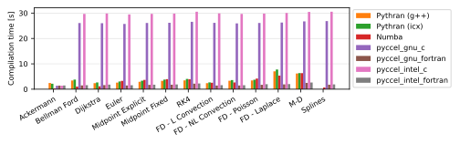

# Benchmarks

Several tests are available for the user to benchmark Pyccel against other common accelerators, notably [pythran](https://pythran.readthedocs.io/en/latest/) and [numba](https://numba.pydata.org/).
The same code is used for all tests, only the decorators change.

The dependencies can be installed using the command `python3 -m pip install .`

The code can be executed by running the script `benchmarks/run_benchmarks.py`.

In order to test pyccel and/or pythran, configuration files must be provided. An example configuration for pythran is found in [`benchmarks/config.pythranrc`](./benchmarks/config.pythranrc). This configuration is the default pythran configuration with the following additional flags:
- `-O3`
- `-march=native`
- `-mtune=native`
- `-mavx`
- `-ffast-math`

Pyccel configurations valid for your machine can be generated using the following command (which may be adapted for another compiler family, see the [pyccel documentation](https://pyccel.github.io/pyccel/docs/compiler.html)):
```
pyccel --compiler-family intel --export-compiler-config pyccel_intel.json
```
This configuration can then be modified to include additional flags or use different compilers. The tests shown below add the following additional flags (which match the flags added to pythran):
- `-O3`
- `-march=native`
- `-mtune=native`
- `-mavx`
- `-ffast-math`

Additional options can be used with this script to add further comparisons, change the output format, or change what is generated.

Run `python3 benchmarks/run_benchmarks.py --help` for more details.

The results below are presented for the current state of the development branch of pyccel, as well as the most recent version of pyccel available on pypi.

A requirements.txt file providing the necessary packages to reproduce the tests run can be found in the `version_specific_results` folder.
The environment can be reproduced using the following commands:
```
python3 -m venv my_virtual_environment
source my_virtual_environment/bin/activate
pip3 install -r requirements.txt
```
## Tests used

The tests used can be found in the [benchmarks/tests](./benchmarks/tests) directory.

### Ackermann

A basic implementation of the Ackermann function which is one of the simplest and oldest examples of a total computable function that is not primitive recursive.

### Bellman Ford

An algorithm for solving the shortest path problem. The code is adapted from examples written by [J. Burkardt](https://people.sc.fsu.edu/~jburkardt/py_src/py_src.html)

### Djikstra

An algorithm for solving the shortest path problem. The code is adapted from examples written by [J. Burkardt](https://people.sc.fsu.edu/~jburkardt/py_src/py_src.html)

### Euler

Solves an ordinary differential equation using Euler's method. The code is adapted from examples written by [J. Burkardt](https://people.sc.fsu.edu/~jburkardt/py_src/py_src.html)

### Midpoint Explicit

Solves an ordinary differential equation using the explicit midpoint method. The code is adapted from examples written by [J. Burkardt](https://people.sc.fsu.edu/~jburkardt/py_src/py_src.html)

### Midpoint Fixed

Solves an ordinary differential equation using the implicit midpoint method with a fixed number of iterations. The code is adapted from examples written by [J. Burkardt](https://people.sc.fsu.edu/~jburkardt/py_src/py_src.html)

### RK4

Solves an ordinary differential equation using a fourth order Runge-Kutta method. The code is adapted from examples written by [J. Burkardt](https://people.sc.fsu.edu/~jburkardt/py_src/py_src.html)

### FD - Linear Convection

Solves a 1D linear convection problem using Finite Differences methods. The code is adapted from examples written by [L. A. Barba](https://lorenabarba.com/blog/cfd-python-12-steps-to-navier-stokes/)

### FD - Non-Linear Convection

Solves a 1D non-linear convection problem using Finite Differences methods. The code is adapted from examples written by [L. A. Barba](https://lorenabarba.com/blog/cfd-python-12-steps-to-navier-stokes/)

### FD - Poisson

Solves a 2D Poisson problem using Finite Differences methods. The code is adapted from examples written by [L. A. Barba](https://lorenabarba.com/blog/cfd-python-12-steps-to-navier-stokes/)

### FD - Laplace

Solves a 2D Laplace problem using Finite Differences methods. The code is adapted from examples written by [L. A. Barba](https://lorenabarba.com/blog/cfd-python-12-steps-to-navier-stokes/)

### MD

Runs a molecular dynamics simulation. The code is adapted from examples written by [J. Burkardt](https://people.sc.fsu.edu/~jburkardt/py_src/py_src.html)

### Splines

Evaluates a non-uniform spline saved as a class instance at a large number of test points. The code uses Algorithm A2.2 from the NURBS book (Piegl, Les, and Wayne Tiller. The NURBS book. Springer Science & Business Media, 2012.).
## Development branch results
### Performance Comparison (as of Tue Jul  1 16:37:28 UTC 2025)
## Compilation time
Algorithm                 | python                    | pythran_gnu               | pythran_intel             | numba                     | pyccel_gnu_c              | pyccel_gnu_fortran        | pyccel_intel_c            | pyccel_intel_fortran     
------------------------- | ------------------------- | ------------------------- | ------------------------- | ------------------------- | ------------------------- | ------------------------- | ------------------------- | -------------------------
Ackermann                 | -                         | 2.35                      | 2.08                      | 0.28                      | 1.35                      | 1.37                      | 1.38                      | 1.41                     
Bellman Ford              | -                         | 3.36                      | 3.64                      | 0.94                      | 1.64                      | 1.52                      | 1.56                      | 1.58                     
Dijkstra                  | -                         | 2.35                      | 2.68                      | 1.23                      | 1.75                      | 1.65                      | 1.70                      | 1.71                     
Euler                     | -                         | 2.65                      | 3.06                      | 3.38                      | 1.61                      | 1.50                      | 1.57                      | 1.60                     
Midpoint Explicit         | -                         | 3.03                      | 3.51                      | 3.77                      | 1.85                      | 1.75                      | 1.81                      | 1.81                     
Midpoint Fixed            | -                         | 3.32                      | 3.74                      | 3.77                      | 1.90                      | 1.79                      | 1.83                      | 1.84                     
RK4                       | -                         | 3.50                      | 3.95                      | 3.76                      | 2.24                      | 2.15                      | 2.15                      | 2.21                     
FD - L Convection         | -                         | 2.40                      | 2.72                      | 2.65                      | 1.58                      | 1.47                      | 1.51                      | 1.53                     
FD - NL Convection        | -                         | 3.35                      | 3.61                      | 2.50                      | 1.54                      | 1.45                      | 1.52                      | 1.49                     
FD - Poisson              | -                         | 3.47                      | 3.72                      | 5.69                      | 1.68                      | 1.76                      | 1.64                      | 1.88                     
FD - Laplace              | -                         | 6.95                      | 7.76                      | 7.20                      | 1.95                      | 1.89                      | 1.88                      | 1.98                     
M-D                       | -                         | 6.27                      | 6.25                      | 8.55                      | 2.35                      | 2.47                      | 2.24                      | 2.56                     
Splines                   | -                         | -                         | -                         | 0.59                      | 1.82                      | 1.76                      | 1.73                      | 1.86                     

## Execution time
Algorithm                 | python                    | pythran_gnu               | pythran_intel             | numba                     | pyccel_gnu_c              | pyccel_gnu_fortran        | pyccel_intel_c            | pyccel_intel_fortran     
------------------------- | ------------------------- | ------------------------- | ------------------------- | ------------------------- | ------------------------- | ------------------------- | ------------------------- | -------------------------
Ackermann (ms)            | 422.00                    | 2.91                      | 3.05                      | 10.90                     | 1.23                      | 1.32                      | 4.01                      | 8.89                     
Bellman Ford (ms)         | 1720.00                   | 5.25                      | 3.44                      | 3.80                      | 3.77                      | 3.29                      | 5.88                      | 4.25                     
Dijkstra (ms)             | 4790.00                   | 21.50                     | 18.00                     | 20.90                     | 71.90                     | 19.70                     | 70.00                     | 23.40                    
Euler (ms)                | 3400.00                   | 25.40                     | 25.60                     | 36.50                     | 27.10                     | 11.70                     | 27.00                     | 16.40                    
Midpoint Explicit (ms)    | 6880.00                   | 51.30                     | 50.70                     | 69.20                     | 44.90                     | 19.80                     | 46.30                     | 16.40                    
Midpoint Fixed (ms)       | 34700.00                  | 269.00                    | 93.10                     | 322.00                    | 191.00                    | 73.10                     | 198.00                    | 51.90                    
RK4 (ms)                  | 17200.00                  | 153.00                    | 35.30                     | 128.00                    | 95.40                     | 31.70                     | 91.40                     | 28.00                    
FD - L Convection (ms)    | 2110.00                   | 1.49                      | 1.64                      | 5.63                      | 6.85                      | 1.50                      | 7.73                      | 1.49                     
FD - NL Convection (ms)   | 2630.00                   | 1.84                      | 1.67                      | 5.65                      | 6.73                      | 1.60                      | 7.96                      | 1.39                     
FD - Poisson (ms)         | 5740.00                   | 2.88                      | 5.38                      | 6.68                      | 16.10                     | 2.60                      | 23.90                     | 2.62                     
FD - Laplace (ms)         | 634.00                    | 67.90                     | 128.00                    | 277.00                    | 485.00                    | 60.60                     | 664.00                    | 60.40                    
M-D (ms)                  | 14400.00                  | 35.90                     | 52.30                     | 60.00                     | 117.00                    | 62.20                     | 61.90                     | 89.30                    
Splines (ms)              | 1640.00                   | -                         | -                         | 18.60                     | 14.30                     | 17.80                     | 15.20                     | 27.60                    



## Python 3.8 results
## Python 3.9 results
## Python 3.10 results
## Python 3.11 results
## Python 3.12 results
