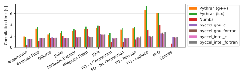

# Benchmarks

Several tests are available for the user to benchmark Pyccel against other common accelerators, notably [pythran](https://pythran.readthedocs.io/en/latest/) and [numba](https://numba.pydata.org/).
The same code is used for all tests, only the decorators change.

The dependencies can be installed using the command `python3 -m pip install .

The code can be executed by running the script `benchmarks/run_benchmarks.py`.
Additional options can be used with this script to add additional comparisons, change the output format, or change what is generated.

Run `python3 benchmarks/run_benchmarks.py --help` for more details.

The results below are presented for the current state of the development branch of pyccel, as well as the most recent version of pyccel available on pypi.

A requirements.txt file providing the necessary packages to reproduce the tests run can be found in the `version_specific_results` folder.
The environment can be reproduced using the following commands:
```
python3 -m venv my_virtual_environment
source my_virtual_environment/bin/activate
pip3 -r requirements.txt
```
## Tests used

The tests used can be found in the [benchmarks/tests](./benchmarks/tests) directory.

### Ackermann

A basic implementation of the Ackermann function which is one of the simplest and oldest examples of a total computable function that is not primitive recursive.

### Bellman Ford

An algorithm for solving the shortest path problem. The code is adapted from examples written by [J. Burkardt](https://people.sc.fsu.edu/~jburkardt/py_src/py_src.html)

### Djikstra

An algorithm for solving the shortest path problem. The code is adapted from examples written by [J. Burkardt](https://people.sc.fsu.edu/~jburkardt/py_src/py_src.html)

### Euler

Solves an ordinary differential equation using Euler's method. The code is adapted from examples written by [J. Burkardt](https://people.sc.fsu.edu/~jburkardt/py_src/py_src.html)

### Midpoint Explicit

Solves an ordinary differential equation using the explicit midpoint method. The code is adapted from examples written by [J. Burkardt](https://people.sc.fsu.edu/~jburkardt/py_src/py_src.html)

### Midpoint Fixed

Solves an ordinary differential equation using the implicit midpoint method with a fixed number of iterations. The code is adapted from examples written by [J. Burkardt](https://people.sc.fsu.edu/~jburkardt/py_src/py_src.html)

### RK4

Solves an ordinary differential equation using a fourth order Runge-Kutta method. The code is adapted from examples written by [J. Burkardt](https://people.sc.fsu.edu/~jburkardt/py_src/py_src.html)

### FD - Linear Convection

Solves a 1D linear convection problem using Finite Differences methods. The code is adapted from examples written by [L. A. Barba](https://lorenabarba.com/blog/cfd-python-12-steps-to-navier-stokes/)

### FD - Non-Linear Convection

Solves a 1D non-linear convection problem using Finite Differences methods. The code is adapted from examples written by [L. A. Barba](https://lorenabarba.com/blog/cfd-python-12-steps-to-navier-stokes/)

### FD - Poisson

Solves a 2D Poisson problem using Finite Differences methods. The code is adapted from examples written by [L. A. Barba](https://lorenabarba.com/blog/cfd-python-12-steps-to-navier-stokes/)

### FD - Laplace

Solves a 2D Laplace problem using Finite Differences methods. The code is adapted from examples written by [L. A. Barba](https://lorenabarba.com/blog/cfd-python-12-steps-to-navier-stokes/)

### MD

Runs a molecular dynamics simulation. The code is adapted from examples written by [J. Burkardt](https://people.sc.fsu.edu/~jburkardt/py_src/py_src.html)
## Development branch results
### Performance Comparison (as of Wed Dec 14 07:59:25 UTC 2022)
## Compilation time
Algorithm                 | python                    | pythran                   | numba                     | pyccel                    | pyccel_c                 
------------------------- | ------------------------- | ------------------------- | ------------------------- | ------------------------- | -------------------------
Ackermann                 | -                         | 2.48                      | 0.40                      | 1.58                      | 1.48                     
Bellman Ford              | -                         | 3.25                      | 1.13                      | 2.31                      | 2.18                     
Dijkstra                  | -                         | 3.16                      | 1.46                      | 2.38                      | 2.26                     
Euler                     | -                         | 3.69                      | 1.51                      | 2.30                      | 2.27                     
Midpoint Explicit         | -                         | 4.48                      | 2.35                      | 2.72                      | 2.63                     
Midpoint Fixed            | -                         | 4.99                      | 2.72                      | 2.79                      | 2.79                     
RK4                       | -                         | 5.28                      | 2.80                      | 3.41                      | 3.29                     
FD - L Convection         | -                         | 2.94                      | 0.37                      | 2.17                      | 2.17                     
FD - NL Convection        | -                         | 2.88                      | 0.37                      | 2.17                      | 2.18                     
FD - Poisson              | -                         | 8.54                      | 0.90                      | 2.32                      | 2.26                     
FD - Laplace              | -                         | 12.40                     | 2.04                      | 2.99                      | -                        
M-D                       | -                         | -                         | 6.24                      | 3.52                      | 3.19                     

## Execution time
Algorithm                 | python                    | pythran                   | numba                     | pyccel                    | pyccel_c                 
------------------------- | ------------------------- | ------------------------- | ------------------------- | ------------------------- | -------------------------
Ackermann (ms)            | 435.00                    | 4.61                      | 21.70                     | 2.52                      | 2.80                     
Bellman Ford (ns)         | 72100.00                  | 459.00                    | 800.00                    | 253.00                    | 552.00                   
Dijkstra (ns)             | 34500.00                  | 378.00                    | 600.00                    | 307.00                    | 573.00                   
Euler (ms)                | 54.40                     | 0.79                      | 1.32                      | 0.16                      | 3.47                     
Midpoint Explicit (ms)    | 111.00                    | 1.79                      | 3.21                      | 0.26                      | 6.23                     
Midpoint Fixed (ms)       | 544.00                    | 10.80                     | 19.30                     | 1.36                      | 27.40                    
RK4 (ms)                  | 288.00                    | 2.29                      | 6.93                      | 0.32                      | 7.60                     
FD - L Convection (ms)    | 2400.00                   | 1.91                      | 11.30                     | 1.79                      | 2.05                     
FD - NL Convection (ms)   | 3080.00                   | 2.21                      | 10.90                     | 1.75                      | 1.98                     
FD - Poisson (ms)         | 5150.00                   | 2.42                      | 12.60                     | 4.65                      | 2.05                     
FD - Laplace (\textmu s)  | 48.70                     | 2.89                      | 9920.00                   | 2.38                      | -                        
M-D (ms)                  | 54300.00                  | -                         | 256.00                    | 313.00                    | 325.00                   


## Python 3.7 results
### Performance Comparison (as of 1.7.0)
## Compilation time
Algorithm                 | python                    | pythran                   | numba                     | pyccel                    | pyccel_c                 
------------------------- | ------------------------- | ------------------------- | ------------------------- | ------------------------- | -------------------------
Ackermann                 | -                         | 2.67                      | 0.50                      | 1.75                      | 1.65                     
Bellman Ford              | -                         | 3.46                      | 1.37                      | 2.59                      | 2.54                     
Dijkstra                  | -                         | 3.27                      | 1.81                      | 2.61                      | 2.49                     
Euler                     | -                         | 4.30                      | 1.87                      | 2.52                      | 2.45                     
Midpoint Explicit         | -                         | 4.95                      | 2.85                      | 2.95                      | 3.15                     
Midpoint Fixed            | -                         | 6.07                      | 3.44                      | 3.11                      | 3.20                     
RK4                       | -                         | 6.09                      | 3.43                      | 3.70                      | 3.63                     
FD - L Convection         | -                         | 3.29                      | 0.49                      | 2.47                      | 2.42                     
FD - NL Convection        | -                         | 3.04                      | 0.44                      | 2.37                      | 2.35                     
FD - Poisson              | -                         | 9.16                      | 1.04                      | 2.47                      | 2.60                     
FD - Laplace              | -                         | 16.95                     | 2.95                      | 3.43                      | -                        
M-D                       | -                         | -                         | 6.32                      | 3.87                      | 3.24                     

## Execution time
Algorithm                 | python                    | pythran                   | numba                     | pyccel                    | pyccel_c                 
------------------------- | ------------------------- | ------------------------- | ------------------------- | ------------------------- | -------------------------
Ackermann (ms)            | 662.00 $\pm$ 20.00        | 5.52 $\pm$ 0.19           | 35.90 $\pm$ 1.70          | 2.50 $\pm$ 0.12           | 2.61 $\pm$ 0.09          
Bellman Ford (ns)         | 83400.00 $\pm$ 4200.00    | 512.00 $\pm$ 17.00        | 732.00 $\pm$ 28.00        | 332.00 $\pm$ 11.00        | 694.00 $\pm$ 24.00       
Dijkstra (ns)             | 44800.00 $\pm$ 1900.00    | 424.00 $\pm$ 17.00        | 506.00 $\pm$ 36.00        | 377.00 $\pm$ 12.00        | 651.00 $\pm$ 28.00       
Euler (ms)                | 74.90 $\pm$ 4.30          | 0.99 $\pm$ 0.06           | 1.27 $\pm$ 0.04           | 0.21 $\pm$ 0.01           | 3.79 $\pm$ 0.14          
Midpoint Explicit (ms)    | 150.00 $\pm$ 8.00         | 1.97 $\pm$ 0.11           | 3.15 $\pm$ 0.08           | 0.38 $\pm$ 0.01           | 7.11 $\pm$ 0.40          
Midpoint Fixed (ms)       | 784.00 $\pm$ 28.00        | 12.80 $\pm$ 0.70          | 17.20 $\pm$ 1.10          | 1.37 $\pm$ 0.09           | 28.90 $\pm$ 1.10         
RK4 (ms)                  | 354.00 $\pm$ 22.00        | 2.77 $\pm$ 0.14           | 5.99 $\pm$ 0.26           | 0.44 $\pm$ 0.01           | 7.73 $\pm$ 0.24          
FD - L Convection (ms)    | 2900.00 $\pm$ 100.00      | 2.19 $\pm$ 0.09           | 11.80 $\pm$ 0.40          | 2.67 $\pm$ 0.10           | 3.53 $\pm$ 0.16          
FD - NL Convection (ms)   | 4140.00 $\pm$ 120.00      | 2.36 $\pm$ 0.10           | 11.60 $\pm$ 0.30          | 2.43 $\pm$ 0.07           | 3.44 $\pm$ 0.15          
FD - Poisson (ms)         | 6000.00 $\pm$ 260.00      | 4.42 $\pm$ 0.13           | 13.50 $\pm$ 0.60          | 5.90 $\pm$ 0.23           | 4.64 $\pm$ 0.47          
FD - Laplace (\textmu s)  | 203.00 $\pm$ 32.00        | 3.49 $\pm$ 0.31           | 13.50 $\pm$ 1.20          | 3.00 $\pm$ 0.07           | -                        
M-D (ms)                  | 66000.00 $\pm$ 3300.00    | -                         | 303.00 $\pm$ 11.00        | 359.00 $\pm$ 9.00         | 370.00 $\pm$ 21.00       


## Python 3.8 results
### Performance Comparison (as of 1.7.0)
## Compilation time
Algorithm                 | python                    | pythran                   | numba                     | pyccel                    | pyccel_c                 
------------------------- | ------------------------- | ------------------------- | ------------------------- | ------------------------- | -------------------------
Ackermann                 | -                         | 1.81                      | 0.34                      | 1.26                      | 1.15                     
Bellman Ford              | -                         | 2.43                      | 0.94                      | 1.84                      | 1.75                     
Dijkstra                  | -                         | 2.47                      | 1.22                      | 1.91                      | 1.83                     
Euler                     | -                         | 2.91                      | 1.30                      | 1.86                      | 1.81                     
Midpoint Explicit         | -                         | 3.50                      | 2.00                      | 2.22                      | 2.15                     
Midpoint Fixed            | -                         | 4.00                      | 2.30                      | 2.30                      | 2.23                     
RK4                       | -                         | 4.15                      | 2.35                      | 2.78                      | 2.68                     
FD - L Convection         | -                         | 2.20                      | 0.32                      | 1.73                      | 1.72                     
FD - NL Convection        | -                         | 2.19                      | 0.31                      | 1.72                      | 1.73                     
FD - Poisson              | -                         | 6.83                      | 0.74                      | 1.84                      | 1.81                     
FD - Laplace              | -                         | 10.15                     | 1.72                      | 2.44                      | -                        
M-D                       | -                         | -                         | 5.25                      | 2.86                      | 2.60                     

## Execution time
Algorithm                 | python                    | pythran                   | numba                     | pyccel                    | pyccel_c                 
------------------------- | ------------------------- | ------------------------- | ------------------------- | ------------------------- | -------------------------
Ackermann (ms)            | 474.00 $\pm$ 5.00         | 10.40 $\pm$ 0.10          | 32.30 $\pm$ 0.20          | 3.20 $\pm$ 0.00           | 3.28 $\pm$ 0.00          
Bellman Ford (ns)         | 59000.00 $\pm$ 700.00     | 372.00 $\pm$ 4.00         | 539.00 $\pm$ 4.00         | 226.00 $\pm$ 1.00         | 487.00 $\pm$ 8.00        
Dijkstra (ns)             | 30700.00 $\pm$ 400.00     | 319.00 $\pm$ 2.00         | 353.00 $\pm$ 5.00         | 246.00 $\pm$ 1.00         | 467.00 $\pm$ 4.00        
Euler (ms)                | 46.10 $\pm$ 0.60          | 0.64 $\pm$ 0.02           | 1.28 $\pm$ 0.01           | 0.14 $\pm$ 0.00           | 2.55 $\pm$ 0.02          
Midpoint Explicit (ms)    | 94.40 $\pm$ 0.90          | 1.45 $\pm$ 0.05           | 3.19 $\pm$ 0.08           | 0.24 $\pm$ 0.00           | 4.60 $\pm$ 0.03          
Midpoint Fixed (ms)       | 474.00 $\pm$ 8.00         | 8.76 $\pm$ 0.09           | 17.60 $\pm$ 0.20          | 0.97 $\pm$ 0.03           | 19.80 $\pm$ 0.20         
RK4 (ms)                  | 239.00 $\pm$ 5.00         | 2.05 $\pm$ 0.01           | 6.38 $\pm$ 0.09           | 0.28 $\pm$ 0.01           | 5.46 $\pm$ 0.05          
FD - L Convection (ms)    | 2330.00 $\pm$ 30.00       | 1.82 $\pm$ 0.01           | 9.16 $\pm$ 0.17           | 1.71 $\pm$ 0.01           | 1.55 $\pm$ 0.00          
FD - NL Convection (ms)   | 2930.00 $\pm$ 30.00       | 1.72 $\pm$ 0.00           | 9.44 $\pm$ 0.14           | 1.61 $\pm$ 0.00           | 1.58 $\pm$ 0.00          
FD - Poisson (ms)         | 4130.00 $\pm$ 10.00       | 2.36 $\pm$ 0.01           | 11.00 $\pm$ 0.10          | 3.96 $\pm$ 0.00           | 2.04 $\pm$ 0.00          
FD - Laplace (\textmu s)  | 52.10 $\pm$ 0.90          | 2.46 $\pm$ 0.03           | 8.92 $\pm$ 0.07           | 2.10 $\pm$ 0.02           | -                        
M-D (ms)                  | 50000.00 $\pm$ 1200.00    | -                         | 231.00 $\pm$ 1.00         | 303.00 $\pm$ 0.00         | 304.00 $\pm$ 0.00        


## Python 3.9 results
### Performance Comparison (as of 1.7.0)
## Compilation time
Algorithm                 | python                    | pythran                   | numba                     | pyccel                    | pyccel_c                 
------------------------- | ------------------------- | ------------------------- | ------------------------- | ------------------------- | -------------------------
Ackermann                 | -                         | 1.95                      | 0.35                      | 1.37                      | 1.23                     
Bellman Ford              | -                         | 2.60                      | 0.95                      | 1.94                      | 1.86                     
Dijkstra                  | -                         | 2.61                      | 1.26                      | 2.06                      | 1.97                     
Euler                     | -                         | 3.09                      | 1.30                      | 1.98                      | 1.92                     
Midpoint Explicit         | -                         | 3.74                      | 2.03                      | 2.30                      | 2.28                     
Midpoint Fixed            | -                         | 4.27                      | 2.33                      | 2.40                      | 2.38                     
RK4                       | -                         | 4.46                      | 2.39                      | 2.91                      | 2.81                     
FD - L Convection         | -                         | 2.37                      | 0.32                      | 1.83                      | 1.85                     
FD - NL Convection        | -                         | 2.37                      | 0.33                      | 1.83                      | 1.84                     
FD - Poisson              | -                         | 7.17                      | 0.77                      | 1.92                      | 1.91                     
FD - Laplace              | -                         | 10.84                     | 1.76                      | 2.59                      | -                        
M-D                       | -                         | -                         | 5.36                      | 3.02                      | 2.75                     

## Execution time
Algorithm                 | python                    | pythran                   | numba                     | pyccel                    | pyccel_c                 
------------------------- | ------------------------- | ------------------------- | ------------------------- | ------------------------- | -------------------------
Ackermann (ms)            | 408.00 $\pm$ 2.00         | 8.93 $\pm$ 0.05           | 31.30 $\pm$ 0.40          | 3.27 $\pm$ 0.00           | 3.34 $\pm$ 0.01          
Bellman Ford (ns)         | 59400.00 $\pm$ 600.00     | 366.00 $\pm$ 7.00         | 536.00 $\pm$ 8.00         | 214.00 $\pm$ 5.00         | 496.00 $\pm$ 8.00        
Dijkstra (ns)             | 28800.00 $\pm$ 200.00     | 321.00 $\pm$ 7.00         | 373.00 $\pm$ 4.00         | 260.00 $\pm$ 0.00         | 470.00 $\pm$ 13.00       
Euler (ms)                | 44.70 $\pm$ 0.80          | 0.69 $\pm$ 0.00           | 1.14 $\pm$ 0.00           | 0.13 $\pm$ 0.01           | 2.96 $\pm$ 0.02          
Midpoint Explicit (ms)    | 93.30 $\pm$ 1.60          | 1.53 $\pm$ 0.01           | 2.92 $\pm$ 0.03           | 0.23 $\pm$ 0.01           | 5.30 $\pm$ 0.03          
Midpoint Fixed (ms)       | 459.00 $\pm$ 9.00         | 9.31 $\pm$ 0.03           | 16.00 $\pm$ 0.00          | 0.94 $\pm$ 0.00           | 23.40 $\pm$ 0.10         
RK4 (ms)                  | 232.00 $\pm$ 5.00         | 1.93 $\pm$ 0.01           | 5.81 $\pm$ 0.06           | 0.27 $\pm$ 0.00           | 6.33 $\pm$ 0.04          
FD - L Convection (ms)    | 2360.00 $\pm$ 40.00       | 1.70 $\pm$ 0.04           | 9.38 $\pm$ 0.07           | 1.64 $\pm$ 0.01           | 1.53 $\pm$ 0.02          
FD - NL Convection (ms)   | 2990.00 $\pm$ 40.00       | 1.90 $\pm$ 0.02           | 9.22 $\pm$ 0.05           | 1.70 $\pm$ 0.02           | 1.82 $\pm$ 0.03          
FD - Poisson (ms)         | 4390.00 $\pm$ 30.00       | 2.03 $\pm$ 0.01           | 10.50 $\pm$ 0.10          | 3.98 $\pm$ 0.03           | 1.76 $\pm$ 0.00          
FD - Laplace (\textmu s)  | 56.30 $\pm$ 1.90          | 2.54 $\pm$ 0.01           | 8.73 $\pm$ 0.11           | 2.00 $\pm$ 0.02           | -                        
M-D (ms)                  | 45600.00 $\pm$ 1100.00    | -                         | 223.00 $\pm$ 2.00         | 269.00 $\pm$ 2.00         | 274.00 $\pm$ 0.00        



## Python 3.10 results
### Performance Comparison (as of 1.7.0)
## Compilation time
Algorithm                 | python                    | pythran                   | numba                     | pyccel                    | pyccel_c                 
------------------------- | ------------------------- | ------------------------- | ------------------------- | ------------------------- | -------------------------
Ackermann                 | -                         | 2.32                      | 0.37                      | 1.62                      | 1.38                     
Bellman Ford              | -                         | 2.88                      | 1.05                      | 2.28                      | 2.09                     
Dijkstra                  | -                         | 3.04                      | 1.43                      | 2.35                      | 2.20                     
Euler                     | -                         | 3.77                      | 1.39                      | 2.23                      | 2.21                     
Midpoint Explicit         | -                         | 4.32                      | 2.24                      | 2.62                      | 2.60                     
Midpoint Fixed            | -                         | 4.76                      | 2.56                      | 2.73                      | 2.66                     
RK4                       | -                         | 5.18                      | 2.74                      | 3.30                      | 3.05                     
FD - L Convection         | -                         | 2.91                      | 0.35                      | 2.05                      | 2.13                     
FD - NL Convection        | -                         | 2.78                      | 0.35                      | 2.05                      | 2.08                     
FD - Poisson              | -                         | 7.99                      | 0.84                      | 2.22                      | 2.14                     
FD - Laplace              | -                         | 11.65                     | 1.87                      | 2.97                      | -                        
M-D                       | -                         | -                         | 5.99                      | 3.36                      | 3.02                     

## Execution time
Algorithm                 | python                    | pythran                   | numba                     | pyccel                    | pyccel_c                 
------------------------- | ------------------------- | ------------------------- | ------------------------- | ------------------------- | -------------------------
Ackermann (ms)            | 412.00 $\pm$ 18.00        | 4.20 $\pm$ 0.23           | 20.20 $\pm$ 1.00          | 2.46 $\pm$ 0.14           | 2.55 $\pm$ 0.12          
Bellman Ford (ns)         | 62400.00 $\pm$ 2600.00    | 407.00 $\pm$ 19.00        | 597.00 $\pm$ 28.00        | 241.00 $\pm$ 9.00         | 548.00 $\pm$ 28.00       
Dijkstra (ns)             | 33300.00 $\pm$ 2300.00    | 352.00 $\pm$ 16.00        | 416.00 $\pm$ 20.00        | 288.00 $\pm$ 14.00        | 530.00 $\pm$ 23.00       
Euler (ms)                | 53.30 $\pm$ 2.50          | 0.76 $\pm$ 0.03           | 1.25 $\pm$ 0.06           | 0.15 $\pm$ 0.01           | 3.39 $\pm$ 0.11          
Midpoint Explicit (ms)    | 108.00 $\pm$ 4.00         | 1.72 $\pm$ 0.10           | 3.31 $\pm$ 0.13           | 0.26 $\pm$ 0.01           | 6.16 $\pm$ 0.15          
Midpoint Fixed (ms)       | 535.00 $\pm$ 21.00        | 10.30 $\pm$ 0.30          | 18.10 $\pm$ 0.80          | 1.10 $\pm$ 0.07           | 26.70 $\pm$ 0.70         
RK4 (ms)                  | 266.00 $\pm$ 8.00         | 2.21 $\pm$ 0.08           | 6.60 $\pm$ 0.20           | 0.30 $\pm$ 0.02           | 6.81 $\pm$ 0.23          
FD - L Convection (ms)    | 2460.00 $\pm$ 60.00       | 1.75 $\pm$ 0.12           | 10.50 $\pm$ 0.50          | 1.91 $\pm$ 0.08           | 1.96 $\pm$ 0.09          
FD - NL Convection (ms)   | 3130.00 $\pm$ 140.00      | 2.01 $\pm$ 0.14           | 10.20 $\pm$ 0.50          | 1.71 $\pm$ 0.12           | 1.94 $\pm$ 0.14          
FD - Poisson (ms)         | 4900.00 $\pm$ 110.00      | 2.27 $\pm$ 0.10           | 12.00 $\pm$ 0.40          | 4.47 $\pm$ 0.19           | 2.00 $\pm$ 0.07          
FD - Laplace (\textmu s)  | 60.10 $\pm$ 3.00          | 2.79 $\pm$ 0.11           | 9.90 $\pm$ 0.43           | 2.25 $\pm$ 0.07           | -                        
M-D (ms)                  | 52900.00 $\pm$ 1600.00    | -                         | 254.00 $\pm$ 12.00        | 306.00 $\pm$ 13.00        | 303.00 $\pm$ 17.00       


## Python 3.11 results
### Performance Comparison (as of 1.7.0)
## Compilation time
Algorithm                 | python                    | pythran                   | pyccel                    | pyccel_c                 
------------------------- | ------------------------- | ------------------------- | ------------------------- | -------------------------
Ackermann                 | -                         | 2.01                      | 1.30                      | 1.20                     
Bellman Ford              | -                         | 2.60                      | 1.90                      | 1.82                     
Dijkstra                  | -                         | 2.58                      | 1.98                      | 1.88                     
Euler                     | -                         | 3.07                      | 1.92                      | 1.87                     
Midpoint Explicit         | -                         | 3.65                      | 2.23                      | 2.17                     
Midpoint Fixed            | -                         | 4.07                      | 2.27                      | 2.24                     
RK4                       | -                         | 4.25                      | 2.76                      | 2.68                     
FD - L Convection         | -                         | 2.39                      | 1.77                      | 1.76                     
FD - NL Convection        | -                         | 2.38                      | 1.79                      | 1.77                     
FD - Poisson              | -                         | 6.92                      | 1.86                      | 1.84                     
FD - Laplace              | -                         | 10.13                     | 2.47                      | -                        
M-D                       | -                         | -                         | 2.85                      | 2.60                     

## Execution time
Algorithm                 | python                    | pythran                   | pyccel                    | pyccel_c                 
------------------------- | ------------------------- | ------------------------- | ------------------------- | -------------------------
Ackermann (ms)            | 403.00 $\pm$ 2.00         | 9.72 $\pm$ 0.03           | 3.14 $\pm$ 0.00           | 3.33 $\pm$ 0.00          
Bellman Ford (ns)         | 55200.00 $\pm$ 300.00     | 368.00 $\pm$ 3.00         | 220.00 $\pm$ 1.00         | 481.00 $\pm$ 3.00        
Dijkstra (ns)             | 27300.00 $\pm$ 200.00     | 330.00 $\pm$ 5.00         | 243.00 $\pm$ 2.00         | 473.00 $\pm$ 5.00        
Euler (\textmu s)         | 48200.00 $\pm$ 300.00     | 632.00 $\pm$ 12.00        | 142.00 $\pm$ 3.00         | 2550.00 $\pm$ 30.00      
Midpoint Explicit (ms)    | 96.00 $\pm$ 0.40          | 1.44 $\pm$ 0.03           | 0.24 $\pm$ 0.00           | 4.60 $\pm$ 0.07          
Midpoint Fixed (ms)       | 480.00 $\pm$ 5.00         | 8.79 $\pm$ 0.05           | 0.98 $\pm$ 0.04           | 19.90 $\pm$ 0.20         
RK4 (ms)                  | 246.00 $\pm$ 1.00         | 2.08 $\pm$ 0.02           | 0.28 $\pm$ 0.02           | 5.43 $\pm$ 0.04          
FD - L Convection (ms)    | 1910.00 $\pm$ 30.00       | 1.67 $\pm$ 0.11           | 1.62 $\pm$ 0.00           | 1.56 $\pm$ 0.00          
FD - NL Convection (ms)   | 2330.00 $\pm$ 20.00       | 1.92 $\pm$ 0.00           | 1.60 $\pm$ 0.00           | 1.57 $\pm$ 0.00          
FD - Poisson (ms)         | 4460.00 $\pm$ 60.00       | 2.35 $\pm$ 0.01           | 3.96 $\pm$ 0.00           | 2.04 $\pm$ 0.00          
FD - Laplace (\textmu s)  | 53.50 $\pm$ 0.40          | 2.62 $\pm$ 0.06           | 2.02 $\pm$ 0.02           | -                        
M-D (ms)                  | 49400.00 $\pm$ 500.00     | -                         | 302.00 $\pm$ 1.00         | 303.00 $\pm$ 0.00        


