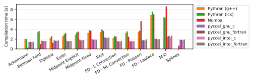

# Benchmarks

Several tests are available for the user to benchmark Pyccel against other common accelerators, notably [pythran](https://pythran.readthedocs.io/en/latest/) and [numba](https://numba.pydata.org/).
The same code is used for all tests, only the decorators change.

The dependencies can be installed using the command `python3 -m pip install .`

The code can be executed by running the script `benchmarks/run_benchmarks.py`.

In order to test pyccel and/or pythran, configuration files must be provided. An example configuration for pythran is found in [`benchmarks/config.pythranrc`](./benchmarks/config.pythranrc). This configuration is the default pythran configuration with the following additional flags:
- `-O3`
- `-march=native`
- `-mtune=native`
- `-mavx`
- `-ffast-math`
Pyccel configurations valid for your machine can be generated using the following command (which may be adapted for c generation or other compiler languages, see the [pyccel documentation](https://github.com/pyccel/pyccel/blob/master/tutorial/compiler.md)):
```
pyccel --language=fortran --export-compile-info pyccel_fortran.json
```
This configuration can then be modified to include additional flags or use different compilers. The tests shown below add the following additional flags (which match the flags added to pythran):
- `-O3`
- `-march=native`
- `-mtune=native`
- `-mavx`
- `-ffast-math`

Additional options can be used with this script to add further comparisons, change the output format, or change what is generated.

Run `python3 benchmarks/run_benchmarks.py --help` for more details.

The results below are presented for the current state of the development branch of pyccel, as well as the most recent version of pyccel available on pypi.

A requirements.txt file providing the necessary packages to reproduce the tests run can be found in the `version_specific_results` folder.
The environment can be reproduced using the following commands:
```
python3 -m venv my_virtual_environment
source my_virtual_environment/bin/activate
pip3 install -r requirements.txt
```
## Tests used

The tests used can be found in the [benchmarks/tests](./benchmarks/tests) directory.

### Ackermann

A basic implementation of the Ackermann function which is one of the simplest and oldest examples of a total computable function that is not primitive recursive.

### Bellman Ford

An algorithm for solving the shortest path problem. The code is adapted from examples written by [J. Burkardt](https://people.sc.fsu.edu/~jburkardt/py_src/py_src.html)

### Djikstra

An algorithm for solving the shortest path problem. The code is adapted from examples written by [J. Burkardt](https://people.sc.fsu.edu/~jburkardt/py_src/py_src.html)

### Euler

Solves an ordinary differential equation using Euler's method. The code is adapted from examples written by [J. Burkardt](https://people.sc.fsu.edu/~jburkardt/py_src/py_src.html)

### Midpoint Explicit

Solves an ordinary differential equation using the explicit midpoint method. The code is adapted from examples written by [J. Burkardt](https://people.sc.fsu.edu/~jburkardt/py_src/py_src.html)

### Midpoint Fixed

Solves an ordinary differential equation using the implicit midpoint method with a fixed number of iterations. The code is adapted from examples written by [J. Burkardt](https://people.sc.fsu.edu/~jburkardt/py_src/py_src.html)

### RK4

Solves an ordinary differential equation using a fourth order Runge-Kutta method. The code is adapted from examples written by [J. Burkardt](https://people.sc.fsu.edu/~jburkardt/py_src/py_src.html)

### FD - Linear Convection

Solves a 1D linear convection problem using Finite Differences methods. The code is adapted from examples written by [L. A. Barba](https://lorenabarba.com/blog/cfd-python-12-steps-to-navier-stokes/)

### FD - Non-Linear Convection

Solves a 1D non-linear convection problem using Finite Differences methods. The code is adapted from examples written by [L. A. Barba](https://lorenabarba.com/blog/cfd-python-12-steps-to-navier-stokes/)

### FD - Poisson

Solves a 2D Poisson problem using Finite Differences methods. The code is adapted from examples written by [L. A. Barba](https://lorenabarba.com/blog/cfd-python-12-steps-to-navier-stokes/)

### FD - Laplace

Solves a 2D Laplace problem using Finite Differences methods. The code is adapted from examples written by [L. A. Barba](https://lorenabarba.com/blog/cfd-python-12-steps-to-navier-stokes/)

### MD

Runs a molecular dynamics simulation. The code is adapted from examples written by [J. Burkardt](https://people.sc.fsu.edu/~jburkardt/py_src/py_src.html)
## Development branch results
### Performance Comparison (as of Thu Feb 29 21:04:16 UTC 2024)
## Compilation time
Algorithm                 | python                    | pythran_gnu               | pythran_intel             | numba                     | pyccel_fortran_gnu        | pyccel_c_gnu              | pyccel_fortran_intel      | pyccel_c_intel           
------------------------- | ------------------------- | ------------------------- | ------------------------- | ------------------------- | ------------------------- | ------------------------- | ------------------------- | -------------------------
Ackermann                 | -                         | 2.35                      | 2.21                      | 0.32                      | 1.25                      | 1.20                      | 1.31                      | 1.30                     
Bellman Ford              | -                         | 3.45                      | 3.81                      | 1.07                      | 2.36                      | 2.52                      | 2.47                      | 3.33                     
Dijkstra                  | -                         | 2.43                      | 2.84                      | 1.57                      | 2.40                      | 2.57                      | 2.59                      | 3.36                     
Euler                     | -                         | 2.77                      | 3.23                      | 2.01                      | 2.32                      | 2.53                      | 2.44                      | 3.30                     
Midpoint Explicit         | -                         | 3.13                      | 3.65                      | 2.98                      | 2.58                      | 2.81                      | 2.72                      | 3.55                     
Midpoint Fixed            | -                         | 3.52                      | 4.30                      | 3.19                      | 2.65                      | 2.88                      | 2.79                      | 3.62                     
RK4                       | -                         | 3.81                      | 4.43                      | 3.72                      | 3.06                      | 3.28                      | 3.18                      | 4.02                     
FD - L Convection         | -                         | 2.40                      | 2.81                      | 0.85                      | 2.29                      | 2.54                      | 2.45                      | 3.26                     
FD - NL Convection        | -                         | 3.39                      | 3.76                      | 0.87                      | 2.31                      | 2.55                      | 2.48                      | 3.27                     
FD - Poisson              | -                         | 3.42                      | 3.96                      | 1.32                      | 2.41                      | 2.60                      | 2.99                      | 3.33                     
FD - Laplace              | -                         | 6.64                      | 8.76                      | 3.01                      | 2.75                      | 2.97                      | 3.00                      | 3.80                     
M-D                       | -                         | 6.33                      | 7.35                      | 4.01                      | 3.12                      | 3.16                      | 3.30                      | 4.23                     

## Execution time
Algorithm                 | python                    | pythran_gnu               | pythran_intel             | numba                     | pyccel_fortran_gnu        | pyccel_c_gnu              | pyccel_fortran_intel      | pyccel_c_intel           
------------------------- | ------------------------- | ------------------------- | ------------------------- | ------------------------- | ------------------------- | ------------------------- | ------------------------- | -------------------------
Ackermann (ms)            | 307.00                    | 2.95                      | 3.47                      | 9.59                      | 1.50                      | 1.50                      | 7.53                      | 4.76                     
Bellman Ford (ms)         | 1790.00                   | 4.17                      | 3.24                      | 3.93                      | 2.97                      | 5.60                      | 4.40                      | 19.00                    
Dijkstra (ms)             | 4950.00                   | 23.20                     | 17.50                     | 19.30                     | 18.40                     | 30.60                     | 24.20                     | 22.20                    
Euler (ms)                | 3800.00                   | 28.80                     | 28.50                     | 37.70                     | 16.10                     | 143.00                    | 14.20                     | 128.00                   
Midpoint Explicit (ms)    | 7780.00                   | 58.80                     | 56.70                     | 82.60                     | 23.40                     | 281.00                    | 16.40                     | 253.00                   
Midpoint Fixed (ms)       | 39500.00                  | 253.00                    | 63.20                     | 373.00                    | 75.10                     | 1430.00                   | 64.30                     | 1240.00                  
RK4 (ms)                  | 19900.00                  | 164.00                    | 37.60                     | 140.00                    | 35.10                     | 487.00                    | 37.70                     | 415.00                   
FD - L Convection (ms)    | 2280.00                   | 1.64                      | 1.57                      | 2.65                      | 1.49                      | 1.83                      | 1.30                      | 3.68                     
FD - NL Convection (ms)   | 2840.00                   | 2.03                      | 1.80                      | 2.79                      | 1.80                      | 2.19                      | 1.51                      | 3.73                     
FD - Poisson (ms)         | 6320.00                   | 3.01                      | 2.66                      | 7.13                      | 2.79                      | 3.78                      | 2.63                      | 8.85                     
FD - Laplace (ms)         | 596.00                    | 64.00                     | 151.00                    | 244.00                    | 62.00                     | 256.00                    | 58.00                     | 303.00                   
M-D (ms)                  | 14900.00                  | 15.10                     | 51.70                     | 59.20                     | 53.70                     | 59.60                     | 69.00                     | 64.60                    


## Python 3.8 results
### Performance Comparison (as of 1.11.1)
## Compilation time
Algorithm                 | python                    | pythran_gnu               | pythran_intel             | numba                     | pyccel_fortran_gnu        | pyccel_c_gnu              | pyccel_fortran_intel      | pyccel_c_intel           
------------------------- | ------------------------- | ------------------------- | ------------------------- | ------------------------- | ------------------------- | ------------------------- | ------------------------- | -------------------------
Ackermann                 | -                         | 2.04                      | 2.16                      | 0.34                      | 1.35                      | 1.30                      | 1.42                      | 1.38                     
Bellman Ford              | -                         | 3.54                      | 3.91                      | 1.13                      | 2.51                      | 2.66                      | 2.63                      | 3.48                     
Dijkstra                  | -                         | 2.45                      | 2.84                      | 1.66                      | 2.59                      | 2.71                      | 2.78                      | 3.55                     
Euler                     | -                         | 2.83                      | 3.28                      | 2.12                      | 2.47                      | 2.65                      | 2.60                      | 3.53                     
Midpoint Explicit         | -                         | 3.24                      | 3.75                      | 3.11                      | 2.78                      | 3.00                      | 2.91                      | 3.76                     
Midpoint Fixed            | -                         | 3.61                      | 4.44                      | 3.35                      | 2.79                      | 3.07                      | 2.97                      | 3.83                     
RK4                       | -                         | 3.97                      | 4.66                      | 3.91                      | 3.30                      | 3.44                      | 3.42                      | 4.30                     
FD - L Convection         | -                         | 2.46                      | 2.83                      | 0.91                      | 2.47                      | 2.64                      | 2.61                      | 3.42                     
FD - NL Convection        | -                         | 3.47                      | 3.84                      | 0.93                      | 2.45                      | 2.67                      | 2.63                      | 3.45                     
FD - Poisson              | -                         | 3.49                      | 4.07                      | 1.39                      | 2.53                      | 2.78                      | 3.14                      | 3.52                     
FD - Laplace              | -                         | 6.99                      | 9.23                      | 3.18                      | 2.95                      | 3.16                      | 3.17                      | 4.01                     
M-D                       | -                         | 6.63                      | 7.65                      | 4.13                      | 3.36                      | 3.32                      | 3.54                      | 4.52                     

## Execution time
Algorithm                 | python                    | pythran_gnu               | pythran_intel             | numba                     | pyccel_fortran_gnu        | pyccel_c_gnu              | pyccel_fortran_intel      | pyccel_c_intel           
------------------------- | ------------------------- | ------------------------- | ------------------------- | ------------------------- | ------------------------- | ------------------------- | ------------------------- | -------------------------
Ackermann (ms)            | 327.00 $\pm$ 8.00         | 3.01 $\pm$ 0.03           | 3.47 $\pm$ 0.00           | 10.70 $\pm$ 0.10          | 1.55 $\pm$ 0.00           | 1.55 $\pm$ 0.00           | 8.51 $\pm$ 0.13           | 4.77 $\pm$ 0.00          
Bellman Ford (ms)         | 1850.00 $\pm$ 10.00       | 4.89 $\pm$ 0.01           | 3.22 $\pm$ 0.05           | 3.84 $\pm$ 0.07           | 2.96 $\pm$ 0.02           | 6.09 $\pm$ 0.02           | 4.28 $\pm$ 0.12           | 18.30 $\pm$ 0.40         
Dijkstra (ms)             | 4980.00 $\pm$ 60.00       | 27.70 $\pm$ 0.50          | 17.80 $\pm$ 0.20          | 21.90 $\pm$ 0.60          | 19.40 $\pm$ 0.50          | 32.10 $\pm$ 0.30          | 26.20 $\pm$ 0.80          | 23.50 $\pm$ 0.40         
Euler (ms)                | 3910.00 $\pm$ 20.00       | 29.80 $\pm$ 0.70          | 28.90 $\pm$ 0.40          | 39.00 $\pm$ 1.20          | 16.00 $\pm$ 0.70          | 143.00 $\pm$ 2.00         | 14.80 $\pm$ 0.40          | 130.00 $\pm$ 2.00        
Midpoint Explicit (ms)    | 7880.00 $\pm$ 50.00       | 59.90 $\pm$ 0.50          | 57.60 $\pm$ 1.00          | 84.60 $\pm$ 9.00          | 23.70 $\pm$ 0.60          | 287.00 $\pm$ 17.00        | 16.40 $\pm$ 0.40          | 251.00 $\pm$ 1.00        
Midpoint Fixed (ms)       | 40700.00 $\pm$ 400.00     | 256.00 $\pm$ 1.00         | 65.20 $\pm$ 5.70          | 388.00 $\pm$ 13.00        | 75.80 $\pm$ 0.80          | 1400.00 $\pm$ 20.00       | 63.00 $\pm$ 2.60          | 1240.00 $\pm$ 20.00      
RK4 (ms)                  | 20400.00 $\pm$ 300.00     | 164.00 $\pm$ 3.00         | 38.60 $\pm$ 0.50          | 152.00 $\pm$ 16.00        | 36.70 $\pm$ 0.60          | 521.00 $\pm$ 92.00        | 38.50 $\pm$ 0.30          | 415.00 $\pm$ 13.00       
FD - L Convection (ms)    | 2440.00 $\pm$ 40.00       | 1.53 $\pm$ 0.04           | 1.58 $\pm$ 0.02           | 2.70 $\pm$ 0.06           | 1.58 $\pm$ 0.21           | 1.88 $\pm$ 0.10           | 1.32 $\pm$ 0.01           | 3.69 $\pm$ 0.01          
FD - NL Convection (ms)   | 3030.00 $\pm$ 70.00       | 1.97 $\pm$ 0.02           | 1.83 $\pm$ 0.04           | 2.83 $\pm$ 0.05           | 1.90 $\pm$ 0.11           | 2.00 $\pm$ 0.01           | 1.38 $\pm$ 0.01           | 3.75 $\pm$ 0.04          
FD - Poisson (ms)         | 6460.00 $\pm$ 40.00       | 3.21 $\pm$ 0.33           | 2.92 $\pm$ 0.50           | 7.18 $\pm$ 0.03           | 2.89 $\pm$ 0.02           | 3.84 $\pm$ 0.04           | 2.64 $\pm$ 0.02           | 8.93 $\pm$ 0.03          
FD - Laplace (ms)         | 596.00 $\pm$ 14.00        | 68.80 $\pm$ 0.70          | 153.00 $\pm$ 1.00         | 251.00 $\pm$ 1.00         | 63.30 $\pm$ 0.90          | 260.00 $\pm$ 2.00         | 63.40 $\pm$ 0.70          | 305.00 $\pm$ 1.00        
M-D (ms)                  | 15600.00 $\pm$ 200.00     | 15.10 $\pm$ 0.00          | 52.00 $\pm$ 0.40          | 59.30 $\pm$ 0.40          | 54.30 $\pm$ 0.10          | 59.20 $\pm$ 0.30          | 70.70 $\pm$ 0.50          | 61.60 $\pm$ 0.50         


## Python 3.9 results
### Performance Comparison (as of 1.11.1)
## Compilation time
Algorithm                 | python                    | pythran_gnu               | pythran_intel             | numba                     | pyccel_fortran_gnu        | pyccel_c_gnu              | pyccel_fortran_intel      | pyccel_c_intel           
------------------------- | ------------------------- | ------------------------- | ------------------------- | ------------------------- | ------------------------- | ------------------------- | ------------------------- | -------------------------
Ackermann                 | -                         | 1.92                      | 2.01                      | 0.32                      | 1.26                      | 1.21                      | 1.34                      | 1.30                     
Bellman Ford              | -                         | 3.31                      | 3.69                      | 1.05                      | 2.38                      | 2.56                      | 2.50                      | 3.34                     
Dijkstra                  | -                         | 2.30                      | 2.68                      | 1.56                      | 2.46                      | 2.57                      | 2.62                      | 3.39                     
Euler                     | -                         | 2.63                      | 3.07                      | 1.99                      | 2.34                      | 2.56                      | 2.48                      | 3.32                     
Midpoint Explicit         | -                         | 2.98                      | 3.49                      | 2.96                      | 2.60                      | 2.83                      | 2.75                      | 3.56                     
Midpoint Fixed            | -                         | 3.39                      | 4.14                      | 3.17                      | 2.67                      | 2.88                      | 2.80                      | 3.64                     
RK4                       | -                         | 3.66                      | 4.27                      | 3.71                      | 3.10                      | 3.27                      | 3.21                      | 4.05                     
FD - L Convection         | -                         | 2.25                      | 2.65                      | 0.84                      | 2.31                      | 2.52                      | 2.47                      | 3.29                     
FD - NL Convection        | -                         | 3.24                      | 3.61                      | 0.87                      | 2.36                      | 2.56                      | 2.52                      | 3.31                     
FD - Poisson              | -                         | 3.28                      | 3.78                      | 1.30                      | 2.44                      | 2.62                      | 3.03                      | 3.37                     
FD - Laplace              | -                         | 6.48                      | 8.53                      | 2.98                      | 2.80                      | 2.99                      | 3.01                      | 3.84                     
M-D                       | -                         | 6.19                      | 7.09                      | 3.98                      | 3.15                      | 3.13                      | 3.31                      | 4.26                     

## Execution time
Algorithm                 | python                    | pythran_gnu               | pythran_intel             | numba                     | pyccel_fortran_gnu        | pyccel_c_gnu              | pyccel_fortran_intel      | pyccel_c_intel           
------------------------- | ------------------------- | ------------------------- | ------------------------- | ------------------------- | ------------------------- | ------------------------- | ------------------------- | -------------------------
Ackermann (ms)            | 299.00 $\pm$ 3.00         | 2.95 $\pm$ 0.01           | 3.46 $\pm$ 0.00           | 10.80 $\pm$ 0.00          | 1.50 $\pm$ 0.01           | 1.50 $\pm$ 0.00           | 8.91 $\pm$ 0.33           | 4.76 $\pm$ 0.00          
Bellman Ford (ms)         | 1910.00 $\pm$ 40.00       | 4.16 $\pm$ 0.01           | 3.22 $\pm$ 0.05           | 3.82 $\pm$ 0.05           | 2.94 $\pm$ 0.02           | 6.01 $\pm$ 0.03           | 4.42 $\pm$ 0.03           | 18.40 $\pm$ 0.30         
Dijkstra (ms)             | 5120.00 $\pm$ 70.00       | 24.30 $\pm$ 0.40          | 16.10 $\pm$ 0.10          | 18.80 $\pm$ 0.40          | 18.00 $\pm$ 0.30          | 30.30 $\pm$ 0.50          | 23.10 $\pm$ 0.50          | 22.40 $\pm$ 0.20         
Euler (ms)                | 3830.00 $\pm$ 30.00       | 28.20 $\pm$ 0.20          | 28.20 $\pm$ 0.30          | 39.60 $\pm$ 1.20          | 14.70 $\pm$ 0.50          | 144.00 $\pm$ 3.00         | 14.30 $\pm$ 0.40          | 127.00 $\pm$ 2.00        
Midpoint Explicit (ms)    | 7860.00 $\pm$ 60.00       | 59.50 $\pm$ 0.40          | 56.10 $\pm$ 0.40          | 81.70 $\pm$ 2.90          | 22.70 $\pm$ 0.50          | 280.00 $\pm$ 2.00         | 15.90 $\pm$ 0.40          | 251.00 $\pm$ 3.00        
Midpoint Fixed (ms)       | 40100.00 $\pm$ 400.00     | 255.00 $\pm$ 1.00         | 63.10 $\pm$ 0.40          | 388.00 $\pm$ 10.00        | 74.40 $\pm$ 0.70          | 1390.00 $\pm$ 20.00       | 60.40 $\pm$ 2.80          | 1230.00 $\pm$ 10.00      
RK4 (ms)                  | 20100.00 $\pm$ 200.00     | 165.00 $\pm$ 8.00         | 37.80 $\pm$ 0.40          | 147.00 $\pm$ 2.00         | 35.60 $\pm$ 0.70          | 487.00 $\pm$ 6.00         | 38.00 $\pm$ 0.50          | 402.00 $\pm$ 3.00        
FD - L Convection (ms)    | 2500.00 $\pm$ 30.00       | 1.66 $\pm$ 0.04           | 1.58 $\pm$ 0.03           | 2.71 $\pm$ 0.04           | 1.76 $\pm$ 0.02           | 1.72 $\pm$ 0.13           | 1.32 $\pm$ 0.01           | 3.75 $\pm$ 0.05          
FD - NL Convection (ms)   | 3030.00 $\pm$ 20.00       | 1.92 $\pm$ 0.07           | 1.76 $\pm$ 0.06           | 2.84 $\pm$ 0.04           | 1.77 $\pm$ 0.11           | 2.07 $\pm$ 0.12           | 1.53 $\pm$ 0.01           | 3.74 $\pm$ 0.01          
FD - Poisson (ms)         | 6460.00 $\pm$ 100.00      | 2.97 $\pm$ 0.04           | 2.70 $\pm$ 0.24           | 7.18 $\pm$ 0.04           | 2.76 $\pm$ 0.01           | 3.82 $\pm$ 0.02           | 2.64 $\pm$ 0.01           | 8.96 $\pm$ 0.02          
FD - Laplace (ms)         | 578.00 $\pm$ 3.00         | 64.50 $\pm$ 0.90          | 151.00 $\pm$ 1.00         | 250.00 $\pm$ 1.00         | 58.30 $\pm$ 0.40          | 255.00 $\pm$ 1.00         | 59.90 $\pm$ 0.40          | 304.00 $\pm$ 1.00        
M-D (ms)                  | 15500.00 $\pm$ 100.00     | 15.20 $\pm$ 0.00          | 51.90 $\pm$ 0.30          | 60.80 $\pm$ 7.10          | 53.80 $\pm$ 0.10          | 59.30 $\pm$ 0.20          | 68.50 $\pm$ 0.80          | 60.40 $\pm$ 0.70         


## Python 3.10 results
### Performance Comparison (as of 1.11.1)
## Compilation time
Algorithm                 | python                    | pythran_gnu               | pythran_intel             | numba                     | pyccel_fortran_gnu        | pyccel_c_gnu              | pyccel_fortran_intel      | pyccel_c_intel           
------------------------- | ------------------------- | ------------------------- | ------------------------- | ------------------------- | ------------------------- | ------------------------- | ------------------------- | -------------------------
Ackermann                 | -                         | 2.48                      | 2.32                      | 0.33                      | 1.30                      | 1.26                      | 1.34                      | 1.30                     
Bellman Ford              | -                         | 3.48                      | 3.84                      | 1.09                      | 2.37                      | 2.55                      | 2.48                      | 3.39                     
Dijkstra                  | -                         | 2.48                      | 2.94                      | 1.62                      | 2.51                      | 2.67                      | 2.66                      | 3.44                     
Euler                     | -                         | 2.87                      | 3.32                      | 2.07                      | 2.37                      | 2.57                      | 2.48                      | 3.33                     
Midpoint Explicit         | -                         | 3.26                      | 3.77                      | 3.14                      | 2.71                      | 2.90                      | 2.81                      | 3.91                     
Midpoint Fixed            | -                         | 3.58                      | 4.35                      | 3.25                      | 2.65                      | 2.88                      | 2.79                      | 3.62                     
RK4                       | -                         | 3.99                      | 4.70                      | 3.83                      | 3.16                      | 3.34                      | 3.28                      | 4.12                     
FD - L Convection         | -                         | 2.44                      | 2.84                      | 0.86                      | 2.33                      | 2.51                      | 2.44                      | 3.29                     
FD - NL Convection        | -                         | 3.36                      | 3.79                      | 0.88                      | 2.32                      | 2.52                      | 2.53                      | 3.30                     
FD - Poisson              | -                         | 3.44                      | 4.00                      | 1.35                      | 2.47                      | 2.61                      | 3.06                      | 3.35                     
FD - Laplace              | -                         | 6.91                      | 9.11                      | 3.13                      | 2.83                      | 3.03                      | 3.05                      | 3.94                     
M-D                       | -                         | 6.52                      | 7.32                      | 4.03                      | 3.10                      | 3.11                      | 3.30                      | 4.23                     

## Execution time
Algorithm                 | python                    | pythran_gnu               | pythran_intel             | numba                     | pyccel_fortran_gnu        | pyccel_c_gnu              | pyccel_fortran_intel      | pyccel_c_intel           
------------------------- | ------------------------- | ------------------------- | ------------------------- | ------------------------- | ------------------------- | ------------------------- | ------------------------- | -------------------------
Ackermann (ms)            | 319.00 $\pm$ 4.00         | 2.99 $\pm$ 0.09           | 3.48 $\pm$ 0.02           | 10.70 $\pm$ 0.10          | 1.55 $\pm$ 0.01           | 1.55 $\pm$ 0.00           | 8.63 $\pm$ 0.28           | 3.93 $\pm$ 0.01          
Bellman Ford (ms)         | 1780.00 $\pm$ 20.00       | 4.16 $\pm$ 0.01           | 3.24 $\pm$ 0.05           | 3.85 $\pm$ 0.06           | 2.95 $\pm$ 0.02           | 6.04 $\pm$ 0.18           | 4.40 $\pm$ 0.02           | 18.60 $\pm$ 0.40         
Dijkstra (ms)             | 4940.00 $\pm$ 40.00       | 23.80 $\pm$ 0.40          | 17.30 $\pm$ 0.40          | 19.60 $\pm$ 0.80          | 18.70 $\pm$ 0.50          | 31.60 $\pm$ 0.60          | 24.70 $\pm$ 0.60          | 23.00 $\pm$ 0.40         
Euler (ms)                | 3860.00 $\pm$ 30.00       | 28.70 $\pm$ 0.50          | 28.80 $\pm$ 0.30          | 38.80 $\pm$ 1.10          | 15.10 $\pm$ 0.80          | 144.00 $\pm$ 7.00         | 14.50 $\pm$ 0.40          | 129.00 $\pm$ 6.00        
Midpoint Explicit (ms)    | 7880.00 $\pm$ 100.00      | 59.90 $\pm$ 0.40          | 57.00 $\pm$ 0.70          | 81.80 $\pm$ 2.80          | 23.80 $\pm$ 0.70          | 282.00 $\pm$ 3.00         | 16.60 $\pm$ 0.60          | 252.00 $\pm$ 2.00        
Midpoint Fixed (ms)       | 39900.00 $\pm$ 200.00     | 259.00 $\pm$ 5.00         | 63.30 $\pm$ 0.70          | 388.00 $\pm$ 13.00        | 75.20 $\pm$ 0.70          | 1400.00 $\pm$ 20.00       | 61.60 $\pm$ 2.50          | 1240.00 $\pm$ 20.00      
RK4 (ms)                  | 20200.00 $\pm$ 100.00     | 162.00 $\pm$ 3.00         | 38.40 $\pm$ 0.50          | 146.00 $\pm$ 4.00         | 37.70 $\pm$ 0.70          | 487.00 $\pm$ 3.00         | 40.10 $\pm$ 3.60          | 410.00 $\pm$ 6.00        
FD - L Convection (ms)    | 2300.00 $\pm$ 30.00       | 1.66 $\pm$ 0.04           | 1.61 $\pm$ 0.07           | 2.70 $\pm$ 0.06           | 1.54 $\pm$ 0.14           | 1.75 $\pm$ 0.11           | 1.52 $\pm$ 0.01           | 3.70 $\pm$ 0.02          
FD - NL Convection (ms)   | 2880.00 $\pm$ 30.00       | 1.91 $\pm$ 0.07           | 1.81 $\pm$ 0.01           | 2.82 $\pm$ 0.05           | 2.01 $\pm$ 0.19           | 2.11 $\pm$ 0.10           | 1.38 $\pm$ 0.01           | 3.75 $\pm$ 0.01          
FD - Poisson (ms)         | 6460.00 $\pm$ 40.00       | 3.00 $\pm$ 0.12           | 2.72 $\pm$ 0.04           | 7.18 $\pm$ 0.03           | 2.86 $\pm$ 0.03           | 3.87 $\pm$ 0.02           | 2.65 $\pm$ 0.06           | 8.94 $\pm$ 0.03          
FD - Laplace (ms)         | 588.00 $\pm$ 12.00        | 68.20 $\pm$ 0.50          | 152.00 $\pm$ 1.00         | 246.00 $\pm$ 1.00         | 63.40 $\pm$ 0.70          | 257.00 $\pm$ 1.00         | 63.50 $\pm$ 1.50          | 306.00 $\pm$ 1.00        
M-D (ms)                  | 15200.00 $\pm$ 300.00     | 15.20 $\pm$ 0.00          | 51.90 $\pm$ 0.20          | 59.50 $\pm$ 0.20          | 54.20 $\pm$ 0.40          | 59.60 $\pm$ 0.30          | 68.20 $\pm$ 1.20          | 61.30 $\pm$ 3.80         


## Python 3.11 results
### Performance Comparison (as of 1.11.1)
## Compilation time
Algorithm                 | python                    | pythran_gnu               | pythran_intel             | numba                     | pyccel_fortran_gnu        | pyccel_c_gnu              | pyccel_fortran_intel      | pyccel_c_intel           
------------------------- | ------------------------- | ------------------------- | ------------------------- | ------------------------- | ------------------------- | ------------------------- | ------------------------- | -------------------------
Ackermann                 | -                         | 2.36                      | 2.24                      | 0.29                      | 1.22                      | 1.18                      | 1.31                      | 1.28                     
Bellman Ford              | -                         | 3.34                      | 3.73                      | 1.09                      | 2.37                      | 2.51                      | 2.47                      | 3.30                     
Dijkstra                  | -                         | 2.51                      | 2.93                      | 1.64                      | 2.45                      | 2.57                      | 2.57                      | 3.43                     
Euler                     | -                         | 2.81                      | 3.27                      | 1.98                      | 2.39                      | 2.59                      | 2.58                      | 3.47                     
Midpoint Explicit         | -                         | 3.26                      | 3.78                      | 3.01                      | 2.47                      | 2.89                      | 2.71                      | 3.77                     
Midpoint Fixed            | -                         | 3.54                      | 4.20                      | 3.08                      | 2.60                      | 2.83                      | 2.77                      | 3.65                     
RK4                       | -                         | 3.73                      | 4.35                      | 3.56                      | 2.99                      | 3.19                      | 3.15                      | 3.95                     
FD - L Convection         | -                         | 2.34                      | 2.78                      | 0.86                      | 2.27                      | 2.50                      | 2.45                      | 3.27                     
FD - NL Convection        | -                         | 3.41                      | 3.76                      | 0.84                      | 2.27                      | 2.50                      | 2.47                      | 3.25                     
FD - Poisson              | -                         | 3.34                      | 4.01                      | 1.25                      | 2.39                      | 2.59                      | 2.97                      | 3.32                     
FD - Laplace              | -                         | 6.53                      | 8.69                      | 2.88                      | 2.71                      | 2.95                      | 2.95                      | 3.76                     
M-D                       | -                         | 6.20                      | 7.30                      | 3.93                      | 3.05                      | 3.10                      | 3.20                      | 4.24                     

## Execution time
Algorithm                 | python                    | pythran_gnu               | pythran_intel             | numba                     | pyccel_fortran_gnu        | pyccel_c_gnu              | pyccel_fortran_intel      | pyccel_c_intel           
------------------------- | ------------------------- | ------------------------- | ------------------------- | ------------------------- | ------------------------- | ------------------------- | ------------------------- | -------------------------
Ackermann (ms)            | 505.00 $\pm$ 36.00        | 2.96 $\pm$ 0.06           | 3.47 $\pm$ 0.01           | 10.70 $\pm$ 0.10          | 1.50 $\pm$ 0.00           | 1.50 $\pm$ 0.00           | 9.77 $\pm$ 0.38           | 3.93 $\pm$ 0.00          
Bellman Ford (ms)         | 2060.00 $\pm$ 20.00       | 4.17 $\pm$ 0.02           | 3.21 $\pm$ 0.05           | 3.86 $\pm$ 0.10           | 2.95 $\pm$ 0.02           | 6.04 $\pm$ 0.02           | 4.40 $\pm$ 0.02           | 18.40 $\pm$ 0.20         
Dijkstra (ms)             | 5000.00 $\pm$ 70.00       | 27.00 $\pm$ 0.40          | 17.40 $\pm$ 0.40          | 20.50 $\pm$ 0.40          | 18.30 $\pm$ 0.40          | 30.00 $\pm$ 0.50          | 24.20 $\pm$ 0.50          | 22.90 $\pm$ 0.40         
Euler (ms)                | 3700.00 $\pm$ 20.00       | 29.00 $\pm$ 0.30          | 29.00 $\pm$ 1.00          | 38.40 $\pm$ 0.30          | 16.00 $\pm$ 0.60          | 143.00 $\pm$ 2.00         | 14.90 $\pm$ 0.40          | 128.00 $\pm$ 2.00        
Midpoint Explicit (ms)    | 7560.00 $\pm$ 60.00       | 59.70 $\pm$ 0.40          | 57.00 $\pm$ 0.40          | 73.50 $\pm$ 0.60          | 24.10 $\pm$ 0.70          | 280.00 $\pm$ 2.00         | 16.50 $\pm$ 0.90          | 250.00 $\pm$ 2.00        
Midpoint Fixed (ms)       | 38500.00 $\pm$ 400.00     | 259.00 $\pm$ 10.00        | 63.20 $\pm$ 0.30          | 376.00 $\pm$ 2.00         | 75.20 $\pm$ 0.90          | 1390.00 $\pm$ 20.00       | 62.00 $\pm$ 2.80          | 1270.00 $\pm$ 80.00      
RK4 (ms)                  | 19600.00 $\pm$ 200.00     | 167.00 $\pm$ 3.00         | 37.70 $\pm$ 0.40          | 143.00 $\pm$ 17.00        | 33.30 $\pm$ 0.40          | 487.00 $\pm$ 7.00         | 38.80 $\pm$ 4.60          | 406.00 $\pm$ 8.00        
FD - L Convection (ms)    | 2290.00 $\pm$ 20.00       | 1.72 $\pm$ 0.10           | 1.65 $\pm$ 0.10           | 2.72 $\pm$ 0.08           | 1.78 $\pm$ 0.01           | 1.61 $\pm$ 0.01           | 1.30 $\pm$ 0.01           | 3.88 $\pm$ 0.07          
FD - NL Convection (ms)   | 2880.00 $\pm$ 20.00       | 1.87 $\pm$ 0.13           | 1.76 $\pm$ 0.06           | 2.82 $\pm$ 0.03           | 1.99 $\pm$ 0.29           | 2.06 $\pm$ 0.08           | 1.52 $\pm$ 0.01           | 3.74 $\pm$ 0.01          
FD - Poisson (ms)         | 6190.00 $\pm$ 140.00      | 2.99 $\pm$ 0.04           | 2.70 $\pm$ 0.14           | 7.18 $\pm$ 0.09           | 2.82 $\pm$ 0.02           | 3.82 $\pm$ 0.02           | 2.68 $\pm$ 0.01           | 8.92 $\pm$ 0.03          
FD - Laplace (ms)         | 591.00 $\pm$ 13.00        | 68.60 $\pm$ 0.40          | 152.00 $\pm$ 1.00         | 246.00 $\pm$ 1.00         | 63.80 $\pm$ 2.10          | 309.00 $\pm$ 3.00         | 59.60 $\pm$ 0.30          | 307.00 $\pm$ 1.00        
M-D (ms)                  | 14900.00 $\pm$ 100.00     | 15.20 $\pm$ 0.00          | 51.90 $\pm$ 0.30          | 59.50 $\pm$ 0.30          | 54.20 $\pm$ 0.20          | 59.70 $\pm$ 0.30          | 71.00 $\pm$ 0.60          | 60.40 $\pm$ 1.00         


## Python 3.12 results
### Performance Comparison (as of 1.11.1)
## Compilation time
Algorithm                 | python                    | pythran_gnu               | pythran_intel             | numba                     | pyccel_fortran_gnu        | pyccel_c_gnu              | pyccel_fortran_intel      | pyccel_c_intel           
------------------------- | ------------------------- | ------------------------- | ------------------------- | ------------------------- | ------------------------- | ------------------------- | ------------------------- | -------------------------
Ackermann                 | -                         | -                         | -                         | 0.31                      | 1.37                      | 1.32                      | 1.45                      | 1.43                     
Bellman Ford              | -                         | -                         | -                         | 1.22                      | 2.52                      | 2.68                      | 2.64                      | 3.48                     
Dijkstra                  | -                         | -                         | -                         | 1.64                      | 2.57                      | 2.71                      | 2.76                      | 3.53                     
Euler                     | -                         | -                         | -                         | 2.05                      | 2.48                      | 2.69                      | 2.60                      | 3.46                     
Midpoint Explicit         | -                         | -                         | -                         | 3.02                      | 2.76                      | 2.96                      | 2.89                      | 3.74                     
Midpoint Fixed            | -                         | -                         | -                         | 3.24                      | 2.86                      | 3.11                      | 3.01                      | 3.87                     
RK4                       | -                         | -                         | -                         | 3.73                      | 3.34                      | 3.50                      | 3.43                      | 4.30                     
FD - L Convection         | -                         | -                         | -                         | 0.92                      | 2.46                      | 2.70                      | 2.60                      | 3.43                     
FD - NL Convection        | -                         | -                         | -                         | 0.91                      | 2.46                      | 2.68                      | 2.66                      | 3.42                     
FD - Poisson              | -                         | -                         | -                         | 1.36                      | 2.57                      | 2.79                      | 3.19                      | 3.51                     
FD - Laplace              | -                         | -                         | -                         | 3.00                      | 2.95                      | 3.16                      | 3.16                      | 4.01                     
M-D                       | -                         | -                         | -                         | 4.06                      | 3.36                      | 3.33                      | 3.56                      | 4.46                     

## Execution time
Algorithm                 | python                    | pythran_gnu               | pythran_intel             | numba                     | pyccel_fortran_gnu        | pyccel_c_gnu              | pyccel_fortran_intel      | pyccel_c_intel           
------------------------- | ------------------------- | ------------------------- | ------------------------- | ------------------------- | ------------------------- | ------------------------- | ------------------------- | -------------------------
Ackermann (ms)            | 488.00 $\pm$ 7.00         | -                         | -                         | 10.60 $\pm$ 0.30          | 1.54 $\pm$ 0.02           | 1.50 $\pm$ 0.01           | 8.89 $\pm$ 0.36           | 4.76 $\pm$ 0.01          
Bellman Ford (ms)         | 2510.00 $\pm$ 40.00       | -                         | -                         | 3.85 $\pm$ 0.08           | 2.95 $\pm$ 0.03           | 5.65 $\pm$ 0.04           | 4.38 $\pm$ 0.01           | 18.10 $\pm$ 0.50         
Dijkstra (ms)             | 6940.00 $\pm$ 40.00       | -                         | -                         | 19.70 $\pm$ 0.50          | 18.30 $\pm$ 0.40          | 31.50 $\pm$ 0.40          | 24.00 $\pm$ 0.50          | 22.70 $\pm$ 0.40         
Euler (ms)                | 4820.00 $\pm$ 20.00       | -                         | -                         | 37.50 $\pm$ 0.40          | 15.50 $\pm$ 0.50          | 142.00 $\pm$ 2.00         | 14.50 $\pm$ 0.30          | 129.00 $\pm$ 1.00        
Midpoint Explicit (ms)    | 9680.00 $\pm$ 50.00       | -                         | -                         | 73.10 $\pm$ 0.90          | 23.10 $\pm$ 0.60          | 281.00 $\pm$ 1.00         | 15.90 $\pm$ 0.30          | 250.00 $\pm$ 2.00        
Midpoint Fixed (s)        | 47.90 $\pm$ 0.20          | -                         | -                         | 0.38 $\pm$ 0.01           | 0.07 $\pm$ 0.00           | 1.39 $\pm$ 0.02           | 0.06 $\pm$ 0.00           | 1.23 $\pm$ 0.01          
RK4 (ms)                  | 24300.00 $\pm$ 100.00     | -                         | -                         | 140.00 $\pm$ 1.00         | 33.00 $\pm$ 0.90          | 488.00 $\pm$ 7.00         | 39.50 $\pm$ 3.80          | 406.00 $\pm$ 2.00        
FD - L Convection (ms)    | 2870.00 $\pm$ 20.00       | -                         | -                         | 2.70 $\pm$ 0.03           | 1.55 $\pm$ 0.10           | 1.73 $\pm$ 0.13           | 1.32 $\pm$ 0.01           | 3.70 $\pm$ 0.01          
FD - NL Convection (ms)   | 3560.00 $\pm$ 20.00       | -                         | -                         | 2.84 $\pm$ 0.06           | 1.83 $\pm$ 0.04           | 2.06 $\pm$ 0.08           | 1.39 $\pm$ 0.01           | 3.74 $\pm$ 0.01          
FD - Poisson (ms)         | 8160.00 $\pm$ 120.00      | -                         | -                         | 7.17 $\pm$ 0.03           | 2.76 $\pm$ 0.01           | 3.85 $\pm$ 0.02           | 2.68 $\pm$ 0.14           | 9.31 $\pm$ 0.11          
FD - Laplace (ms)         | 597.00 $\pm$ 4.00         | -                         | -                         | 246.00 $\pm$ 1.00         | 60.50 $\pm$ 2.80          | 281.00 $\pm$ 1.00         | 62.90 $\pm$ 1.50          | 307.00 $\pm$ 1.00        
M-D (ms)                  | 18400.00 $\pm$ 100.00     | -                         | -                         | 59.30 $\pm$ 0.20          | 54.70 $\pm$ 2.90          | 59.40 $\pm$ 0.10          | 70.90 $\pm$ 0.40          | 61.00 $\pm$ 1.70         



